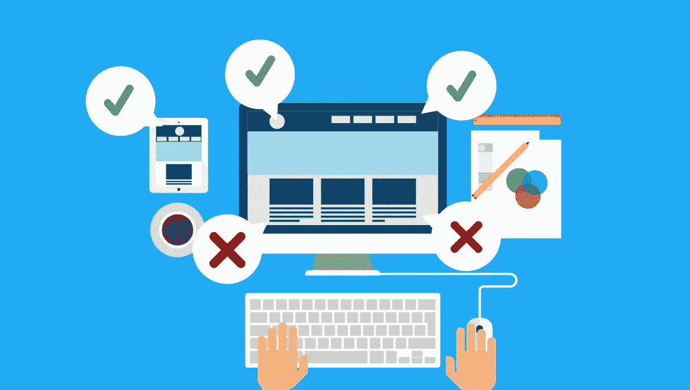
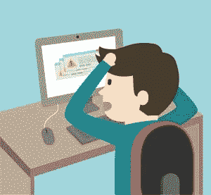

# 会毁掉你网站的设计错误

> 原文：<https://medium.com/visualmodo/design-mistakes-that-can-ruin-your-website-6b5f0b9560bf?source=collection_archive---------0----------------------->

以及如何避免

现在看看一些大的设计错误，它们会毁掉你的网站理念、风格，甚至是你的商业形象。网站是你企业的虚拟表现，是产生转化的主要枢纽。然而，真正的挑战不是建立一个网站，而是让它以最好的方式可用。

说到网站设计，即使是最有经验的网页设计师也会犯错误。从不吸引人的主页到糟糕的导航系统，不相关的内容到非常慢的服务器时间，等等。为了提高网站的性能，这里列出了网站设计者经常犯的 10 个最严重的网站错误。

# 会毁掉你网站的设计错误

**1。糟糕的导航:**一个好的网站设计不仅仅是外观和感觉，更重要的是可用性。导航对一个网站[设计](https://creativemarket.com/visualmodo/shop)的成败影响比其他任何因素都大。好的导航让用户很容易找到他们想要的东西，或者换句话说，他们可以不受干扰地快速浏览网页。另一方面，如果你的导航栏设计得很糟糕，那么它会给用户带来麻烦。网站上的导航条应该以无缝的方式引导访问者到网站的其他区域。以下是一些建议:

为图片使用文字描述和替代文字，以确保导航简单
确保你的导航与你网站的主题相得益彰，并与你的整体品牌相一致。
让你的网站导航具有描述性，以确保它能方便地与用户交流，不会造成任何混淆。

**最佳实践:**将导航条放在页面的顶部或左侧，以确保用户的可见性，无论屏幕分辨率如何。你也可以在主导航栏中添加易于查找的站点地图，这样访问者就可以对你的[站点](https://visualmodo.com/)的每个页面一目了然。

**2。使用不相关的图片:**图片增加了网站的视觉吸引力，是吸引用户注意力的绝佳方式。然而，小心你使用的图像，使用不相关的或低分辨率的图像不是一个好主意。你上传到网站上的图片需要与网站上的信息或内容相关，检查其质量和清晰度，不要错过有用性。图片是好的，但是添加太多的图片会分散用户的注意力，降低网站的加载速度，从而影响网站的性能。

最佳实践:如果你的网站设计有太多的图片或整页动画，那么给用户一个跳过按钮的选项是一个好主意。

**3。糟糕的标志设计:标志对每个企业或公司都至关重要，不用说，它是品牌的重要组成部分。因此，请确保你的标志设计良好，并正确地放在你的网站上。在设计你的企业标志时，要牢记你的目标受众，选择一种与你隐藏在标志中的信息相匹配的颜色，也就是品牌信息。糟糕的标志设计会干扰你的网站设计，并对你的品牌产生负面影响。**

**最佳实践:**徽标放置的标准惯例是在页面的左上角区域。将你的 logo 放在用户期望的地方是一个很好的做法，也能确保用户友好的体验。

**4。过时的信息:**一个[精心设计的](https://visualmodo.com/)网站，如果内容过时或不相关，那就是大错特错。为了保持你的网站的可信度和在搜索引擎结果中排名更高，你需要不断地在你的网站上添加新鲜的、信息丰富的内容。它可以是博客、最新消息、公司事件、产品发布等形式。例如，如果你是一名兽医，那么你的博客可以涵盖与宠物相关的话题，如狗耳朵感染、狗过敏等。此外，确保你网站上的所有内容没有任何拼写或语法错误，并且对用户有价值。如果不能每天更新内容，至少每月更新一次。

**最佳实践:**为你的网站起草内容时，为每个网页使用一个合适的页面标题。设计师经常忘记给网页命名，他们只是在网页上放一段文字，完全忽略了标题、副标题、段落符号等等。一个合适的页面标题是必不可少的，这样用户才能知道他们在哪里。

**5。非响应性网站设计:**fresh sparks 的一项调查显示，40%的用户在糟糕的移动体验后曾去过竞争对手的网站。我们生活在一个数字时代，人们经常与手机、Ipads、平板电脑等手持设备保持联系。为了给你的用户一个手机友好的体验，有一个响应迅速的网站设计是当务之急。无论你的网站设计有多好，如果没有响应，用户就会失去信心，离开你的网站。所以，如果你还没有开始向响应式网站转变，在你的消费者认为浏览你的网站所提供的内容太费事之前，赶快行动吧。

最佳实践:如果你不想拥有一个响应式的网页设计或移动网站，考虑为移动用户开发一个应用程序，给他们一个移动友好的体验。

**6。字体样式和颜色太多:**你的网站页面要有一致统一的外观。这可以通过使用相似的字体风格和最多一种或两种颜色来实现。这里的想法是向观众保证你的可靠和稳定。大多数用户会在你的网页上停留几秒钟，同时决定是继续浏览还是离开。选择字体时，选择可读性强、看起来专业的字体。

**最佳实践:**标准实践是保持字体大小为 12 或 14。

**7。没有社交媒体经验:**社交媒体已经成为每个企业营销策略不可或缺的一部分。几乎所有公司都有自己的脸书页面、Twitter 和 Instagram 账户。如果您没有在网站上添加社交媒体按钮，这将被视为网站错误。因此，新网站的最佳实践是，用户应该可以不受干扰地从一个平台快速转移到另一个平台。因此，让你的访客连接到你的社交媒体页面，详细了解你的产品和服务。

**最佳实践:**网站设计的最佳实践是在网站顶部添加分享按钮，让用户更容易找到你的社交媒体体验。

**8。无法将行动号召按钮放在正确的位置:**您的 CTA 按钮需要让用户忍不住点击。如果按钮不清晰可见或者没有放在合适的位置，那么“行动号召”按钮的真正目的就失败了。确保你将 CTA 按钮放在网页的折叠上方或折叠下方，这两个位置对于按钮的功效至关重要。因此，确保你正确放置 CTA 按钮，以[提高你的转化率](https://visualmodo.com/wordpress-themes/)。

**最佳实践:**在您的网站上固定 CTA 按钮时，也要考虑其他元素，如背景颜色、周围的图像和文本。

**9。断链或死链:**断链或死链是指网页上不再存在或不起作用的链接。它通常发生在两种情况下:1)网站所有者为链接输入了不正确的 URL)目标网站删除了链接的网页，导致 404 错误。断开的链接不仅会干扰你的网站设计，还会损害你的网站功能。它会将用户重定向到错误页面，从而对用户体验产生负面影响，同时也会损害你在搜索引擎中的排名。定期测试你的网站，以确保所有的链接都正常工作，并确保你的网站链接页面包含所有相关的链接。

**最佳实践:**在你网站的页脚添加一个“联系网站管理员”的链接，这样如果用户发现任何损坏的链接，可以很快修复。

**10。不包括联系电话:**最后，另一个常见的网站设计错误是不包括联系电话、详细地址、电子邮件地址。这些信息是如此重要，以至于链接应该被添加到你网站的每一页。应该给观众足够的灵活性，让他们以自己想要的方式联系你。这些信息的存在增加了网站的可信度，安慰了访问者，并确保访问者可以很容易地与你取得联系。

**最佳实践:**确保“联系我们”是主导航的一部分，而不是像页脚或工具栏那样成为第二导航的一部分。

确保上述设计错误不会损害网站的整体参与度。遵循这些指示，维护一个干净、没有错误的网站。