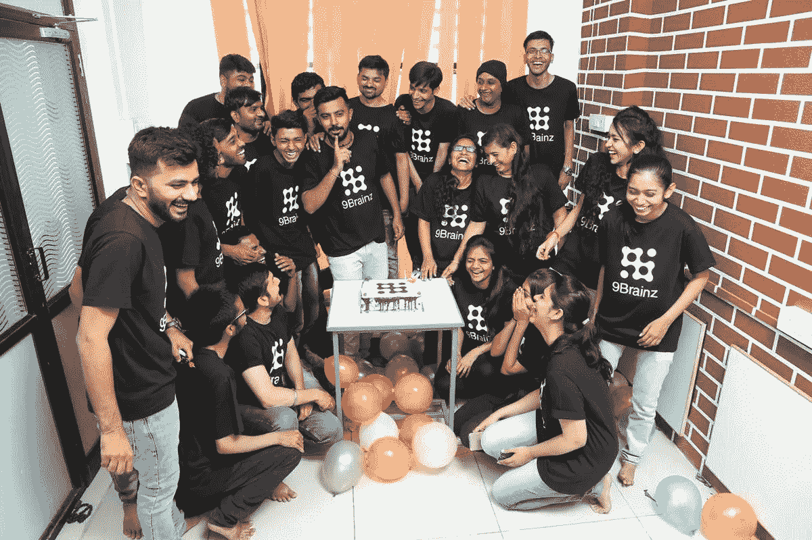
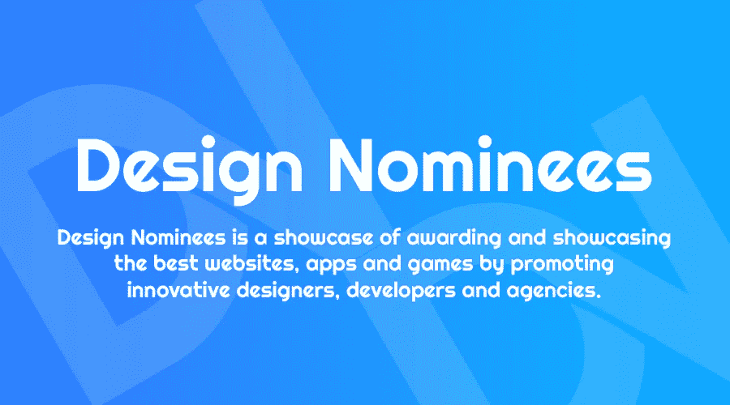

# 设计提名面试

> 原文：<https://medium.com/visualmodo/design-nominees-interview-dddcd0f7980b?source=collection_archive---------0----------------------->

Design Nominees 是网络上最好的 CSS 设计图库之一，当然，他们惊人的项目背后有很多工作。因此，我们准备了这个采访问题，这样你就可以更多地了解这个品牌，我们将看到这个伟大的互联网公司的历史，它正在帮助设计界，并美丽地展示他们的作品。

# 设计提名面试

# 你是谁？

我们成长。我们喜欢。我们珍惜每一个阶段，每一刻。我们也不会错过珍惜过去的回忆。我们相信“成长的快乐”。我们是 [9Brainz](https://9brainz.com/)

9Brainz 是一个雄心勃勃的智慧团队，是第一家提供虚拟现实和 3D 艺术以及其他 IT 产品最佳服务的技术公司。

# 你是做什么的？

衡量我们是谁的标准是我们做了什么。我们有义务为 IT 产品提供广泛的服务。举几个例子:移动应用程序开发，网站开发，搜索引擎优化，应用程序库，虚拟现实应用程序，增强现实应用程序，UX/用户界面设计，三维艺术服务。

但是我们做什么，从来没有我们怎么做重要。质量和满意度是我们的客户不断带着新项目和合同回到我们身边的原因。

# 你的公司背后是谁？

公司是我的宝贝。这里的“我的”是 Ravi Gadesha，该公司的主要创始人和现任首席执行官。因为我的声音团队，我已经能够卷起袖子推出不同的产品。[设计提名](https://www.designnominees.com/)是我们最敬爱的资深设计师和开发人员——aa shish kach rola 和 Mahesh Lamba——的关键理念。

# 是什么让你想创业？

当我看到 4 年前的自己时，Ravi 当时正在追求 IT 产品服务的质量。我也在努力加入蓬勃发展的虚拟现实和相关产品市场。也许正是这种渴望让我在非常坚实的基础上开始了这项事业。

# 创业时最大的挑战是什么？

根据我的经验，最大的挑战不是开始，而是维持和提高标准。然而，面临的最大挑战是营销。营销。和营销。它不是关于营销公司名称来获得客户，因为我们有来自全球各地的最好的客户。但是销售内部产品。

# 谁帮助了你，他们在塑造你的业务方向中扮演了怎样的角色？

我的妻子是我一生中遇到的最好的分析师之一，她是 9Brainz 在这里的原因。她总是对我的工作、我对技术和 IT 产品的愿景非常感兴趣，并在适当的时候推动我创办了这家公司。从那以后就没有停止过。有人说得对:

"良好的开端是成功的一半。"

# 你从事开发/设计多久了？

我从事[设计](https://visualmodo.com/)和开发领域已经 7 年了。但我很高兴团队中有在同一领域拥有 11 年经验的人。这导致了 9Brainz 的成功建立，并在两年半的时间里平稳运行。

# 你的设计/开发理念是什么？

给你好看和感觉好的冲击，才会赢得大家的心。所以，你的品味很重要。这是任何产品设计和开发的基础。下一步是与 R&D 一起深入了解产品，并从零开始。主要的重点是开发一种超越所有其他产品的口味。

# 你对其他刚刚起步的设计师/开发者有什么建议？

对于刚刚起步的[设计师](https://visualmodo.com/blog/)和开发商来说，清单上有三件必不可少的事情:

1.  培养高质量的品味。你认为的不仅仅是正确的方法。多年的观察有时已经足够了。
2.  召集合适的人员和其他资源
3.  对细节有眼光

# 你在空闲时间喜欢做什么？

网飞。一个词概括了这一切。

就是这样，如果你想分享任何东西，请随意使用下面的评论部分，并在他们的 [Twitter](https://twitter.com/designnominees) 个人资料中关注我们的设计之友提名者。