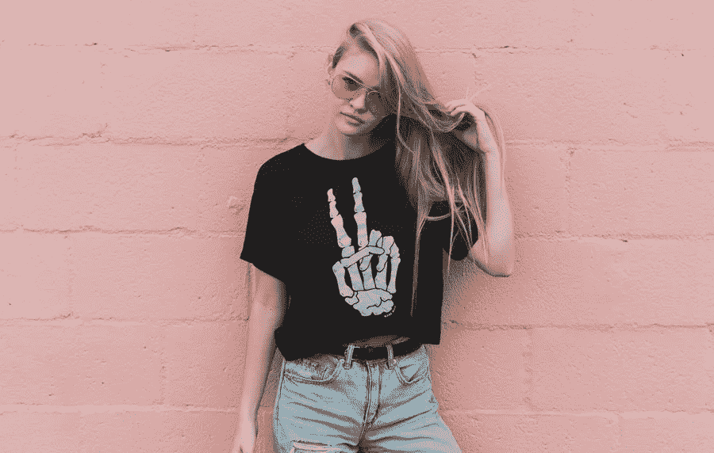

# 2019 年服装电子商务网站应该关注的设计趋势

> 原文：<https://medium.com/visualmodo/design-trends-clothing-ecommerce-websites-should-look-out-for-in-2019-9228de39301b?source=collection_archive---------1----------------------->

我们不要在这里拐弯抹角了，你想赚钱。当然，获得(或设计)最好的网站是一个美好的目标，事关声誉和对工作的普遍自豪感。但是你也希望这个网站给你(或你的客户)带来更多的客户，一个稳定的投资回报率，并作为公司品牌的推广。为了实现这一切，你需要与时俱进，如果你想保持相关性，你需要跟随最新的趋势。赢得竞争优势不是一件容易的事，但这是可以做到的。最重要的地方之一是，你必须在时尚界以及任何与之相关的领域保持相关性。在这里找到 2019 年服装电子商务网站的顶级设计趋势。

# 服装网站的设计趋势

这是一个古老的问题——为金钱牺牲艺术。然而，幸运的是，我们预计服装电子商务网站的趋势将围绕创意和流动性。如果你想跟上潮流，并且真的想给你的客户留下深刻印象，你很清楚停滞不前不是一个选项。因此，结合在与时尚相关的行业中保持相关性所需的创造力，以及你需要赚钱的简单事实，我们预计以下网页设计趋势将在 2019 年变得非常相关。

# 与时俱进

一个真正会持续下去的趋势(也就是说，它不是一种时尚)需要反映世界和现实。这在过去一年发生的所有社会变化中可以最清楚地看到。网站需要包容，展示可能对其产品感兴趣的各种人。事实上，包容性在商业中的重要性是不可低估的。它在各个方面改善你的业务，让你成为这个世界真正需要的社会变革的一部分。

现在，为了正确地展示这一点，您可以做几件事情。首先，在你的网站上找到的任何人的照片和图像中，你应该呈现不同种族背景的人。换句话说，不要只让白人穿你卖的衣服，而是来自所有地方和信仰的人。此外，尽量保持文化敏感性。某些服装风格，比如印有笑话的 T 恤衫，可能会变得对文化不敏感。

# 尝试字体

极简主义似乎是 2018 年的一个主要趋势。现在，东西变得更加奢华，更加狂野和精致。尝试字体应该是网页设计的一个趋势，不管这个网站代表着什么行业。

今年，我们期待一些更花哨、更复古的字体，比如衬线字体。这种风格带有一丝优雅和时尚，我们相信与 2018 年相比，2019 年将会更受欢迎。事实上，你希望你的[内容能够吸引注意力](https://visualmodo.com/write-amazing-blog-post/)，让人们继续阅读，并有希望查看正在出售的产品。

# 复古

如今，几乎所有的东西都出现了复古风格的复兴。网站、汽车、服装、音乐……80 年代已经到来，vaporwave 美学已经巩固了自己，旧时代的外观是任何手工咖啡馆和家庭酿造酒吧的必备。美国、澳大利亚、德国、英国，每个人都热衷于复古造型。你会注意到[的高品质定制衬衫澳大利亚](https://www.allstargraphics.com.au/)松树有这种八七十年代的外观。

因此，我们预测 2019 年的趋势是复古外观成为设计的主流。类似于三、四十或五十年前的摄影作品的柔和色彩，复古的外观，怀旧的风格——这些都可以帮助你突破自我，在竞争中获得优势。

# 有点不对称的东西

有许多工厂制作的网站，都在争夺客户的注意力。你想打破它，违背自己的意愿。2019 年，我们预计人们会厌倦千篇一律的网站，并相信他们会转向更吸引眼球的东西。不对称的布局、风格和设计将帮助你的网站脱颖而出。然而，这里的挑战是找到实际功能和一个好看的网站之间的平衡。

# 视频热潮

电子商务网站上的视频并不新鲜。然而，这些视频的质量现在比以往任何时候都更加重要。以前，你只有一个简单的视频或一个已经在电视上播放的广告。现在，你想要故事，你想要更具原创性和艺术性的东西，同时保持视频质量在美丽的最高高清清晰。

有很多理由[为什么你应该使用视频](https://visualmodo.com/5-reasons-use-videos-online-marketing/)来帮助你的网站，但是当你考虑到它们必须有多好的时候，所有的理由都被放弃了。内容需要是相关的，需要对你的产品有实际的帮助。所以，一个多角度展示一件衣服的视频。所说的物品应该是动态的，为艺术实验提供一些空间，同时传递一些与潜在买家相关的信息。

伙计们，我们相信，一些设计趋势将在 2019 年席卷全球。这些是关于过去和未来的。使用复古外观，但利用更好的视频来恰当地展示你的产品。不对称的字体有点疯狂，但用老派字体保持优雅。