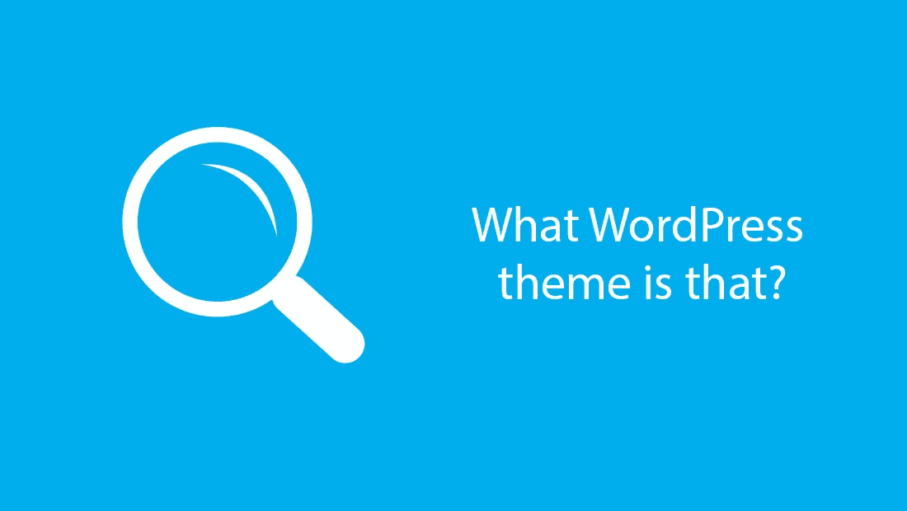
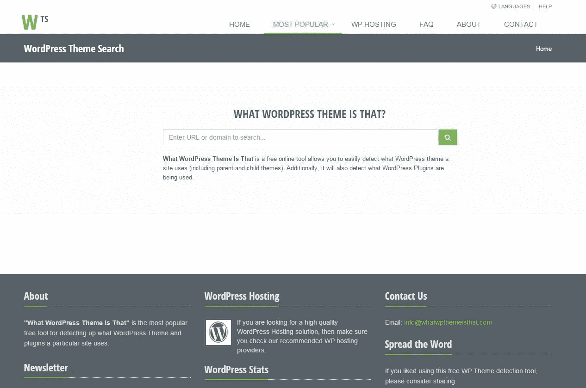

# 发现什么主题和插件是一些网站使用

> 原文：<https://medium.com/visualmodo/discover-what-themes-and-plugins-is-some-site-using-661d6e3cd026?source=collection_archive---------1----------------------->

什么是 WordPress 主题是一个免费的在线工具，它可以让你很容易地发现一个站点使用了什么 WordPress 主题(包括父主题和子主题)。此外，它还将检测哪些 WordPress 插件正在被使用。

你有没有在浏览互联网的时候偶然发现一个令人惊叹的网站，然后，当你惊讶不已的时候:这个网站用的是什么主题？或者:如果我能在我的网站上使用这个设计不是很好吗？现在你可以使用 [WhatWPThemeIsThat](http://whatwpthemeisthat.com/) (一个免费的在线服务，通常被称为“**”)那是什么 WordPress 主题？**’)。

当然，有很多很棒的 WordPress 主题市场(如果你不确定从哪里开始，只需跳上一个网站，如 [MOJO](https://www.mojomarketplace.com/store/visualmodo) 或 Creative market，你无疑会发现大量华丽的设计)。

然而，没有什么能比得上为一个已经存在的网站设计一个完美的惊喜——如果你发现自己面对一个你绝对喜欢的网站设计，然后呢？不幸的是，与浏览主题商店不同，除非你能够阅读网站背后的代码，否则你无法立即知道使用的是什么主题

简而言之:*什么是 WordPress 主题,*是一个被设计来做它在 tin 上所说的事情的网站——即检测任何给定网站正在使用的 WordPress 主题。

在这篇文章中，我将带着*旋转一下那个*是什么 WordPress 主题，向你展示它是做什么的，如何使用它，最重要的是，它是否真的有效(如果有效，效果如何？).

# 发现这是什么 WordPress 主题？

什么是 WordPress 主题?是一个免费的主题检测工具，位于 WhatWPThemeIsThat.com。由终极营销策略公司开发，它是首批上市的主题检测工具之一，早在 2011 年就已推出。

当然，首先也是最重要的，一个网站必须运行 WordPress，你才有希望发现它的主题——这里有一个我们的快速教程，教你如何测试一个网站是否在为你自己使用 WordPress。

如果满足了第一个标准，【WordPress 的主题是什么，就可以挖掘网站的代码来寻找网站主题的蛛丝马迹。

除了网站的主题之外，该工具还能够识别网站正在使用的插件。然而，这是一个困难得多的命题，不太可能检测到正在使用的每一个插件。

到目前为止，一切顺利——您现在可能已经对该工具有了一个很好的想法。然而，它的侦查技巧有一些限制。

首先，并不是所有的 WordPress 网站都会有结果。出于安全考虑，一些网站会主动隐藏他们正在使用的 WordPress，以及他们正在使用的主题。

其次，有问题的 WordPress 网站可能正在使用一个自定义主题，从头开始开发。(同样值得指出的是，如果一个商业主题被修改了，【WordPress 主题是什么，不会注意到这个事实。)

更进一步，如果插件在特定页面上不活跃，该工具检测插件的尝试将会受阻。如果你想找到一个特定插件的名字，确保你找到了一个你确定正在使用它的 URL。

# 使用网站

只需访问 WhatWPThemeIsThat.com，然后输入你想检查的网址。记住:一些网站会在不同的 URL 上使用不同的主题，例如，他们可能会为他们的博客使用单独的主题。同样，如果你的重点是插件，确保你选择一个你知道该功能是活跃的 URL。

输入网址后只需点击 [*搜索*](https://visualmodo.com/blog/) 。

如果你搜索的网站没有使用 WordPress，你会看到如下错误信息:

然而，如果使用 WordPress，它*是*，工具将返回尽可能多的信息。这些信息分为两部分:主题和插件。

# discover 是如何工作的？

为了回答这个问题，我专门设置了一个测试环境，安装了免费的 Twenty 主题。

我还安装了八个免费插件，活跃在网站的前端。我选择的插件有:

*   联系表格 7
*   网络商务
*   WordPress 的 MailChimp
*   独白精简版
*   WP 谷歌地图
*   爱好者作者框
*   Fatcat 应用程序的简易价格表
*   相关职位

为了让事情变得更有挑战性，我还安装了四个*幕后* WordPress 插件:

*   Yoast SEO
*   iThemes 安全
*   WP 超级缓存
*   禁用评论

解决了这个问题，让我们看看*的主题是什么，好吗？*

那么*是怎么做到的呢*是什么 WordPress 主题呢？

首先，值得注意的是，它的主题是“2016 年”。

其次，它还彻底清除了网站上安装和激活的所有八个前端插件。这意味着如果你爱上了一个网站上的特定设计元素——比如说，一个选择加入的表单——你可以找到那个主题是什么，并且你很有可能找到负责它的插件。

对于“隐藏”插件来说，这个插件表现稍差。该工具只标记了安装的四个插件中的 [WP 超级缓存](https://visualmodo.com/best-wordpress-cache-plugins/)。不过，这是意料之中的，因为这些插件很难找到。因此，虽然该工具在检测网站前端插件构成方面非常有用，但在揭示后端基础设施方面显然不太有效。

总的来说，网站的表现给我留下了深刻的印象。我原本期待它能让主题正确，但我认为它在检测插件方面更像是*漫无目的的*。在这个(不可否认是一次性的)测试中，它检测到的插件是 100%准确的。

当然，这并不意味着结果每次都一样准确，我们已经概述了该工具的一些局限性。一些 WordPress 网站所有者可能会隐藏他们的 WordPress 用法，使用自定义主题，或者采取安全措施来隐藏他们的主题。

同样，当涉及到检测插件时，这个插件更难调用。从这个测试的结果我们可以得出结论，任何主动部署在前端的插件都有可能被检测到。然而，仅仅因为一个插件*没有被*检测到，并不一定意味着它没有被使用，所以一定要对结果持保留态度。

# 结论

总而言之，discover 的 WhatWPThemeIsThat 性能相当好(尽管有一些限制)。它可以免费使用，运行时间不超过几秒钟，结果也相对准确。

总的来说，我是一个超级粉丝【WordPress 的主题是什么，下次我遇到一个有*必备*设计的网站时，我一定会再次部署它！