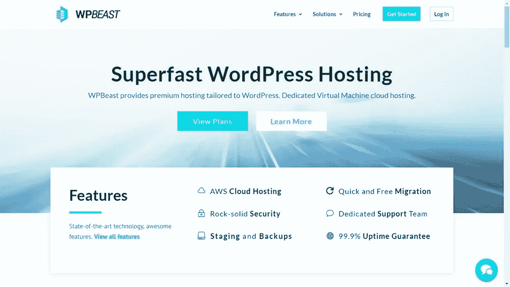

# 剖析 WordPress 主机:你的网站需要什么样的主机？

> 原文：<https://medium.com/visualmodo/dissecting-wordpress-hosting-what-hosting-do-you-need-for-your-site-669dbf8dc504?source=collection_archive---------0----------------------->

每个网站，不管是不是 WordPress，都依赖于稳固的虚拟主机。虚拟主机本质上是一种将你的网站文件连接到互联网的服务，允许人们访问你的网页并与之互动。点击了解更多关于主机和 WordPress 主机的信息[。](https://visualmodo.com/web-hosting-works/)

# 需要什么 WordPress 托管？

不幸的是，虚拟主机的世界，尤其是 WordPress 虚拟主机，是拥挤和难以理解的。有太多的公司提供托管服务，在签约之前很难保证质量。

这通常会导致人们使用错误类型的主机，或者被不能满足他们需求的主机所困扰。在这里，我们试图剖析主机世界，以便将其分为两种主要类型。

共享主机
T3 出发

使用一个共享的主机服务提供商意味着你的[网站](https://visualmodo.com/)文件将会和其他网站存储在同一个服务器上。如果您的流量很低，这是没问题的，但是有几个潜在的问题:

*   共享主机通常提供较慢的加载速度
*   停机时间通常更频繁
*   您的站点可能会受到同一服务器上托管的其他站点的流量的影响

如果项目很小或者你不打算快速发展，我们通常推荐使用共享主机。以下是一些好的提供商:

*   [GoDaddy](https://godaddy.com/)
*   [HostGator](https://hostgator.com/)

使用共享主机没有错，但是要确保它能满足你的需求。

价格也不错，每个月只要几美元。然而，请确保您了解您正在提供的促销活动，因为在促销活动结束后，每项服务的价格都会大幅上涨，通常会超过每月 10 美元。

托管云托管
*用于需求较高的网站*

托管的另一个关键类型是托管云托管。这些服务利用云服务，如亚马逊网络服务或谷歌云平台。

具体来说，每项服务的工作方式取决于提供商——一些提供商仍然运行共享主机模式，但使用智能算法来分散负载，以提高与传统云主机相比的性能。还有的为每个网站提供专用虚拟机，这些虚拟机是云平台内的虚拟空间。

一些优秀的提供商包括:

*   [WPBeast](https://wpbeast.co/)

这些类型的主机的优势是，您通常可以获得更高的正常运行时间率和更快的速度。但是你需要付费——服务起价大约是每月 30 美元。

事实上，还有其他主机介于两者之间，或者属于不同的类别。例如，一些主机提供一个完全专用的服务器来运行你的网站。对于拥有大量用户的网站来说，这可能是必需的。

做决定时，你应该经历三个步骤:

想想你的网站。你的项目是什么？你希望实现什么？你希望什么时候实现它？

**根据这些信息，猜猜你一个月会有多少访客。**还要考虑你是否需要一个加载速度超快的网站，或者这对你来说是否不太重要。

**记住你的长期目标，选择最符合你需求的主机。**

我们 Visualmodo 可以确保 WPBeast 运行良好，并且可以推荐它！