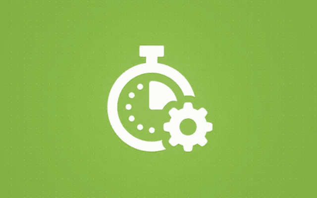
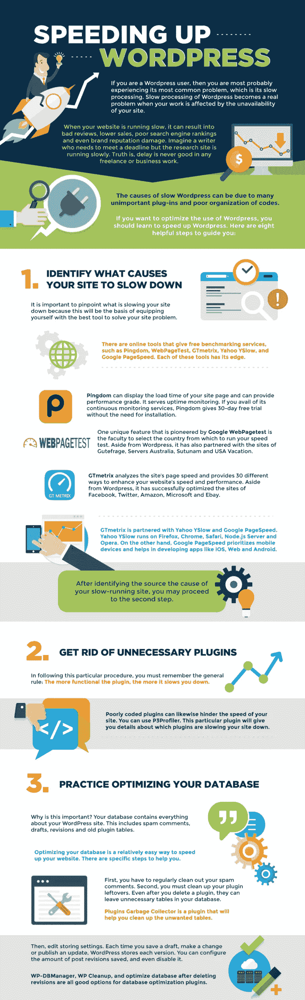

# WordPress 插件会影响网站速度吗？

> 原文：<https://medium.com/visualmodo/do-wordpress-plugins-affect-site-speed-b9830f042d45?source=collection_archive---------0----------------------->

几天前，我们的一个客户问我，WordPress 插件会影响网站速度吗？问得好。综上所述:插件可能会影响网站速度，根据插件，它可以影响网站加载速度很多。这取决于开发 plugin 的方式、代码质量、插件大小以及插件加载的文件。

# WordPress 插件会影响网站速度吗？

是的，原因是有更多的代码涉及到基础设施，因此你需要有所收缩，以使您的网站运行更快。自然，速度较慢的网站在 SERPs 上的排名会比速度较快的网站低，后者的平均排名是 2-3 秒(特别是因为超过 60%的网站流量是面向移动的)。你可以在这份清单上了解更多信息。

你应该明智地选择你的插件，拒绝那些让你的网站变慢的插件。只激活你真正在用的插件，删除其他你不用的插件。虽然不仅仅是插件；图像、视频等也会降低你网站的速度。上传到网站的越少，嵌入的越多——[越好](https://www.greengeeks.com/tutorials/article/the-difference-between-embedding-and-uploading-a-video-in-wordpress/)。

## 如何控制插件？

在你的[网站上，你能做的最重要的事情就是只使用那些良好编码的插件，有良好评价的插件，以及由可靠来源推荐的插件。如果你发现一个 WordPress 插件影响了你网站的负载，那么寻找一个更好的插件，做同样的工作，但是更好。接下来，你需要开始使用缓存和 CDN 来进一步提高你的网站的性能和速度。](https://visualmodo.com/)

另一个你应该考虑的因素是你的网站托管。如果你的主机服务器没有得到适当的优化，那么它将增加你的网站的响应时间。这意味着不仅仅是插件，你网站的整体性能都会变慢。确保你使用的是最好的 WordPress 托管公司之一。

作为最后的手段，你可以卸载那些你可以不用的插件。仔细检查你的网站上安装的插件，看看你是否可以卸载其中的一些。这不是一个理想的[解决方案](https://visualmodo.com/wordpress-themes/)，因为你将不得不在速度特性上做出妥协。