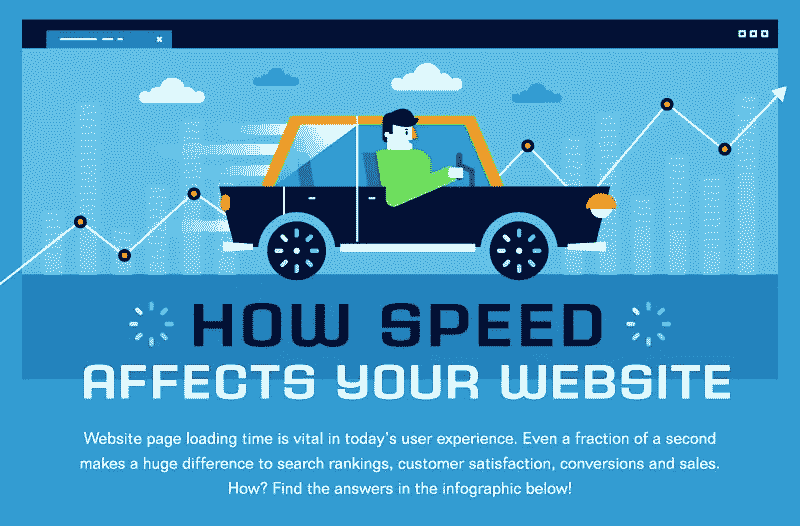

# 你的网站需要提速吗？信息图表

> 原文：<https://medium.com/visualmodo/do-you-need-to-speed-up-your-website-infographic-fcfc5ccf48b3?source=collection_archive---------0----------------------->

网站速度可能很棘手。每个人都知道它很重要，但它仍然是网站最容易被误解的方面之一。那么你怎么知道你的网站是否需要更快呢？

这也很棘手。研究表明，网站所有者不擅长凭直觉决定他们网站的速度。对他们来说，装载时间似乎更短。另一方面，访问者体验到相反的效果——加载时间看起来更长。

你最好的选择是找一个工具来检查网站的性能。一个简单的谷歌搜索就足够了，因为有很多免费工具可以做到这一点。那么你的目标速度是多少？直接来自[主办法庭的专家意见](https://hostingtribunal.com/)建议你的页面应该在 3 秒内加载。

这可能看起来快得可笑，但研究支持它。当然，在线上，越快越好。所以，让你的网站尽可能快是一个好政策。然而，推荐 3 秒的加载时间是有原因的。[比这个速度慢的网站会有很大的缺点。失去访问者是一个不利因素——54%的人会离开一个加载时间超过 3 秒的页面。即使是留下来的访问者也只会访问更少的页面。](https://awards.visualmodo.com/)

# 加速你的网站

对于网店店主来说，速度也很重要。更长的加载时间也意味着更低的转化率和更低的客户忠诚度，尤其是当加载时间超过三秒的时候。缓慢也影响搜索引擎优化。慢速网页会受到谷歌搜索排名算法的惩罚，在搜索中得分较低。访问者由于速度慢而快速离开一个页面也会降低该页面的排名。两者都意味着更少的交通流量。

很明显，网站速度是在线成功的关键因素。了解了这一点，你现在可以改善你的网站的加载时间。或者，如果你想了解更多，你可以在下面的信息图中找到提高网站性能的好处。

查看信息图

 [## 你的网站需要提速吗？信息图- Visualmodo 博客

### 网站速度可能很棘手。每个人都知道它的重要性，但它仍然是最被误解的网站之一…

visualmodo.com](https://visualmodo.com/need-speed-up-website-infographic/)