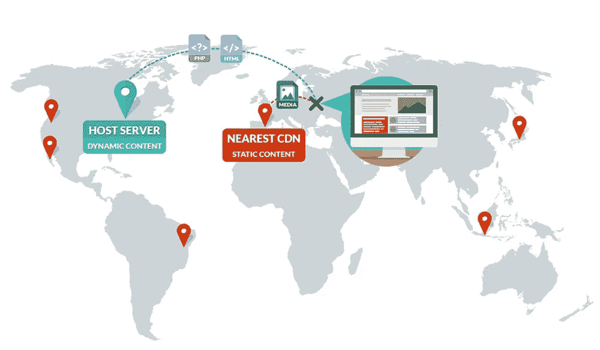
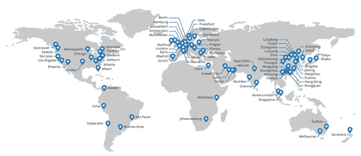

# 我的网站需要用 CDN 吗？

> 原文：<https://medium.com/visualmodo/does-my-website-need-to-use-a-cdn-1568fa5aed38?source=collection_archive---------0----------------------->

使用 CDN 可以大大提高网站速度，同时还有许多其他好处。尽管如此，它们可能并不适合网站的每一种风格。现在看你是否需要使用它。

一个缓慢加载的网站是你在线业务的死刑判决。这听起来可能有点刺耳，但这是事实。从访问者登陆你的网站的那一刻起，他们就在判断和决定你是否应该被信任。

如果你有一个缓慢加载的网站，这是对你不利的一击。

下面你将了解 CDN 实际上是什么，它们是如何工作的，以及为什么你可能想在你当前的网站上利用 CDN 的力量。

# 什么是 CDN？

CDN 代表内容交付网络。这些网络有助于提供离用户最近的网站版本。他们不必把你的网站文件发送到世界各地，而是可以直接访问他们附近的服务器。

你可以做所有必要的现场速度优化，但如果你的网站仍然落后，那么投资 CDN 可能是明智之举。

对于拥有大量全球用户的网站来说，这非常有帮助。访问者不必访问存储在蒙大拿服务器上的网站，他们可以访问离他们最近的网站版本。这可以[大大](https://visualmodo.com/)帮助减少几秒钟的加载时间。

# 它是如何工作的？

当一个访问者访问你的网站时，有一些文件需要加载。这些文件的副本存储在遍布全球的 C.D.N. edge 服务器上。当有人访问您的网站时，他们可以访问在物理位置上离他们最近的文件。

如果你没有使用 [CDN](https://visualmodo.com/) ，那么这些文件将需要从一个服务器位置访问，这个位置可能在世界的另一端。

有了 CDN，文件必须传输更短的距离，因此加载时间也缩短了。

# 常规托管和 cdn 有何不同

因为你已经有了一个 WordPress 站点，你的站点已经被托管在一个特定的位置。您网站的所有文件都存储在这个单一的物理服务器上，当用户输入您的 URL 时就可以访问它。

cdn 与您的虚拟主机一起工作。本质上，CDN 工程增压你现有的主机。您仍然将常规的非静态网站文件存储在原始主机上。但是，静态文件存储在全球不同的服务器上。

注意，一些 WordPress 主机提供商实际上已经在他们的主机包中内置了 CDN，所以你不必在现有主机上使用单独的 CDN。

# 使用 CDNs 的好处

提高速度和性能是网站所有者决定使用 CDN 的主要原因。然而，除了提高站点性能之外，它们还提供了更多的好处。

# 1.改进的性能

cdn 有助于大大提高网站性能和加载速度，无论您的访问者位于世界的哪个角落。

这导致了用户体验的改善，因为你的访问者不需要在你的网站上停留。此外，你可以看到搜索引擎有所提升，因为加载速度是目前谷歌排名的一个因素。

# 2.延长正常运行时间

如果你的网站容易因为流量激增而崩溃，那么你需要一个 CDNs 来支持你。cdn 的构建是为了让您的网站永远不会离线，如果一台服务器瘫痪或流量过载，您可以简单地利用另一台现有的服务器。

# 3.提高安全性

cdn 可以提供更高级别的在线安全性。例如，如果您的网站受到 DDoS 攻击的威胁，那么流量将简单地恢复到不同的服务器。通过使您的站点能够被多个全球服务器访问，您分散了只有一台主机的风险。

# 我需要使用 CDNs 吗？

大多数现存的 WordPress 网站可以从使用 CDN 中获益。事实上，Akamai 最近预测，两年内超过一半的网站流量将通过 cdn 流动。

一些风格的 WordPress 站点不需要使用 CDNs，例如:

*   如果你所有的流量都来自一个本地来源
*   如果你没有收到高流量，你目前的主机就足够了
*   如果你现在没有 cdn 的预算

如果你不在我们上面提到的场景中，那么你绝对应该使用 CDN 来增强你当前的[主机](http://theme.visualmodo.com/rare/)。

如果您的网站正在增长，并且您收到了大量的流量，想要为您的网站增加一层安全，或者您想要更有效地为全球的观众服务，那么 CDN 会非常有用。

对于你的 WordPress 站点来说，CDN 是一笔值得的投资。一些像 Cloudflare 这样的服务甚至免费提供基本的 CDN 计划，所以你可以看看它是否对你的网站有益。

*现在交给你了。你的 WordPress 网站使用 CDN 吗？你看到什么改进了吗？请在下面的评论中分享。*