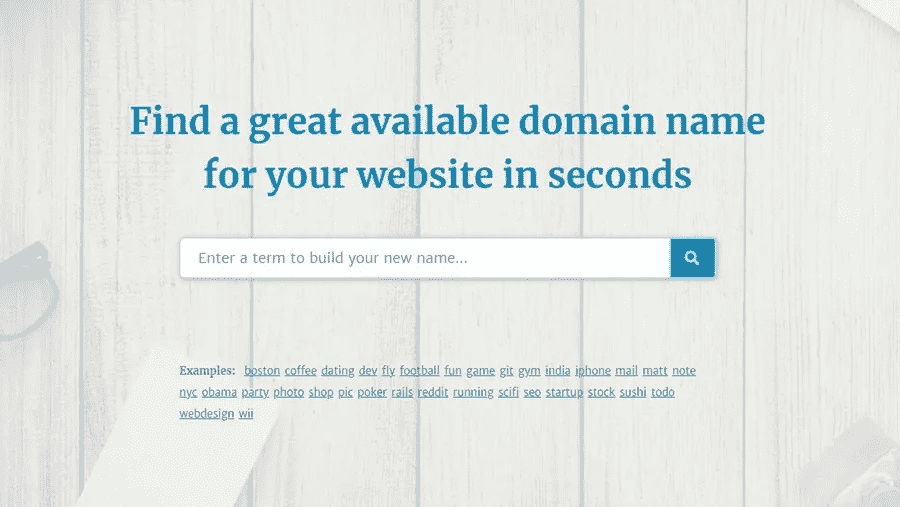

# 域名生成器终极列表

> 原文：<https://medium.com/visualmodo/domain-name-generators-ultimate-list-90502a1619fd?source=collection_archive---------0----------------------->

选择域名并不容易。你想要一个既令人难忘又有意义的网站地址，同时描述你的品牌是什么。但是，即使你已经想出了一些吸引人的和值得你的品牌，你可能会发现。com 域已被占用。那只会让你回到起点，这意味着更多的烦恼和头痛。但是，想出一个已经存在的好域名并不一定要花很长时间。尝试这些顶级域名生成器之一，排名不分先后，并节省一些头发拉。

# 域名生成器列表

我们将从需要您最少输入的域名生成器开始(它们完成了大部分工作)，然后通过不同的定制选项和参数继续讨论那些使您成为操作大脑的生成器。

# [域名类型](https://domaintyper.com/)

这是我个人最喜欢的工具，用于微调我的域名和检查各种顶级域名的可用性。也就是说，它实际上不是一个可以从头开始使用的生成器。

你如何使用这个工具？只需要开始输入你想要的名字，DomainTyper 就会实时给你建议(不需要点击任何按钮)，因此这个工具的名字就有了。当您查看可用域名时，您可以添加或删除您最感兴趣的域名，甚至可以检查可用的社交媒体用户名。

谁应该使用它？如果您几乎确定要使用哪个域名，但是您想检查为其注册不同的 TLD 和社交媒体用户名是否不会有问题，请使用它。

# [精益领域搜索](http://www.leandomainsearch.com/)

这是由 team Automattic 创建的一个工具，该公司负责 WordPress 平台和 WordPress 本身的核心团队，这意味着他们在域名和网站方面应该很有经验。

你如何使用这个工具？这个真的很好用！你所要做的就是提供一个种子关键词——通常是定义你的定位的东西——然后让奇迹发生。这个域名生成器带回来几十甚至几百个域名创意，大部分都可以注册为. com。

# [造字师](http://www.bustaname.com/word_maker)

BustAName 的域名生成器比列表中的其他工具需要更多的输入。通过它的各种参数，你可以控制如何构建你的域名，以及你对什么样的[元素](https://visualmodo.com/blog/)感兴趣。因此，生成的域听起来很原始。

你如何使用这个工具？只要给它你的主要种子关键字，并选择你是否希望它出现在你的域名的开头或结尾。然后，选择你希望你的域名听起来有多自然。最后，限制你的域名的字符数。此外，您可以选择显示默认 TLD 之外的一些 TLD..com

# [名摊](http://www.namestall.com/domain-name-generator)

这不是一个单一的工具，而是一套域名生成器。最有用的三个(IMO)是主域名生成器、三字域名生成器和押韵域名生成器。

你如何使用这个工具？从 NameStall 上的主域名生成器开始，输入您的种子关键字，选择您希望它出现在开头还是结尾，启用/禁用连字符，然后选择一个“单词组”来完成您的域。最后一步实际上很酷，它给你提供了如何定制域名的有趣的可能性。

例如，你可以选择一个名为“1500 个流行遗言”的“单词组”。这听起来就像一个单词列表，可以很好地作为域名的结尾。还有其他类似的词组，如“100 个流行数字”、“200 个流行的 2 个字母单词”、“500 个流行的第一个单词”、“基本英语单词”等等。这给了你一些巨大的可能性来定制你的搜索。

谁应该使用它？如果你对你想要的完整域名没有太多概念，但是你想要能够定制生成器如何执行它的工作，NameStall 的域名生成器是一个有趣的解决方案。

# [命名男孩](http://www.nameboy.com/)

Nameboy 生成的域名非常有趣——尤其是如果你想注册比标准域名更多的域名。也就是说，一旦你对自己的域名有了大致的概念，它会做得更好。

你如何使用这个工具？为了最大限度地利用这个工具，你应该为它提供你的主要种子关键字，再加上一个你想合并成一个域名的次要关键字。或者，您可以允许连字符，甚至要求生成的域名押韵。

谁应该使用它？如果你对你想要的域名有一个大概的想法，但你仍然想寻找该名称和其他可用顶级域名的可能的连字符变体，那么就使用它。

# [Shopify 工具](https://www.shopify.com/tools/business-name-generator)

顾名思义，这个工具是由 Shopify 开发的，Shopify 是网络上最受欢迎和最好的电子商务解决方案之一。这个生成器的运行方式与 LeanDomainSearch 非常相似。

你如何使用这个工具？只需输入一个种子关键字，看看这个生成器对你有什么建议。你将得到的域名都可以在。如果你真的想在这个域名上建立一个 Shopify 商店，你可以当场注册。

# [域名谜题](http://www.domainpuzzler.com/)

这个的不同之处在于，当你生成一个完美的域名时，你可以使用多个关键词作为构建模块。Domain Puzzler 采用这些关键字，并通过所有可能的方式将它们组合起来。同时，它检查哪些组合可用于注册。

你如何使用这个工具？你所需要做的就是提供一组你想在你的域名中使用的关键词，选择你感兴趣的顶级域名，剩下的工作将由工具来完成。你也可以收藏个人域名。

# [不可能](http://impossibility.org/)

不可能性在其生成域名的方法上非常有创意，并且它还为您提供了一些关于如何定制该过程的简洁选项。

你如何使用这个工具？首先，提供一个种子关键字，并选择希望添加到该关键字中的内容。你可以从动词、形容词和名词中选择，你也可以选择它们应该是四个、五个还是六个字母的单词，以及它们应该出现在开头还是结尾。

# [域 Sbot](http://www.domainsbot.com/)

DomainsBot 做得很好，不仅为您生成了有趣的域名，还让您选择想要与原始种子关键字一起使用的同义词。这可以产生一些很酷的定制，否则你不会偶然发现。

你如何使用这个工具？开始提供一个或多个种子关键词。完成初始搜索后，您将能够定制您感兴趣的顶级域名，添加/更改同义词，甚至添加您喜欢的前缀和后缀。域名列表 DomainsBot 从最简单的关键字组合开始，然后进入更有创意的组合。

# [命名网格](https://www.namemesh.com/)

NameMesh 是一个比较好的域名生成器，如果你想在域名中包含多个关键词，可以查看一下。NameMesh 根据你的关键词创建的域名列表是巨大的，它被整齐地分为几个类别:普通、新、短、有趣和搜索引擎优化。

你如何使用这个工具？首先输入你的关键词——你可以有一个或多个——然后选择你感兴趣的顶级域名。NameMesh 会给你一个巨大的生成域名列表，并指出其中哪些可以注册。

提示:取消选择“隐藏注册”，因为这将让你更好地了解某些域名的可行性。基本上，如果一个域名的大多数其他顶级域名已经注册，你就不需要它了。

# 结论

有了这 16 个域名生成器，你应该可以很好地描述你的企业。我错过了什么吗？请在下方留言评论。