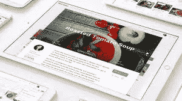

# 域名购买:接下来是什么？

> 原文：<https://medium.com/visualmodo/domain-purchased-what-comes-next-244283ae8617?source=collection_archive---------0----------------------->

那么，你的网站注册了，域名买了，接下来呢？购买域名后，了解如何建立一个成功的网站。

有了域名意味着你离你的网站上线又近了一步。现在你需要做更多的事情来让你的网站运行起来。如果你买了一个域名，但不知道下一步该怎么做，请继续读下去。在这篇文章中，我将分享购买域名后需要做的 9 件事。所有的事情都很容易做。你不需要成为一个精通技术的人来做这些。

完成所有这些步骤后，你的网站就可以运行了。现在让我们开始…

你需要一个虚拟主机

如果你已经从域名提供商那里购买了主机方案，你可以跳过这一步。

大多数域名提供商，如 [GoDaddy](https://www.godaddy.com/) 或 Namecheap，都提供带有他们域名的托管包。但是它们总是有一些限制。我永远不会建议你从域名提供商那里购买主机。

更好的方法是使用知名的主机，如 HostGator 或 Bluehost。

*如果你想知道为什么你需要一个虚拟主机计划，这里有答案。*

虚拟主机是一个服务器，在这里你可以保存你网站的文件，比如图片，视频等等。购买托管计划意味着从远程计算机购买一些空间来存储您的文件。这台计算机将使你的网站可以通过万维网访问。

有不同类型的托管计划，如共享托管，VPS 托管，专用托管等。**共享主机是流量不多的新网站的最佳选择**。这也是最实惠的托管方案。

就个人而言，我对 HostGator 和 Bluehost 都有很好的体验。所以我建议你从 HostGator，media temple 或者 Bluehost 买一个托管包。

HostGator 是领先的虚拟主机提供商。您可以在第一个月花费 0.01 美元开始使用 HostGator。

# 连接随您的主机购买的域

如果你已经从同一家公司购买了域名和主机方案，你可以跳过这一步。

购买域名并从不同的地方托管是一个好主意。它使你的网站安全。这也使得你的站点从一个主机转移到另一个主机变得更加容易。

如果你从不同的公司购买域名和托管计划，你必须互相联系，使你的网站活起来。

这很容易做到。只需登录你的托管账户[并复制你的域名服务器。然后登录到您的域名提供商并编辑您的域名服务器。](https://visualmodo.com/)

您可以在欢迎电子邮件或 cPanel 中找到您的域名服务器。然而，你也可以从你主人的生命支持系统中获得帮助。

# 安装平台

姑且称之为软件吧。

为了有效地运行和维护您的站点，您需要在您的主机上安装一个软件。这被称为内容管理系统(CMS)。它允许您轻松发布、编辑和修改您的内容。

有很多 CMS 在那里。 [**WordPress**](https://wordpress.org/) **是最受欢迎的 CMS** ，已经被世界上 18%的网站使用。它也是最好的博客平台。

如果你像我一样不知道如何编码，WordPress 是你的解决方案。非常好用。通过一键安装，WordPress 让创建网站/博客变得异常简单。可以自己安装 WordPress。

# 设计你的网站

如果你选择了 WordPress 作为你的平台，那么你可以自己做。

有很多 WordPress 主题。无论你是要创建一个个人博客还是一个电子商务网站，你都会有可用的 WordPress 主题。

你可以从 WordPress 主题目录[获得一个免费主题，或者你可以从高级 WordPress 主题提供商那里购买一个高级主题。如果你对你的网站/博客很认真，我建议你选择一个高级主题。但如果只是个人博客，可以带免费主题。](https://wordpress.org/themes/)

一旦你选择并下载了你想要的主题，你需要把它安装在 WordPress 上。大多数高级 WordPress 主题都有一个方便的文档。你可以遵循这些教程，让你的 WordPress 站点变得更棒。你需要考虑的另一件重要事情是拥有一个**唯一的域名**。这将增加你的品牌知名度。如果你有一些设计技巧，你可以创建自己的标志。你可以使用在线标志设计工具。然而，你可以从 Fiverr 雇一个专业人士来设计你的 logo，只需 5 美元！

# 用你的域名创建一封电子邮件

拥有一个像 name@yourdomain.com 一样的电子邮件地址不是比 name@gmail.com 更专业吗？

是的，它是。它增加了品牌的知名度和可信度。

你可以从你的托管 cPanel 设置一个免费的电子邮件地址，或者你可以以每月 5 美元的价格使用 Google Apps。

我更喜欢使用托管 cPanel，因为它免费且易于设置。

# 获取社交媒体账户

无论你是小企业主、博客作者还是营销人员，你都必须与你的受众保持联系，以增加参与度。

与你的观众联系的最好方式是，**使用社交媒体网站**。

有很多社交媒体网站。你必须根据你的受众加入其中的一些。一些最受欢迎的社交媒体网站有:

*   脸谱网
*   推特
*   谷歌+
*   商务化人际关系网
*   拼趣

你应该尽快加入这些网站，以确保匹配的社交媒体网址，如[http://facebook.com/yourdomain.](http://facebook.com/yourdomain.)拥有匹配的网址会增加你的知名度。

# 开始在你的网站上添加内容

内容是你网站最重要的东西。没有内容，网站什么都不是。

你网站的成功取决于你的内容。一旦你的网站启动并运行，你需要开始在你的[网站](https://visualmodo.com/)上添加内容。

这里有一些对你的博客或网站最重要的页面。

*   关于页面
*   联系页面
*   服务页面
*   产品页面
*   常见问题页面
*   隐私政策页面
*   投资组合页面
*   广告页面
*   新闻版面
*   订阅页面
*   推荐页面

您不需要添加所有这些页面。只需添加那些适合你的网站/博客。

即使你正在运营一个网站，拥有一个博客也是一个好主意。写博客是为你的网站建立内容的最好方式。它会帮助你从搜索引擎获得流量。

# 将网站提交给搜索引擎

每当你创建一个新的站点/博客，你总是希望人们能很容易地找到你的站点。人们找到你的网站最简单的方法是通过搜索引擎。

要让你的网站在搜索引擎上被发现，你需要创建一个网站地图并提交给搜索引擎。一旦你的网站被搜索引擎索引，你将开始从搜索引擎获得流量。

# 离线推广你的网站

当你刚开始一个新的博客/网站时，你不能指望从社交媒体或搜索引擎获得即时流量。在社交媒体上建立受众并从搜索引擎获得流量需要时间。然而，你可以通过离线推广你的网站来获得即时的流量。这里有一些你可以做的事情来增加你的博客/网站的流量。

1.  把你的网址放在你的名片上。
2.  在笔、杯子和其他好东西上打印你的网址，并免费赠送。
3.  为你的博客/网站定制一件 t 恤。
4.  赞助一个可以推广你网站的活动。
5.  如果你有一辆车，把你的网址放在你车的侧面。

你可以做更多的事情来推广你的网站。要有创意！

**交给你了**

所以这些都是你购买域名后可以做的事情。如果你对此有任何问题，请随时通过评论来问我。然而，如果你觉得这篇文章有用，请帮我在脸书、Twitter 或 Google+上分享这篇文章。