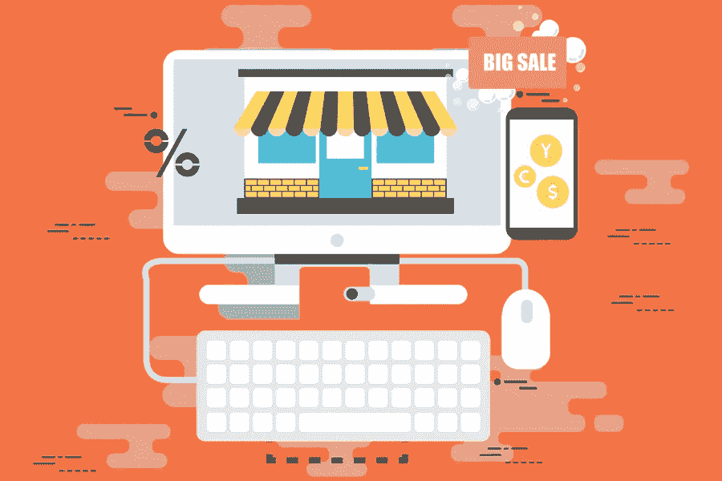

# 电子商务和营销对网站可用性的驱动力

> 原文：<https://medium.com/visualmodo/driving-forces-of-ecommerce-and-marketing-for-site-usability-3f038026be9c?source=collection_archive---------0----------------------->

电子商务是商业的未来，这是毋庸置疑的。在这一过程中，所有商品、服务或任何其他商品的商业交易都是通过互联网进行的。电子商务和营销对网站可用性的驱动力现在很关键，我们将在本文中解释如何做到这一点。

在过去的几年中，电子商务发展迅速，今天的大多数企业都是在线和线下零售相结合的。通过这种垂直整合，公司现在可以向更大的市场和更多的客户销售其多样化的产品和服务。理想情况下，这种特定业务形式的途径分为三大类，例如:

*   涉及第三方企业对客户、B2C 或客户对客户、C2C 参与者的在线市场
*   直接向顾客销售的零售
*   企业对企业或 B2B 场景。

有许多主要品牌遵循电子商务商业模式。其中不同零售商提供的商品和服务种类重叠。

# 驱动力

现在你脑海中可能出现的问题是。为什么所有的零售商都关注并投资数千美元在电子商务的可用性上。诚然，电子商务的发展和整合极大地改变了消费者的日常生活。它还改变了一些业务的标准运营结构或 SOP。这种演变的驱动力可以分为四个不同的类别，例如:

## 人口统计数据

你会看到在像中国这样的发展中国家，城市化发生在不同的地区和部门。这里的人们在寻求更好的生活条件。这反过来又导致了更高的消费支出。另一个重要的变化也是电子商务发展的重要驱动力，那就是越来越强的亲和力。普通人依赖移动设备使用互联网寻找产品和服务。这将满足他们的购物、娱乐和其他需求。

## 消费

人们的消费习惯也发生了显著变化。导致电子商务兴起的另一个巨大因素是什么？人们现在寻求方便、定制和简化。只有网购能给他们提供这三者。然而，他们总是希望获得最佳的网上购物体验。无论他们是为了寻求经济援助还是从网上商店买一双特定的鞋子，如果网站不方便，他们都会离开。因此，对于一个电子商务网站来说，确保容易发现新产品是很重要的。更多相关信息，以及获取产品和服务的多样化方式。

## 结构转变

人们消费习惯的改变保证了产业结构的转变。此外，电子商务平台可用性也因此上升。信息技术领域的技术发展也促进了这种转变。现在每个零售商的营销计划都很周密，管理也很仔细。此外，为了获得规模经济，企业之间进行了几次合并。

## 技术

这也许是电子商务兴起的最重要的驱动力。市场上出现了大量有效且方便的便携式设备。比如智能手机、平板电脑。这些小玩意现在被消费者、个人和企业广泛使用。以执行除了通话、浏览和游戏之外的不同功能。他们现在几乎无时无刻不在社交媒体平台上。寻找新的产品信息。商业品牌、新闻和其他主题。借助高级客户分析等特定技术。电子商务公司现在能够提高其业务的运营水平。

简而言之，[电子商务平台](https://visualmodo.com/consider-choosing-best-ecommerce-platform-seo/)帮助零售商收集信息。更好地分析和理解消费者的行为和偏好。因此，向他们提供他们确切需要的东西，并增加他们的业务收入。随着人工智能和虚拟现实等更先进技术的使用。电子商务的趋势是提供更有趣和全新的 UX。

# 电子商务可用性指南

然而，尽管电子商务的重要性、高成功率和好处。如果你的网站不可见和不可用，你将无法尝到成功的滋味。如果你缺乏用户体验或可用性，你肯定会遭遇身份危机。这两者都有关系，并造成一些混乱。如果你不知道和注意两者之间的区别，你会有灾难性的转化率和营销。

根据国际标准化组织 ISO，这些是:

*   可用性:这决定了用户在特定环境中实现特定目标的有效性、满意度和[效率](https://visualmodo.com/key-things-to-consider-in-your-app-development/)。
*   用户体验:这是一个人的感知，以及他们使用或预期使用产品的反应。服务或系统。

为了确保你提供更好的 UX，你必须确保它是一个更好的网站，设计高效。这意味着在电子商务网站的发展和可用性之前，UX。如果你想遵循这个基本原则。你必须遵循这些具体的方法，以确保更好的电子商务网站的登录页面和结帐的电子商务可用性。这些是:

# 最小化内容:

如果你在登陆页面上放太多东西，会降低加载速度。你不会达到你的目标获得更多的流量。

# 组织内容:

确保使用最少的内容后。此外，你需要像那样组织它，这也会影响你的可用性。

# 电子商务可用性设计:

总之，可用性也将取决于你如何设计网站。确保登录页面包含产品的所有相关信息。此外，你希望消费者点击的链接。

最后，确保有一个非常清晰和令人信服的行动号召，并且结帐过程简单。你也将增加你的电子商务网站的可用性和更好的营销。通过一个重要的选项，如果您添加一个保存购物车功能包括在内。