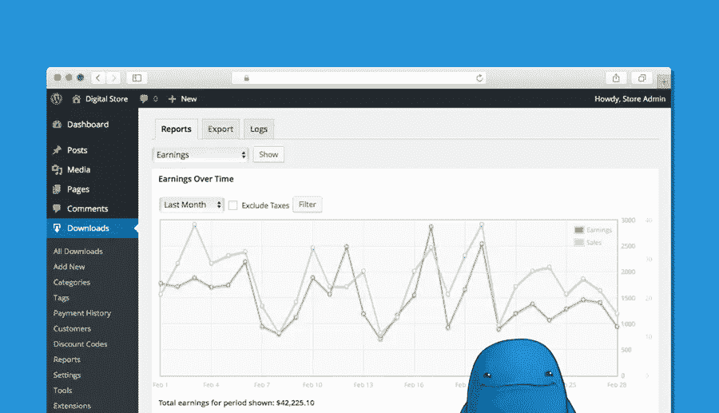

# 轻松数字下载插件评论

> 原文：<https://medium.com/visualmodo/easy-digital-downloads-wordpress-plugin-review-76ff3f481ada?source=collection_archive---------1----------------------->

电子商务商店可以提供各种库存，包括实物商品、多供应商商店和数字产品。本文将重点介绍数码产品(如视频、音频、PDF)的商店经理。一个易于使用的 WordPress 插件，易于数字下载

这个插件可以免费下载，而且，和其他高质量的 WordPress 解决方案一样，它的功能可以通过许多免费和优质的插件来扩展。许多专门为简单的数字下载而设计的主题也是可用的。然而，这个插件是为任何 WordPress 主题设计的。

Easy Digital Downloads (EDD)的核心版本是一个用户友好的插件，适合在你的网站上销售数字文件，并通过 PayPal 或亚马逊接受支付。

免费版本适合创建一个简单的数字商店，轻松数字下载的真正力量来自大量可用于添加功能的插件。这是一个非常灵活的产品。在本帖中，我们将谈论 Easy Digital Downloads 背后的公司，解释该插件提供了什么，并向您展示如何使用它来创建专业的电子商务商店。

# 轻松数字下载背后

轻松数字下载是由 WordPress 开发者 Pippin Williamson 和他的公司 Sandhills Development 创建的。你可能已经熟悉 Pippin，或者在他的网站 Pippins Plugins 上读过他的许多 WordPress 教程中的一个。Sandhills Development 在 WordPress 的世界里很受尊重，原因有很多:

1.  他们因良好的客户服务而享有盛誉。
2.  开发高质量的 WordPress 产品。
3.  他们已经发布了数百个有用的 WordPress 开发教程。

Sandhills 的开发也落后于其他成功的 WordPress 插件，如附属插件 AffiliateWP，会员插件 Restrict Content Pro， [Stripe](https://www.forbes.com/companies/stripe/) 支付插件 WP Simple Pay 和日历插件 Sugar Calendar。然而，皮聘和他的公司如此受人尊敬的最大原因是他们的透明度方法。

在博客上如此公开公司重大决策的决定给了他们很多关注。特别是，他们的“一年回顾”博客帖子反映了过去 12 个月的情况，让每个人都了解了他们公司的运营方式，并帮助他们了解团队成员。

其他受欢迎的文章包括反思 2018 年增加插件的成本。详细说明当他们启用自动会员续费时发生了什么。他们所有的文章让你深入了解一个专业的 WordPress 公司是如何运作的。查看 Pippins Plugins 博客，了解更多关于轻松数字下载背后的人。

# 轻松数字下载功能

Easy Digital Downloads 的核心版本提供了在 WordPress 网站上销售数字产品所需的基本工具。此外，上传任何类型的数字文件在你的网站上出售。我们提供了一个简码来帮助您将产品插入帖子和页面。

折扣代码可以提供给[顾客](https://visualmodo.com/customers/)以鼓励他们购买。此外，限制可以购买文件的次数。这对促销很有用，比如‘只剩 11 份’。免费版支持 PayPal Standard 和亚马逊支付。但是，通过扩展，您可以添加其他支付网关，如 PayPal Pro、Stripe、2Checkout、Authorize.net 和比特币基地。

顾客通过他们的账户查看他们的整个购物历史。此外，您可以通过使用单个短代码向客户显示这一点。在后端，网站所有者可以生成任何时间段的报告，并以 CSV 格式下载这些报告。您可以查看报告类型、收入、按类别分类的收入、下载、付款方式和税收的数据。总之，简易数字下载的美妙之处在于它的简单性。

# 客户

“客户”选项卡提供了您商店的客户信息。除了联系方式，该标签还提供了重要信息，如购买次数和在商店的总花费。

# 轻松数字下载报告

“报告”部分允许您创建关于商店销售业绩的报告。此外，这些报告非常全面，让您可以深入了解商店销售业绩的基本情况。

# 创造你的第一个产品

要创建第一个产品，您需要转到下载→添加新项并添加产品标题、产品描述、上传文件、产品价格等。完成后，点按“发布”按钮。

# 折扣代码(优惠券)

在本节中，您将创建折扣代码，您可以在特定场合分发这些代码以增加销售额。简而言之，只需进入下载→优惠码，最后，点击新增按钮。

# 文件下载

首先，对于从事数字下载的商店来说，这是一个很好的选择。考虑一个场景，其中活动允许下载文件的 10 个副本。通过将文件下载限制设置为 10。其次，你可以完全控制下载过程。此外，在添加/编辑产品时，设置单个产品的下载限制。

# 结论

就是这样！我希望你可以轻松地建立一个高性能的电子商务商店。如果你有问题或者希望澄清一些事情，请不要犹豫，在下面的评论区提问。