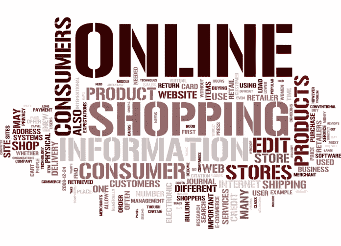

# 电子商务关键词:你需要知道的词汇

> 原文：<https://medium.com/visualmodo/ecommerce-key-terms-the-vocab-you-need-to-know-17600c049449?source=collection_archive---------10----------------------->

还记得小学时，你用抽认卡和彩色编码笔记来学习重要的术语吗？现实世界与那些没有新鲜铅笔和不新鲜学校午餐的无忧无虑的日子相去甚远。但持续学习的重要性依然存在，尤其是因为营销人员有责任理解一个似乎每天都在经历重大气候变化的在线生态系统。

这就是为什么我很高兴向您展示一份易于阅读的电子商务关键术语列表。希望这能对你一直模糊的网上购物概念有所启发。更好的是，我希望它能给你改善和优化你的电子商务网站的思维能力！

*   **放弃:**当一个用户访问你的网站，但却完成了想要的动作(购物，订阅你的邮件列表，等等)
*   **例如:** Gary 访问亚马逊，并将几个 iPhone 配件添加到他的购物车中。当他意识到他已经积累的标签时，他被标签震惊了，并决定推迟购买。当他没有完成交易就离开网站时，这被认为是放弃购物车。
*   **联盟营销:**电子商务平台和在线出版商之间的合作关系，出版商认可/评论/介绍产品，并根据电子商务表现获得报酬。有些代销商的报酬是提及一次，有些是与返回电子商务网站的流量相称的，有些是根据实际销售额支付的。
*   **示例:** Nike 与博客 Billy 合作，共同评论他们的新跑鞋。Billy 的报酬基于他的文章中有多少 Nike 电子商务购买。
*   **平均停留时间:**用户在你的网站上停留的平均秒数。这个计算是基于给定时间范围内的所有网站访问者。
*   **举例:** Nikki 逛 Zappos，花了 45 分 8 秒浏览鞋子。约翰参观了 Zappos，但只花了 3 分 2 秒。(这两个用户之间的)平均现场时间是 24.05。
*   **跳出率:**在你的网站上浏览一页，然后没有点击第二页就退出的人的百分比。可以计算网站上所有页面的跳出率(例如，主页的跳出率可能高于产品页面的跳出率)
*   **例如:**9000 人浏览了你的梭织狗靴页面，其中 2000 人退出时没有浏览你网站的其他部分。你的跳出率是 22%(这很好——任何低于 50%的跳出率都是非常可取的)
*   **点击率:**也称为 CTR，点击率衡量的是交付的总印象与点击的人数。CTR 可以通过 CTA、产品列表和网站上任何其他形式的链接来衡量。
*   **举例:**你的主页每月接待 15000 名访客，特色靴的主页 CTA 接待 900 次点击。你的点击率是 0.06，或者 6%
*   **转化率:**完成一个动作的用户除以有机会完成该动作的用户的百分比。转化率应该从集客营销的各个方面进行跟踪——想想电子邮件打开率、点击付费广告购买率等……但电子商务中最重要的转化率是印象与购买。转换率可以在一段特定的时间内进行跟踪(即广告创意#1 在 11 月的转换率为 2%)，也可以进行滚动测量(即广告创意#1 的整体平均转换率为 0.09%)
*   **例如:** REI 为他们的户外帐篷设计了一个广告词活动。广告组 1 有 7，500 次展示，产生了 1，000 次点击和 500 次购买。广告组的转化率为 0.067，即 6.7%。
*   Cookies:HTTP，或浏览器，Cookies 是网站发送并存储在用户浏览器上的小信息。每当用户再次访问该网站时，该信息被发送回服务器，以提醒服务器该用户以前的活动。Cookies 在电子商务中用于广告定位、基于用户信号的动态网站内容以及保存购物车(也称为保存购物车)。
*   肖恩去 Overstock.com 进行假日购物。他花了一个小时为清单上的每个人往购物车里添加商品，但随后不小心关闭了浏览器。Overstock 不会重复他的选择过程，而是保存他的物品(通常至少保存 7 天)，以便他下次访问时可以轻松完成交易。
*   **折扣代码:**也称为促销代码，折扣代码是简短的字母数字值，允许用户访问隐藏的折扣。
*   **示例:** Bath and Body Works 向他们的订户数据库发送电子邮件，以促销代码“15OFF2DAY”为当天的所有购买提供 15%的折扣。用户在结账时输入代码，并在完成购买前看到折扣。
*   **印象:**向用户显示特定项目、广告或图像的任何时间。
*   **例如:**Target.com 的这个页面有两个横幅广告和 6 个文本广告。每次加载页面时，会发送 8 次广告展示。
*   **移动商务:**随着移动互联网使用的持续增长，移动商务自然也随之而来。据[互联网零售商](http://www.internetretailer.com/2013/01/10/m-commerce-sales-near-25-billion-2012-81)称，2012 年移动商务销售额达到近 250 亿美元，同比增长 81%。最重要的是，从 2011 年到 2012 年的假日季，[移动商务的转换率跃升了 30%](http://seekingalpha.com/article/1116251-holiday-mobile-commerce-boom-one-third-of-e-commerce-traffic-was-mobile-sales-up-171) 。**示例:** Sarah 想买一台平板电脑，但没有时间逛百思买商店。相反，她通过智能手机浏览 BestBuy.com、亚马逊和易贝的商品列表，并根据其他用户评论、价格比较和互动产品演示做出决定。
*   **商家账户:**接受信用卡付款的在线银行账户，也就是向电子商务商店提交付款的地方。
*   **示例:**当 Nora 从 Forever21 购买一件牛仔夹克时，信用卡付款被发送到 Forever21 的在线商家账户。
*   **订单跟踪:**客户查看订单进展直至交付的过程。这通常是使用购买完成时提供的跟踪代码来编排的。
*   **示例:** Patrick 从 GNC.com 订购了几种营养补充剂。在他的确认电子邮件中，Patrick 收到一个跟踪号码，他可以在 GNC 网站上输入该号码，以便随时了解他的订单何时到达。
*   **浏览量:**你网站上一个页面被加载的总次数。
*   例子:玛丽亚想为她的后院买一个蹦床。她浏览了多个在线商店，并在您的网站上查看了同一页面 3 次。这占了 3 个浏览量，即使它们都是由同一用户生成的。
*   **第三方支付处理器:**商家账户的替代品——一些电子商务平台可以通过 PayPal 等提供商接受支付。
*   **例如:**当你从易贝购买一件商品时，付款会被提交到卖家的 PayPal 账户，而不是他们的个人银行账户。
*   **独立用户:**通常简称为“uniques”，独立用户是访问你网站的个人总数。
*   例如:Costco.com 每月有 350 万页面浏览量，但只有 100 万独立用户。这意味着每个用户平均浏览 3.5 页。

我错过了什么你还不清楚的吗？请在下面的评论中给我留言——也许第二轮的关键术语是合适的？让我知道！

电子商务关键词:你需要知道的词汇[https://visualmodo.com/](https://visualmodo.com/)