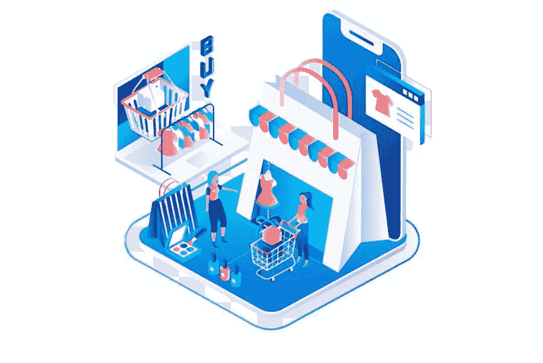

# 电子商务搜索引擎优化指南在线商店如何在 2020 年推动有机流量

> 原文：<https://medium.com/visualmodo/ecommerce-seo-guide-how-online-stores-can-drive-organic-traffic-in-2020-3afeec547116?source=collection_archive---------0----------------------->

虽然没有人能否认搜索引擎优化是电子商务网站的生命线，但大多数在线商店对搜索引擎优化没有兴趣。毫无疑问，社交媒体、搜索引擎和展示广告网络上的广告很棒，但长期依赖它们只会降低你的利润率。如果你也忽视了搜索引擎优化，严重依赖付费广告，你应该知道两个重要的事实:在这篇文章中，你将从最佳电子商务搜索引擎优化指南中学习在线商店如何驱动有机流量。

*   当你的网站是新的，没有人知道它的时候，付费广告是推动流量和销售的最好方式。它给了你作为市场新进入者所需要的早期曝光，以 CPC 和其他形式的投资作为回报。
*   最终，你的在线商店需要有机流量。你不能继续投资广告，减少你的利润率。很简单；你最终需要的是免费、优质、循环的流量。

当你在销售“女式跑步鞋”时，一些用户正在搜索引擎上使用相关关键词寻找一款，你需要你的列表在有机搜索结果中尽可能靠前地显示。

你可能会问如何做到这一点？

这就是电子商务搜索引擎优化所做的。您将了解搜索算法、优化和策略，当用户进行相关搜索查询时，它们可以帮助您在 SERPs 上推送网站链接。

这个指南将帮助你准备一个路线图，并逐步解释你需要做的事情，使你的电子商务商店搜索引擎优化友好。继续阅读，了解 2020 年及以后你的网络商店的 SEO。

# 电子商务关键词研究

不管你是经营一个小型电子商务商店还是一个成熟的多供应商市场；关键词研究永远是比赛的起点。把这部分做好非常重要，否则你可能会-

*   锁定难以排名的关键词
*   排名错误的关键字带来的交通不转化

请注意，以上两种情况对任何电子商务企业都不理想。你需要瞄准正确的关键词，这样你就可以对带来高质量流量的关键词进行排名，而不仅仅是网站服务器上毫无希望的负载。

根据你的定位和目标客户群找到这三类关键词:

*   主要关键词:为你的企业寻找主要关键词，这些关键词与你的定位产生共鸣，并帮助你获得独特的品牌身份。你需要在显著的地方使用这些关键词，比如你的域名和主页。
*   次要关键词:找到 10-15 个针对主要关键词和主要产品的小尾巴关键词。您需要在您的电子商务商店的类别中使用这些关键字。
*   第三长尾关键词:你需要进一步为每个第二关键词找出至少 10-15 个长尾关键词。比如你有 15 个二级关键词，那么你就有 150 个长尾关键词。这些第三或长尾关键词可以作为你的产品页面标题、内部元描述和其他页面文本。

现在，你可能会问，如何发现正确的初级，二级，三级关键字为您的利基？我可以提前建议三种突出的方法:

# 对市场的观察:

使用流行的市场，如亚马逊、易贝、Etsy、阿里巴巴、百思买、沃尔玛等。为了你的关键词研究。找出在你的领域中最受欢迎的产品，它们在这些市场上表现最好。

*   你可以浏览他们的显著页面，例如，主页和特色产品页面等。
*   你可以从他们的搜索自我暗示中得到一些不错的想法。比如我曾经搜索过“n95 口罩”，从亚马逊的搜索栏得到了几个建议:

# 从你的竞争对手那里窃取关键词:

听起来很可疑，跟踪你的直接竞争对手是完全没问题的。只需访问 Google.com，键入您的主要关键字，并按照电子商务搜索引擎优化指南进行搜索，即可为在线商店带来有机流量

让我们再次以“N95 口罩”为例:

虽然我们还没有达到我们的目标，但我们仍然从搜索自动建议本身获得了一些好的关键词。现在，只需按下回车键，等待搜索结果:

您可以在这里做两件事:

*   向下滚动到 SERP 的底部，查看“与 n95 口罩相关的搜索”部分的关键词:

你现在有更多的关键字了。

*   现在，向上滚动并从搜索结果中选择一个竞争对手，他正在像您一样销售 N95 口罩。访问网站，分析其突出的页面、类别、产品页面，寻找潜在的关键词。

注意:不要一味的抄袭竞争对手网站的关键词。他们排名较高可能有 N 个原因。也许他们比你的网站有更好的域名权威。只需列出使用这种方法得到的所有相关关键词，并按照下一节解释的步骤进行操作:

# 使用搜索引擎优化工具:电子商务搜索引擎优化指南来提高网上商店流量

你可以使用几个搜索引擎优化工具，不仅可以发现与你的利基相关的关键词，还可以测量你已经使用上述两种方法找到的关键词。以 Ahrefs 为例。Ahrefs 是一个了不起的搜索引擎优化工具，可以帮助你的关键字研究，竞争研究，并为你的电子商务网站建立链接。

此外，你还可以依赖一些其他的搜索引擎优化工具，比如谷歌分析、谷歌搜索控制台、SEMrush、Moz 和 UberSuggest。虽然谷歌分析和谷歌搜索控制台可以免费使用，但你也可以选择一两个高级工具来获得最佳结果。当涉及到获得更详细和图形化的指导时，高级工具是最好的，这与谷歌分析相反，谷歌分析同样有效，但不容易使用。

了解如何使用谷歌分析和谷歌关键词规划。这些工具会通过测量性能指标来告诉你是否使用了正确的关键词。

# 致力于你的网站架构和页面搜索引擎优化

一旦你有了合适的关键词，就该好好利用它们了。从优化网站的 SEO 基础架构开始。

你的站点架构代表了你如何设置你的导航流、分类页面、产品页面和主页。致力于你的网站架构将优化你的商店，不仅仅是为了 SEO，也是为了网站的用户。为了同样的优化，你需要向你的用户展示你的网站的最相关的内容，并且按照电子商务搜索引擎优化指南，使导航尽可能的平滑，以驱动在线商店的有机流量。

*   使架构简单且可扩展
*   最大限度地减少到达你的突出网页所需的点击次数
*   如前所述，将你的主要、次要和长尾关键词放在相关页面中

注意:如果你正在使用一个好的电子商务软件或多供应商市场解决方案，你会得到你的网站架构开箱排序的大部分。你只需要在你的关键词位置上下功夫，就能得到最好的结果。所以要谨慎选择你的软件。

就你的页面搜索引擎优化而言，优化网站架构和关键词布局将涵盖 90%的工作。剩下的任务可以通过在网页上编写 SEO 友好的内容来完成。它可能包括-

*   你的主页和每一个有适当的元描述的类别页的正文副本
*   产品页面上的内容，包括产品描述和用户生成的内容
*   每个图像的图像内替代文本、元标签和描述，包括产品图像
*   网站上每个 URL 的元数据和描述
*   为预期的站点地图修改 robot.txt 文件

# 技术搜索引擎优化和搜索引擎优化审计

一旦你完成了基本的页面搜索引擎优化，是时候检查一下你在搜索引擎前的位置了。为此，您需要衡量某些指标，并对您的网站进行深度审计。这样做将帮助你实现三个主要目标:

*   首先，你会对你网站的页面搜索引擎优化的质量有一个总体的了解，以及它目前在竞争中的地位
*   其次，可以创建一个任务列表来完成，以改善您的页面上搜索引擎优化之前，你可以移动到离页搜索引擎优化
*   最后，如果你现在朝着正确的方向前进，你会得到保证

以下是你可以做的事情来审计你的网站搜索引擎优化:

# 爬行你网站:电子商务搜索引擎优化指南，以推动交通做网上商店

您可以使用 Google 的搜索控制台等工具，或者将我们传送到您的网站，发现重要的方面，例如:

*   断开的链接
*   缺少元数据
*   重复内容

# b .在网站的其他版本上执行 301 重定向:

如果您的网站 URL 有其他版本，请确保对所有版本应用 301 重定向，只保留一个版本供浏览。例如，您可能有其他版本的 URL，例如-

*   http://yourdomain.com
*   http://www.yourdomain.com
*   https://yourdomain.com
*   https://www.yourdomain.com

确保您只使用其中一个，而 301 将其他人重定向到它。特别是，当您从 HTTP 移动到 HTTPS 时，您需要在用户键入旧的 HTTP URL 时，将他们重定向到新的 HTTPS URL。

拥有多个不同的网址只会混淆搜索爬虫和标记重复的内容问题，这将伤害你的搜索引擎优化。

# 主页审计:

检查您的主页搜索引擎优化错误。确保它有适当的 H1，H2 和 H3 的标题标签，以及关键字丰富的元描述和其他元数据。

# 独特的内容:电子商务搜索引擎优化指南，以提高网上商店的流量

确保您的网站没有重复的内容。让所有网页上的内容保持独特。如果您别无选择，只能在不同的网页上重复使用一些内容，例如同一产品的不同版本的产品描述，您可以使用[规范标签](https://en.wikipedia.org/wiki/Canonical_link_element)让搜索爬虫知道该抓取哪个页面，以及该忽略哪个页面。

# e 分析反向链接配置文件:

您可以使用像 Ahrefs 这样的工具来分析您的反向链接配置文件。您需要从这次审计中发现三件大事:

*   首先，你的锚文本的质量
*   其次，你的反向链接的质量
*   最后，破裂的反向链接

一旦您对这些方面有了一个完整的了解，您就需要努力–

*   让你的锚文本搜索引擎优化友好
*   否认来自不相关来源的反向链接
*   修复断裂的链接

# f 分析移动友好性:电子商务 SEO 指南提高网上商店的流量

您网站的移动友好性在[谷歌搜索引擎优化](https://visualmodo.com/seo-101-what-are-backlinks-and-how-do-they-work/)中扮演着重要角色。移动友好和响应迅速的网页总是比只考虑桌面用户的网页排名更靠前。因此，确保您所有的网页都能为您的移动用户提供最好的用户体验。您可以使用谷歌的 PageSpeed Insights 工具等工具来检查您的移动友好度分数，并获得有用的建议。

# g 分析站点速度:

确保您的网站在各种设备上尽可能快地加载。一个加载较慢的网站永远不会排名良好，至少在谷歌的 SERPs 中是如此。如果您的网页加载时间超过 5-6 秒，您需要将加载时间缩短至 3-4 秒。

# 电子商务 SEO 指南，以推动流量做在线商店最后的话

总之，如果你在所有这些方面优化你的电子商务商店，你会得到一个搜索引擎优化友好的网站。一旦你完成这些优化，你可以使用大量的其他选项来进一步提高你的前景，并使用内容营销，社交媒体营销，影响者营销，联盟营销和链接建设等策略来推动流量。

在未来的，你可能会采用大量其他尖端策略来提高你的 [SEO。然而，本指南中解释的基本步骤总是很重要的，您需要在继续下一步之前优先解决它们。](https://visualmodo.com/understanding-the-difference-between-national-seo-and-local-seo/)