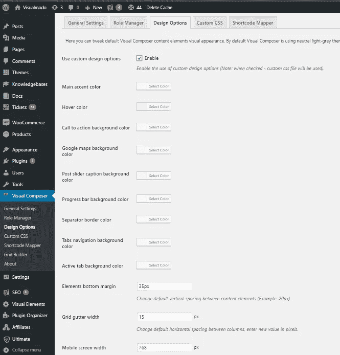
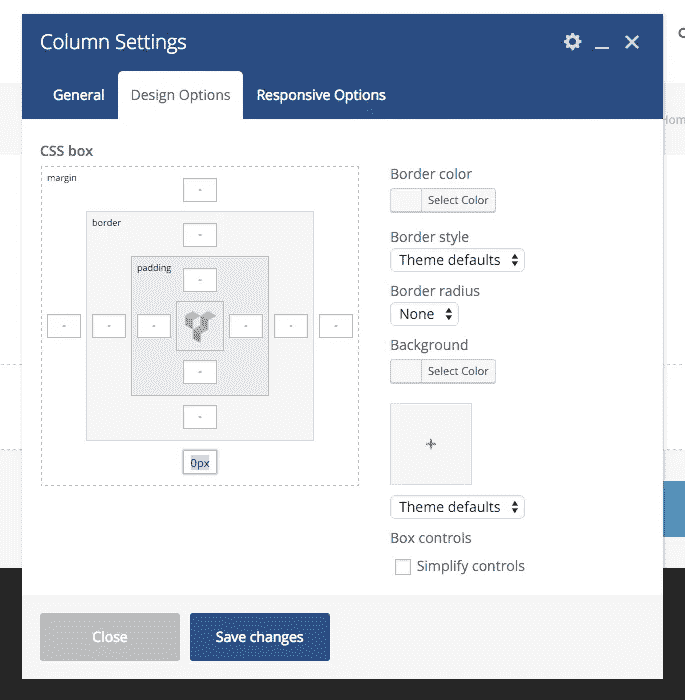
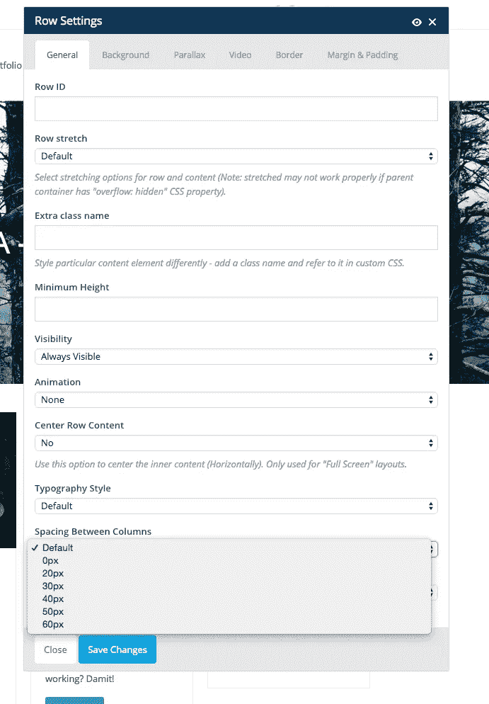

# 编辑可视化编辑器的行和列间距

> 原文：<https://medium.com/visualmodo/edit-visual-composer-spacing-rows-and-columns-41bc4efe6210?source=collection_archive---------0----------------------->

最流行的 WordPress 拖放页面生成器插件是 Visual Composer，现在看看当你想编辑或改变 Visual Composer 的行和列间距时该怎么做。所有的 Visualmodo 主题都包含这个高级插件。

默认情况下，Visualmodo WordPress 主题在 Visual Composer 中的所有栏下添加了 35px 的边距，这允许更好地响应网站，但在构建网站时考虑这一点也非常重要，这样您可以在元素之间创建完美的间距。可以通过 Visual Composer 面板>设计选项区域更改此边距。

# 移除默认的可视合成器间距—后果

如果您为底部列边距全局输入 0px，它将在任何地方删除它，但是，您必须记住为响应布局的列添加边距，在这些布局中，列从相邻的列变为堆叠的列。同时，你也很难保持整个网站的一致性。

# 重设边距的更好方法

重置边距的最佳方法是在编辑列时通过 Visual Composer 的“列”设置来完成。例如，如果处理具有背景的行，并且您希望内容在中间(在一列中)，并且您希望向行添加顶部和底部相同的填充，而不是在顶部添加 40px 的填充，并且允许列具有 40px 的底部边距以产生填充的效果，则最好编辑列并删除底部边距，然后您可以直接向行应用顶部和底部填充。事实上，这是我在现场演示中经常做的事情。

在大多数情况下，你不需要删除列的底部空白，只要记住它在那里，巧妙的工作。例如，只有在添加带有背景的行，并且希望行内填充较小的内容时，才需要删除它。

# 通过行列间距设置移除边距

如果您使用的行没有任何内部列，您也可以通过内置设置轻松选择 0px 作为列边距，并将其设置为 0px 来删除此间距:

见[视频](https://www.youtube.com/watch?v=_zvLtpksu1o)。

视觉作曲者行列间距—visual modo【https://visualmodo.com/ 