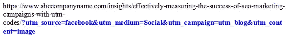

# 用 UTM 码有效衡量网站的成功

> 原文：<https://medium.com/visualmodo/effectively-measuring-the-success-of-website-with-utm-codes-f63748a5856e?source=collection_archive---------0----------------------->

你知道为什么数字营销仍然是营销人员最理想的预算渠道之一吗？数字营销吸引营销人员的主要部分是通过它获得的数据。现在很容易追踪花在数字营销上的每一分钱，只需对照你独特设定的目标和目的进行权衡。在这篇文章中，我们将解释 UTM 代码如何衡量活动的成功。

当涉及到跟踪数字营销的绩效时，有些更容易跟踪和解释，如付费搜索、购物和展示活动等。其他一些常见的渠道和活动可能会更难，如付费社交媒体活动或电子邮件营销。

通常，我们可能会听到人们说他们过去尝试过社交媒体营销，但很难衡量通过它的投资回报。事实上，一项研究表明，近 60%的营销专业人士发现衡量投资回报是数字营销中最大的挑战。

因此，如果你的主要目标是确定你的社交帖子中哪些贡献了你的大部分线索，哪些活动确保了最佳的销售和收入，那么了解 UTM 代码是必不可少的。是的，UTM 代码是许多成功的数字营销人员和社交媒体活动家成功背后的神奇秘密。

# 关于 UTM 电码

UTM 代码扩展为“顽童跟踪模块”，用于定制 URL，供营销人员使用，以跟踪他们通过各种渠道为特定网页获取流量的活动效果。这些你附加到网址上的代码会被谷歌分析解析，然后给你一份报告。你可以在谷歌分析的“活动报告”中找到它来跟踪你的投资回报率。

它被称为“顽童跟踪模块”,因为顽童软件公司最初开发了它。这家分析公司在 2005 年被谷歌收购，后来发展成为谷歌分析公司。

让我们看一个 [UTM 代码生成器](https://siteimprove.com/en-us/analytics/utm-code-builder/) URL 的例子

上述 URL 中用蓝色标记的部分是添加到这个博客的 URL 中的 UTM 参数。运行这个将帮助 Google Analytics 识别这篇博文的流量，特别是来自脸书的流量，将它从其他流量进入的渠道中分离出来。

# UTM 电码的使用

质量 UTM 代码将在以下方面帮助营销人员:

*   在难以衡量的渠道中增加价值，以便规划适当的预算。
*   帮助营销人员了解那些不起作用的东西。无需创建许多报告，一切都可以在一个易于理解的控制面板上获得。
*   更好地分析 A/B 分割测试。
*   从测试阶段到完成推广，加快各种活动的实施和报告。

基本上有五个 UTM 参数，如活动媒介、活动来源、活动名称、活动内容和活动期限等。所有这些收集了关于典型 URL(即网页)的性能的各个方面的信息。有了这些信息，营销人员可以更好地规划他们的数字营销和网页管理策略。