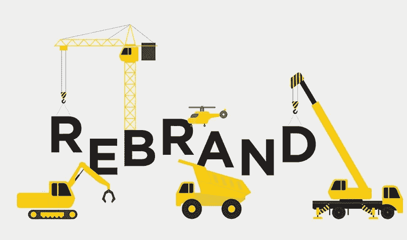

# 八个迹象是时候重塑公司品牌了

> 原文：<https://medium.com/visualmodo/eight-signs-its-time-for-a-company-rebrand-39adf7dfd07f?source=collection_archive---------0----------------------->

每个公司的生活中都有这样的时候，你需要坐下来问问自己，你的品牌是否为你付出了足够的努力。花时间进行一些诚实和坦率的讨论可能很难，但如果你在努力销售，那么可能是时候考虑重塑品牌了。

以下六个迹象表明，是时候改变你的形象了:

# 八个迹象是时候重塑公司品牌了

*   **你看起来一样**

你是如何在竞争中脱颖而出的？你的品牌不是看起来独一无二，而是慢慢地变成了其他所有人的品牌？如果你需要再次脱颖而出，也许是时候改变了。

*   **你的观众变了**

而你没有。你的品牌不再与你的目标市场相联系，也不再与应该购买你产品的受众相一致。做一些市场调查，[快](https://visualmodo.com/)。

*   **您的定价已经改变**

用你的旧形象很难提高你的价格，这是时候提升你的游戏了。[创造一个全新的品牌形象将使你能够调整定价，重新定位产品，以证明价格上涨是合理的。](https://visualmodo.com/blog/)

*   你犯了一些错误

大多数公司在其生命中的某个时刻都会吸引一些不好的反馈，但如果你的公司比大多数公司更具破坏性，那么也许是时候停止与你的品牌斗争，将你的注意力转向重塑你是谁以及你代表什么。

*   **时代变了**

很简单，你跟不上时代的潮流，你的生意因此受到影响。你需要求助于你的品牌大使和顾问，让你焕然一新，既能反映现在，又能让你的品牌走向未来。

*   **你没有提供相同的产品**

随着你的业务增长，你的产品基数增加，这并没有反映在你的品牌上。潜在客户不知道，除了你原来的产品，你现在提供了这么多。你需要一个新的品牌来反映你业务的全部，而不仅仅是其中的一小部分。

*   竞争更加激烈了

当你开始的时候，你是极少数提供你的产品的人之一。随着时间的推移，竞争也在加剧，但这个品牌却保持不变。你需要表现出你是原创的和最好的，你的经历对一切都很重要。重塑品牌，将自己定位为行业权威的代言人。

*   **人们不想和你一起工作**

为什么你的潜在新员工会选择去你的竞争对手那里？因为他们更看重自己的品牌。真的就这么简单。你的薪酬结构可能更有吸引力，你的办公室环境可能更好，但如果你不被认为是一家有前途的公司，顶级人才就会避开你。

重塑品牌可能是一个令人筋疲力尽的过程，如果你必须通过委员会和管理团队来做决定，这个过程会变得更加艰难。但是，如果你想与你的观众、员工和潜在员工重新建立联系，让你的新品牌恰到好处是至关重要的。它可以给疲惫的外表注入新的活力，帮助抹去过去的商业错误。

今天坐下来，长时间地审视一下你的形象，考虑一下你的商业品牌看起来如何，以及你可能需要采取哪些步骤来实现更有成效和更有利可图的明天。

## 作者

> Martina Sanchez 是一名企业家，也是 Lucky Assignments 和 Gum Essays 的内容营销专家，她喜欢写文章，也是一名受人尊敬的“最后一分钟写作”撰稿人，她的文章涵盖了从数字营销到 SEO hacks 等一系列主题。