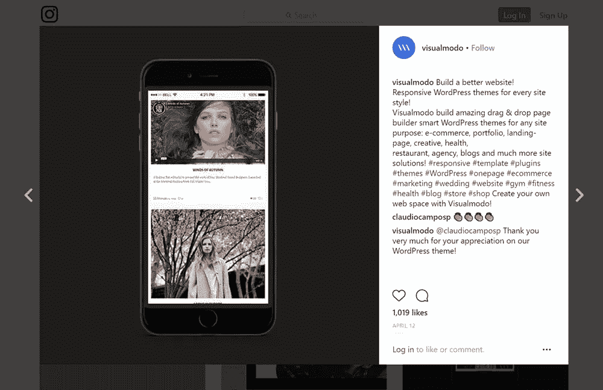
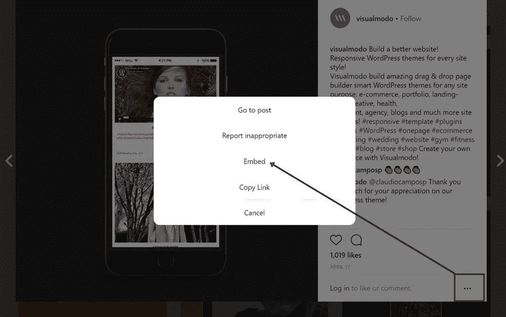

# 在 WordPress 帖子中嵌入 Instagram 照片

> 原文：<https://medium.com/visualmodo/embed-instagram-photos-in-wordpress-posts-cfc70b825cca?source=collection_archive---------0----------------------->

我写了几篇关于图像如何让更多人阅读你的博客或访问你的网站的文章。在这篇文章中，我将讨论如何嵌入你的 Instagram 照片，并在你的网站或博客上展示。这是展示你最好看的照片或展示你博客主题的视觉效果的好方法，同时也增加了你的 Instagram 粉丝。通过在你的博客上展示你的 Instagram feed，你给了你的读者一个预览，当他们关注你时，他们会看到什么。

Instagram 在 2010 年才推出，但却是无可争议的图片分享巨头，每月有*5 亿*用户登录，每天新增近 1 亿条帖子。

将 Instagram 图片添加到你的 WordPress 网站是让你的帖子和页面更吸引人的一个好方法——并利用网站上每天发布的大量美丽照片。

WordPress 让你在帖子和页面上展示 [Instagram](https://visualmodo.com/) 照片变得异常容易。这两者的过程是相同的，所以请遵循以下步骤。

# 获取 Instagram 照片 URL

你需要做的第一件事是找到你想要嵌入到你的 WordPress 网站上的 Instagram 照片。

**如果你正在使用 Instagram 应用**，找到你想要展示的照片，按下垂直省略号(…)，然后**复制分享网址**。您现在需要将它粘贴到桌面上可以访问的地方。用电子邮件把网址发给你自己也行。收到电子邮件后，将网址复制到剪贴板上。

**如果你在 instagram.com**上，找到你想要嵌入的照片，并将其加载到一个单独的页面上。点击显示帖子发布时间的链接来做这件事。

你现在会在一个有文章唯一网址的页面上！将此从导航栏复制到您的剪贴板。

# 将 Instagram 照片添加到 WordPress

复制了 Instagram 帖子的 URL 后，将照片添加到帖子和页面就非常简单了。

添加新的帖子或页面，或者加载您已经发布的帖子或页面。找到您想要添加照片的位置，然后按 return 键为照片创建一个空行。

粘贴网址并再次点击回车键。WordPress 现在会自动显示 Instagram 帖子。

发布或更新你的文章，你就大功告成了！

# 嵌入照片

Instagram 还提供了手动嵌入照片的选项。如果粘贴 URL 不起作用，或者您想要一点额外的控制(您可以选择隐藏描述)，这是一个替代选项。

同样，你需要找到你的照片，但要嵌入你需要使用 instagram.com-你不能使用应用程序。像以前一样，使用唯一的 URL 导航到整页照片。

现在，点击右下角的省略号(…)并点击**嵌入**，而不是复制 URL。

Instagram 现在会给你嵌入代码，你可以复制。如果您想隐藏标题，取消勾选**包括标题**框。

现在，您可以将照片嵌入任何帖子或页面。像以前一样，要么添加新的帖子或页面，要么编辑现有的帖子或页面。你现在想切换到**文本**编辑器，找到你想添加照片的地方。按两次 return 键为照片添加空间并粘贴嵌入代码。

Instagram 生成了很多代码，但是切换回**可视化**编辑器，你会看到添加的照片。如果你希望看到一张灰色的照片，不要担心，照片会显示在你网站的前端。

发布或更新帖子或页面，您就可以添加一张 [Instagram](https://visualmodo.com/) 照片了！

# 结论

Instagram 是在网上发布照片的地方，所以开始在你的 WordPress 网站上使用它吧！这篇文章向你展示了将 Instagram 照片添加到你自己的帖子和页面所需要知道的一切。