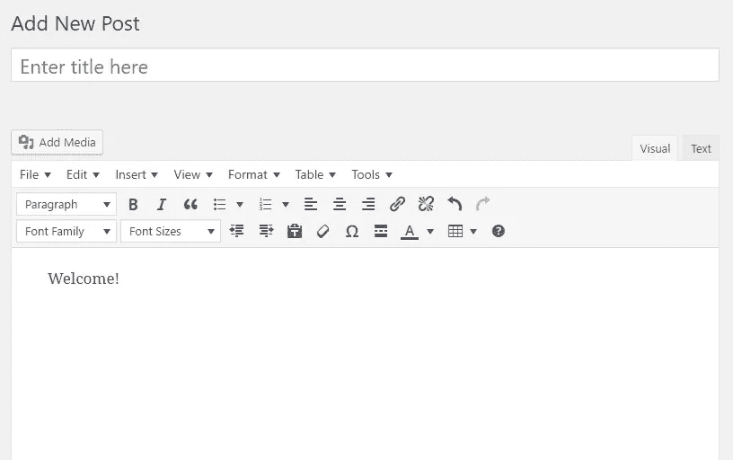

# 免费授权 WordPress 帖子编辑器:TinyMCE 高级插件

> 原文：<https://medium.com/visualmodo/empowering-wordpress-posts-editor-for-free-tinymce-advanced-plugin-2087db8e81f0?source=collection_archive---------0----------------------->

许多最好的 WordPress 网站使用一个高级编辑器，在默认 WordPress 已经包含的功能上提供额外的功能。在这篇文章中，你将学习如何免费使用 TinyMCE 高级插件来增强你的 WordPress 文章编辑器，从而为你的可视化编辑器提供更多的选择。

WordPress 可视化编辑器有一些不错的按钮，几乎足以创建一个惊人的[博客](https://visualmodo.com/blog/)帖子。但是如果你想改变文本的字体大小、字体系列或背景颜色，你需要使用 HTML 手工操作。

# 授权 WordPress 帖子编辑器

如果你没有任何 HTML 知识，这可能会很难。幸运的是，WordPress 可视化编辑器是[TinyMCE](http://www.tinymce.com/)——一个开源的 WYSIWYG(所见即所得)编辑器。像所有东西一样，你可以通过使用插件来增强它。

有一个很棒的插件叫 TinyMCE Advanced，它允许你在 WordPress 可视化编辑器中添加更多的按钮。这个插件的神奇之处在于，它允许你添加、删除和排列显示在你的可视化编辑器上的按钮。

您将能够访问许多默认可视化编辑器中没有的功能。以下是该插件的一些值得注意的特性:

*   启用 TinyMCE 菜单。
*   创建和编辑表格。
*   列表的几个选项。
*   更改字体系列和字体大小。
*   能够在编辑器中搜索和替换。
*   还有[更](https://visualmodo.com/)。

# 添加按钮

首先，你需要安装插件。你可以在这里找到 TinyMCE 高级插件[。](https://wordpress.org/plugins/tinymce-advanced/)

一旦你激活了插件，进入 WordPress dashboard >设置，点击 TinyMCE 高级’。

然后你就会看到这样的页面。

您可以在“未使用的按钮”下看到所有附加按钮。只需将按钮从“未使用的按钮”中拖放到工具栏即可。通过将按钮拖放到未使用的按钮中，可以从工具栏中删除按钮。

您也可以使用拖放来重新排列工具栏中的按钮。完成后，点击“保存更改”按钮。

现在你的 WordPress 文章编辑器将看起来像这样:(如果它没有显示所有的按钮，点击‘工具栏切换’按钮)

是的，完全变了。现在你有更多的按钮来定制你的新博客文章。这个插件的另一个惊人之处是，它可以从你的 CSS 中导入样式。

# 最后的话

我强烈建议你使用这个插件来增强你的可视化编辑器，让你的帖子更有吸引力。一旦你开始发布格式良好的 WordPress 博客文章，它将改善读者体验，提高你的博客权威。它会节省你的时间，让你的生活更轻松。