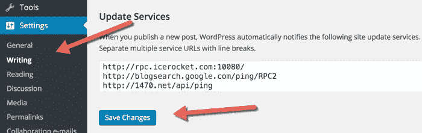

# 创建一个 WordPress 站点后要做的基本事情

> 原文：<https://medium.com/visualmodo/essential-things-to-do-after-creating-a-wordpress-site-8ed81db3d4c3?source=collection_archive---------0----------------------->

当你安装 WordPress 时，你需要启动你的站点或博客，以下是创建 WordPress 站点指南后要做的基本事情。当你安装 WordPress 时，你会得到一个普通的安装，包括一些东西，如虚拟帖子、虚拟页面和虚拟评论，所以在你的 WordPress 站点上要做的第一件事是:

# 在 WordPress 网站#1 上要做的重要事情

**删除默认帖子、页面和评论**

登录你的 WordPress 仪表盘，进入**帖子>所有帖子**，删除默认的“Hello world”帖子。

同样，进入**页面>所有页面**，删除默认的“样张”。

最后，点击**“评论”**，删除默认评论。

# 在 WordPress 网站#2 上要做的基本事情

**设置 WordPress 永久链接**

默认的 WordPress permalink 是—[**http://yourdomain.com/p=123.**](http://yourdomain.com/p=123.)

这个永久链接很短，但是对搜索引擎不友好。

进入**设置>永久链接**并选择**“帖子名称”。**

点击**“保存”。**

现在，当你的网址出现在搜索引擎中时，一些关键词将是可见的。这将有助于你排名更高，获得更多的流量。

这里有一个 SML 的例子:

# 在 WordPress 网站#3 上要做的基本事情

**设置你的时区**

接下来的两个设置可在**设置>概述中找到。**

确保将您的时区设置为您的当地时间，这样当您安排帖子时，它们将根据您的时间上线。

***亦注:***

当你安装 WordPress 的时候，你添加了一个“网站标题”&“标语”。您可以随时从该设置页面更改这些设置。这两件事非常重要，因为这是谷歌搜索中显示的内容。

*您还可以在此设置页面设置您的管理员电子邮件地址(您将在此接收所有管理员信件)。*

# 在 WordPress 网站#4 上要做的基本事情

**启用/禁用用户注册**

你需要决定你是否打算[拥有一个多作者的博客](https://www.shoutmeloud.com/how-to-create-multi-author-wordpress-blog-for-guest-posting.html)(像 ShoutMeLoud)，或者你是否打算成为唯一的作者。

如果你打算允许访客发帖(就像 SML 那样)，那么就要做好收到大量垃圾邮件注册的准备。然而，你可以在插件的[帮助下解决这个问题。](https://www.shoutmeloud.com/wangguard-plugin-stop-wordpress-user-registration-spam.html)

为此，勾选**“任何人都可以注册”**框，并将**“新用户默认角色”**设置为**“贡献者”。**

如果你不想让人们注册，不要勾选“任何人都可以注册”框。

# 在 WordPress 网站#5 上要做的基本事情

**设置 WordPress 讨论/评论设置**

现在，进入**设置>讨论。**

如果你不知道在这里做什么，这可能会变得混乱。不过只要照着上面的截图做就好了。

# 在 WordPress 网站#6 上要做的基本事情

**填充 WordPress Ping 列表**

默认情况下，WordPress 只 pings 一个服务。但是您可以通过扩展 ping 列表来通知更多的服务。

转到**设置>写入**并将更多服务添加到 ping 列表中。

你可以在这里得到一个大的 ping 列表: [WordPress ping 列表](https://www.shoutmeloud.com/wordpress-ping-list.html)。

# 在 WordPress 网站#7 上要做的重要事情

**WordPress 媒体设置**

这个设置将极大地改善 WordPress 处理图像的方式。

默认情况下，WordPress 为每个上传的图片创建多个尺寸。这不是一个好的做法。这将加载你的博客与不必要的文件，你的博客将很快变得臃肿。

转到**设置>媒体、**并使用下面的截图来配置适当的设置:

我也**强烈推荐**你添加一个插件，在上传图像时压缩图像。

你可以在这里阅读所有关于 WordPress 图片压缩插件的内容。

# 在 WordPress 网站#8 上要做的基本事情

**禁用目录浏览**

对于这个设置，你需要编辑你的 WordPress。 [htaccess](https://www.shoutmeloud.com/how-to-edit-your-wordpress-htaccess-file.html) 文件。不要慌；这其实很简单。

*   你可以按照这个指南学习如何编辑你的 WordPress。htaccess 文件。

将这行代码添加到您的。htaccess 文件(在底部):

`Options All -Indexes`

这将禁用目录浏览，而目录浏览是维护博客安全的重要一步。

**快速回顾**

1.  删除默认值。
2.  设置 WordPress 永久链接结构。
3.  设置时区。
4.  设置用户注册。
5.  跟帖评论。
6.  填充 WordPress ping 列表。
7.  设置 WordPress 媒体设置。
8.  禁用目录浏览。

如果你刚刚安装了 WordPress，确保这 8 个必要的设置配置正确。在你安装 WordPress 的任何时候，你应该确保在做任何事情之前做这 8 件事。我建议你把这篇文章加入书签，这样你每次安装 WordPress 的时候都可以参考。

# 安装 WordPress 后要做的重要事情

你可以在我们的博客[https://visualmodo.com/blog/](https://visualmodo.com/blog/)下看到更多插件和重要的事情

*别忘了分享这篇文章！*