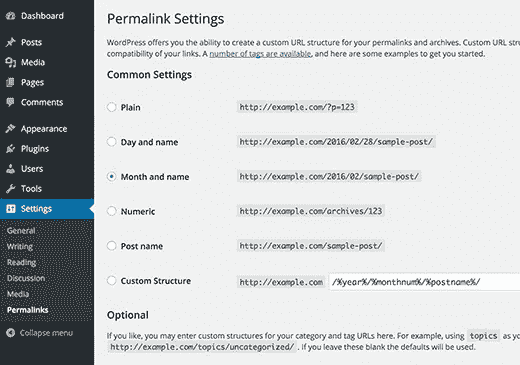
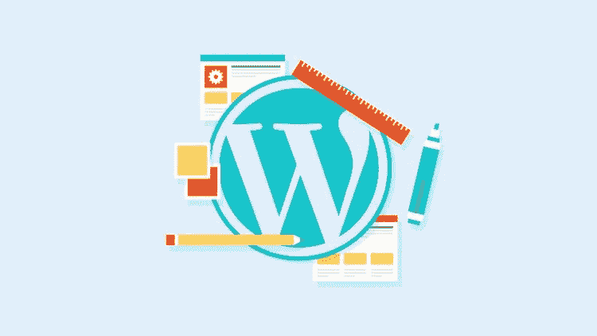

# WordPress 初学者的基本提示

> 原文：<https://medium.com/visualmodo/essential-tips-for-wordpress-beginners-a4f41e3811d7?source=collection_archive---------1----------------------->

没有多少使用 WordPress 网站的经验？查看使用 WordPress 时更好的起点的最重要指南和 WordPress 初学者的基本提示。

如果这听起来很熟悉，请举手…你遇到某人，他们说了所有正确的事情。他们充满了赞美和赞誉。除了之外，他们有些地方让你很烦。他们的言行不一致。他们可能很健忘，甚至*的意思是*。最终，光芒褪去，你看清了他们的真面目。不是人们*说了什么*，而是他们*做了什么*才让一段关系得以维系。这就是你托管 WordPress 网站的方式，尤其是如果你刚刚开始。

# WordPress 初学者的基本提示

那是因为你不能只跟*谈论【WordPress 有多棒，然后期望它为你工作。你也不能只是阅读它。为了看到你想要的结果，你必须在这些话后面放一些行动。你需要*使用*下面概述的 WordPress 最佳实践。*

WordPress 初学者在早期实施这些有用的(并且有效的)技术将会使自己成功，并且更快地看到结果。

# 1.你的边栏不是你的门厅壁橱

你知道那个你害怕打开的门厅壁橱，因为所有放在架子顶上的东西可能会滚出来砸到你的头上？这就是很多 WordPress 工具条的样子。

它们塞满了你的广告，你的社交媒体图标，你最近推文的链接，你的脸书粉丝的照片，等等。在所有这些信息中，可能有一个你真的想让你的网站访问者点击的链接，但是如果他们找不到，你最好不要把它放在那里。解决办法？将你的侧边栏精简到绝对必要的内容。

转到**外观&小部件**并移除除了*实际上为您的业务或事业做些事情的小部件*之外的所有东西。如果一个 widget 没有将人添加到您的列表中，没有将钱存入您的银行帐户，或者没有让某人执行您希望他们执行的操作，请将其移除。

# 2.使查找您的资料库中的内容变得容易

如果你有一个图书馆，按照购买的月份把书存放在不同的建筑里有意义吗？

当然不是。你最终会从一栋楼走到另一栋楼，寻找你想要的书。

你在 WordPress 的**媒体库**也是这样。创建一个集成的文件夹来存放你所有的媒体，使搜索变得容易:只需插入一个关键字，你马上就能找到你要找的文件。

要设置你的 WordPress 网站，让你所有的媒体文件都放在一个文件夹中，你可以按名称搜索，进入**设置&媒体**和**取消选中** 按钮，旁边的**“将我的上传整理到按月和按年的文件夹中”**

# 3.清理你的永久链接

你努力为你的网站创造引人注目的内容，所以你想让谷歌、必应和雅虎找到它。通过使用指向你的信息的简短的“路标”使他们容易理解。

你是怎么做到的？

你想花一点时间学习一下 [SEO 文案](https://visualmodo.com/category/seo/)的基础知识(没你想象的那么难)。你可以立即开始做的一个快速改进是，在发布链接之前，使用编辑页面顶部的内置 WordPress permalink 字段来修改链接。

删除不必要的词，在你的描述中明智地使用关键词。

不要用关键词来填充它——确保最终的结果对一个人来说是愉快的。

例如:

**yoursite.com/7 种选择最佳汽车轮胎的方法**

变得…

**yoursite.com/choosing-tires-tips**

还有这个:

**your site . com/the-copy writers-guide-to-get-more-clients than-you-can-handle**

变得…

**yoursite.com/getting-copywriting-clients**。

这里的想法是创建一个紧凑的永久链接，告诉搜索引擎你的帖子包含什么，并帮助你对你想出名的关键词进行排名。

# 4.通过有针对性的标题和描述最大限度地扩大影响

当你在脸书、Google+和 LinkedIn 上分享你的帖子和页面时，这些服务会为你分享的链接选择一个页面标题和描述。

当你的页面在搜索引擎中出现时，标题和描述是人们用来决定是否点击你的链接的依据。页面标题也是搜索引擎的一个重要元素。这使得标题和描述成为页面上最重要的文本。为了更好地控制这些结果中出现的内容，使用 [SEO 优化软件，如 Scribe](http://scribeseo.com/) 来编辑页面标题和描述。

记住，*描述*主要是给读者看的。不要试图用这些来迎合谷歌机器人——相反，让它们更有吸引力，详细阐述你在[标题](https://visualmodo.com/knowledgebase/wordpress-header-settings/)中做出的承诺，并使用强有力的[行动号召](https://visualmodo.com/knowledgebase/wordpress-header-settings/)来鼓励点击。

# 5.让您的图像为您服务

图像为你的页面增添了美感和趣味。他们可以有一个搜索引擎优化工作要做。

每次您将图像上传到网站时，您都有机会在图像标题和替代文本栏中添加关键词。

你会问，那些是什么？

图片的 **title** 标签会生成有用的小文本，当有人将鼠标悬停在该图片上时就会出现。

如果由于某种原因图像不可用——或者您的读者正在使用辅助设备查看您的网页——**替换文本**标签是他们将看到的代替您的图像的文本。

同样，他们需要有意义。如果这是一个关于轮胎的故事，并且你使用了一个泥泞的轮胎的图像，不要仅仅称它为“轮胎”称之为“泥泞道路的最佳轮胎品牌”，或其他一些描述人们会在你的内容中找到什么的文字。并确保替代标签准确描述您正在显示的图像。这不是一个随意填充关键词的地方，这只是另一种让你的网站清晰明了的方式。

# 6.通过登录页面集中注意力并引发回应

想让你的网站访问者采取行动吗？排除干扰，将他们的注意力集中在[登陆页面](https://visualmodo.com/wordpress-themes/)上。许多高级主题——包括来自 StudioPress 的散文，我一直最喜欢的主题——都有一个内置在中的登陆页面模板*。它产生了一个没有导航菜单和大量空白工作空间的页面。*

这将把你的访问者的注意力集中在你希望他们采取的一个行动上，并增加他们填写该表格的机会，点击那个*添加到购物车*按钮，或者跟随你共享的那个单个链接。

如果你的主题没有内置的登陆页面，WordPress 的[前提登陆页面软件](https://visualmodo.com/wordpress-themes/)可以帮助你。即使你的主题有一个登陆页面模板，Premise 也可以提供文案建议和丰富的图片库，让你的页面更加有效。

Premise 创建多功能的登录页面，让你完全控制风格和内容，而不需要知道一行代码，它可以与任何 WordPress 主题一起工作。

# 7.不要忘记卑微的页脚

在你的 WordPress 网站的底部是有时被遗忘的页脚区。您可以在其中添加版权信息、重要页面的链接或网站所有者的信息。许多高级主题允许你将这个区域扩展成一个成熟的内容部分，在这里你可以加入一个简短的简历，选择加入你的电子邮件列表，热门文章或页面的链接等等。

请记住，人们会向下滚动到页脚来查看谁在网站后面，所以给他们他们正在寻找的东西，并继续让他们参与这个重要的空间。

# 开局好

如果有一个好的开始，关系会运行得最好。这也适用于你与你的博客或网站的关系。

使用这里列出的 7 个技巧，通过与你的 WordPress 站点建立持久的关系来满足你的需求。需要更多 WordPress 初学者的技巧吗？指望我们[支持](https://visualmodo.com/)团队！有迫切的问题吗？不要害羞:请在评论中告诉我们。