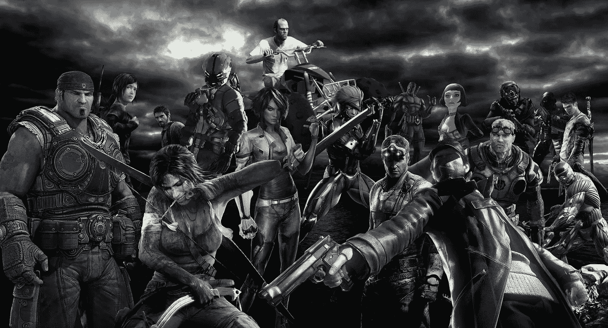
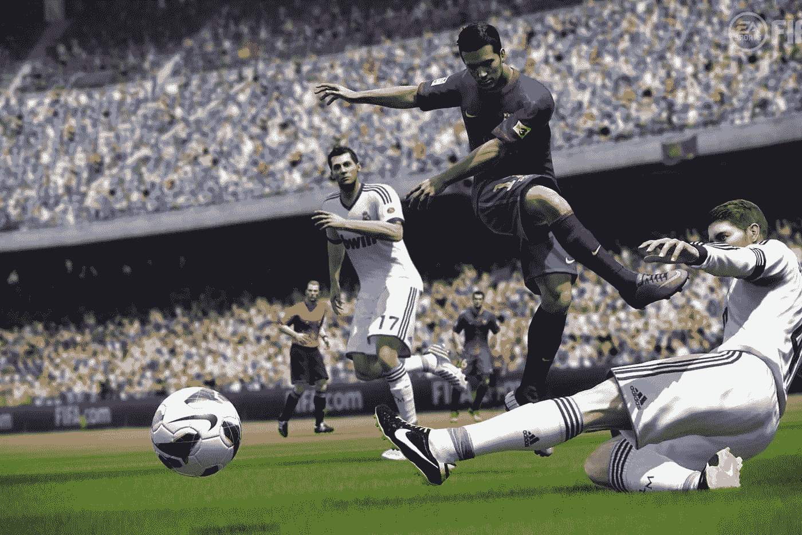
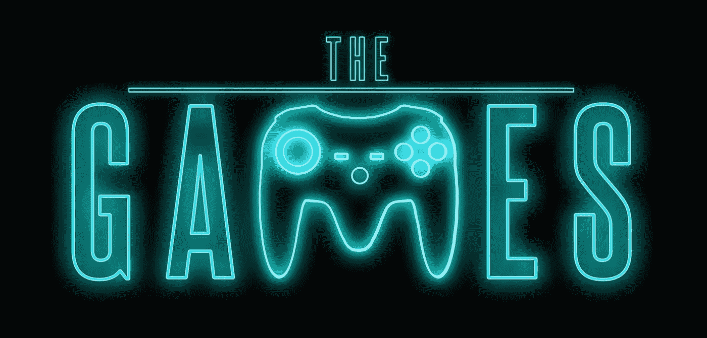

# 游戏产业的演变

> 原文：<https://medium.com/visualmodo/evolution-of-games-industry-e0fefe24e49?source=collection_archive---------0----------------------->

## 和它的工作

像许多人一样，我对视频游戏行业的热爱始于 90 年代，从 Game Boy 到我的任天堂 64。玩《神奇宝贝之蓝》和《斯派罗》的时候，事实上，我记得我被这些酷炫的画面迷住了！—但当我现在回头看那些我曾经认为已经不存在的图形和设计，并将它们与下一代游戏机进行比较时，我对自己说，游戏行业发生了多大的变化和多大的改进。一些其他的爱出现在所有的游戏风格和游戏方式中，你可以在[在线赌场看到更多关于这个令人惊奇的游戏](https://online-casino.ie/)

# 游戏产业及其工作的演变

就拿我过去 18 年最喜欢的游戏 FIFA series 来说，对我来说，它是我第一次真正热爱游戏的地方——确切地说，是 FIFA 98，这个游戏太棒了。

我和罗马里欧、里瓦尔多、齐达内等球员一起打球，我认为这是最好的图形，因为我每个周六都坐在那里，全力以赴，24 比 0，30 比 0(我保证，这完全不是业余的！)

然后我们来到现在，因为我们看到了惊人的图形为他们的最新版国际足联 17 电子艺术带给你，他们只是没有可比性！

现在我必须承认，这让你质疑这和我的游戏招聘行业有什么关系？

嗯，实际上这关系很大，因为由于目前市场上游戏、游戏技术和设计的辉煌，这意味着游戏工作室和游戏开发者对员工的需求增加了。

在“[次世代](https://visualmodo.com/)”游戏机以及个人电脑和掌上电脑上的顶级游戏浪潮意味着工作室的数量和投入的资金都有了大幅增长。更不用说世界上有多少独立开发者正在选择大牌游戏，如 Hitman 的 Sumo Digital 和 Forza Horizon 系列的 Playground 游戏。

不仅如此，它还是一个可以为你们中的一些人提供最好机会的行业。随着远程工作在该行业的一些大公司中越来越受欢迎。想象一下，当你 12 岁的时候，坐在那里想我喜欢游戏，我喜欢在游戏中工作，但不离开我的房子。嗯，现在这可以成为现实，而不仅仅是一个梦想！

随着新工作室的蓬勃发展和更多在室内和室外工作的可能性，反过来也为各种游戏爱好者创造了更多的工作机会，从设计师、程序员到 QA 测试员。即使在过去的五年里，我们也注意到了该行业的巨大繁荣，以及它开始向目前的高度发展的方式。事实上，来自 TIGA 的一项研究表明，英国工业正处于健康增长时期，就业、收入和税收贡献在去年全面上升。

说了这么多，做了这么多，如果阅读这篇文章启发了你开始在游戏领域密切合作，无论是与我一起工作的创意人员与高质量的游戏人交谈，或者如果你是一个有抱负的或当前的游戏艺术家、程序员或设计师，请不要犹豫与我联系。