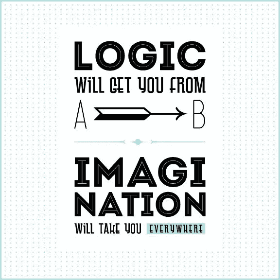

# 著名设计语录

> 原文：<https://medium.com/visualmodo/famous-design-quotes-ce7bdab9c5a0?source=collection_archive---------0----------------------->

## 寻找灵感

你在寻找有创意的设计灵感吗？然后看看著名设计师的作品和哲学——他们的才华、智慧和标志性是有原因的！这里有一些当代顶尖平面设计师的伟大设计名言。

# 灵感的著名设计语录

# 安托万·德·圣·埃克苏佩里

“设计师知道他已经达到了完美，不是当没有什么可以添加的时候，而是当没有什么可以删除的时候。”

# 戴维·卡森

"平面设计将在摇滚乐之后拯救世界."

# 梅顿·戈拉瑟

“对一件设计有三种反应——是，不是，哇！Wow 才是要瞄准的。”

# 保罗跑了

“比起好的设计，公众更熟悉糟糕的设计。实际上，它习惯于选择糟糕的设计，因为这就是它的生活。新的变得具有威胁性，旧的变得令人安心。”

# 斯特凡·萨格梅斯特

“你可以在一幅伦勃朗的作品前，或者在一幅平面设计作品前，体验一次艺术体验。”

# 鲍勃·吉尔

“我从来没有遇到过愚蠢客户的问题。没有所谓的坏客户。我们工作的一部分就是做好工作，让客户接受它。”

# 薛·博兰

“正是通过错误，你才能真正成长。你必须变坏才能变好。”

# 迈克尔·比鲁特

“如果你为好客户做好工作，就会为其他好客户带来其他好工作。如果你为糟糕的客户做了糟糕的工作，就会导致其他糟糕的客户做其他糟糕的工作。”

# 奇普·基德

“永远不要爱上一个想法。她们是妓女。如果和你在一起的那个人不能胜任工作，总会有另一个人的。”

# 玛丽安·班杰斯

“但我发现，对我自己来说，毫无例外，我越是把工作当作我自己的东西，当作个人的东西，T2 就越成功。”

# 内维尔·布罗迪

"数字设计就像绘画，只是颜料永远不会干."

# 约书亚·布鲁尔

”苏格拉底说，“认识你自己。”我说，“了解你的用户。“你猜怎么着？他们不像你那样思考。”

# 索尔·巴斯

“我想做美丽的东西，即使没人在乎，而不是丑陋的东西。这就是我的意图。”

# 弗兰克·奇梅罗

“好的设计就是让其他设计师觉得自己是白痴，因为那个想法不是他们的。”

# 林顿领导人

“在设计中，我追求两件事:简单和清晰。伟大的[设计](http://theme.visualmodo.com/spark/)就诞生于这两样东西。”

# 杰弗里·泽尔德曼

“内容先于设计。没有内容的设计不是设计，而是装饰。

# 马西莫·维格内利

“设计师的一生是战斗的一生。与丑恶作斗争。就像医生对抗疾病一样。对我们来说，视觉疾病是我们身边的东西，我们试图用设计来治愈它。”

你知道一些好的引用吗？欢迎在下面的评论区写下来和我们分享！