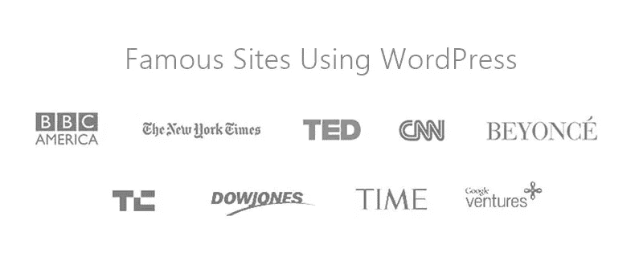
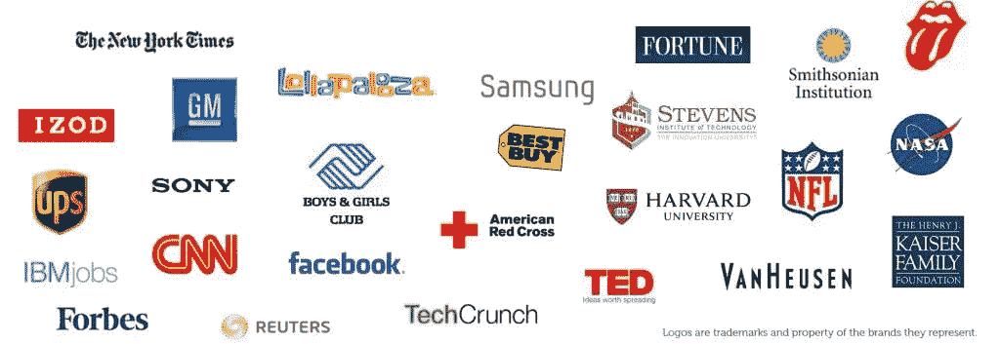

# 使用 WordPress 的著名网站

> 原文：<https://medium.com/visualmodo/famous-sites-using-wordpress-929a16928c8f?source=collection_archive---------0----------------------->

WordPress 受欢迎已经不是秘密了。30%的网站使用 WordPress，在内容管理系统方面，WordPress 占据了 59.4%的市场份额。但是不仅仅是大量的小网站在使用 WordPress——你知道吗，世界上一些最大最著名的网站和品牌也在使用 WordPress。

这就是我将在这篇文章中深入探讨的问题！看看一些最大的使用 WordPress 的网站，由 Alexa 流量排名和真实数据支持。我们用 WordPress:你几乎肯定听说过的品牌/企业，把超过 50 个领先的/著名的品牌放在一起展示！我用 WordPress 列出了一些著名的网站。

# 使用 WordPress 的著名网站

*   TED [直播现场](http://blog.ted.com/)
*   人物[现场直播](http://stylenews.peoplestylewatch.com/)
*   威瑞森 Fios [现场直播](https://fios.verizon.com/)
*   Etsy [现场直播](https://blog.etsy.com/en/)
*   综艺[现场直播](http://variety.com/)
*   家得宝[现场直播](https://careers.homedepot.com/)
*   Whitehouse.gov[现场直播](https://www.whitehouse.gov/)
*   路透社[现场直播](http://blogs.reuters.com/us/)
*   UPS [现场直播](http://blog.ups.com/)
*   AMC [现场直播](http://www.amc.com/)
*   PlayStation [Live 网站](http://blog.us.playstation.com/)
*   Zillow [现场直播](https://www.zillow.com/blog/)
*   芝加哥太阳时报[现场直播](https://chicago.suntimes.com/)
*   Skype [直播网站](https://blogs.skype.com/)
*   Yelp [直播现场](https://www.yelpblog.com/)
*   蒂姆·费里斯[现场直播](https://tim.blog/)
*   下一个网站[直播网站](http://thenextweb.com/)
*   《纽约客》[直播网站](http://www.newyorker.com/)
*   Tech Crunch [现场直播](http://techcrunch.com/)
*   多尔[直播现场](http://dolegetupandgrow.com/)
*   笑乌贼[直播现场](http://laughingsquid.com/)

# WordPress 是为每个人准备的！

WordPress 不仅仅是为大品牌和知名品牌服务的，WordPress 是为你和所有想为任何目的建立一个网站的人服务的，有几乎无限的主题，插件和一个大规模的有用的社区，这就是你所需要的！请在[这一页](https://visualmodo.com/customers/)上看看我们的一些客户。

# 如何建立自己的 WordPress 网站？

看着所有这些使用 WordPress 的流行品牌，你可能想知道如何开始你自己的 WordPress 网站。首先，你需要确保你选择了正确的平台。一个自托管的 WordPress.org 网站让你可以自由地构建真正强大的网站，拥有 WordPress 的所有功能。更多[见这里](https://www.bluehost.com/track/claudiocamposp/)。

你知道另一个吗？想在这里列出你的吗？欢迎在下面的评论区写下你的想法。