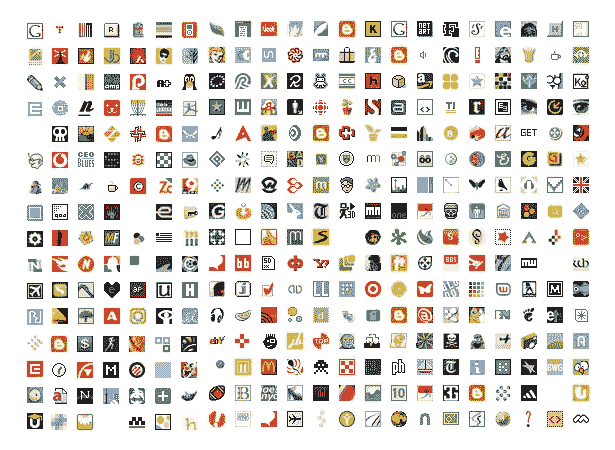
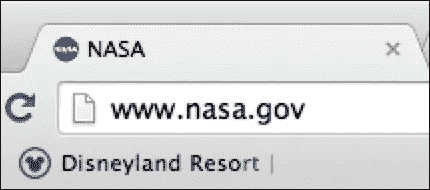

# 图标:搜索引擎优化的好处

> 原文：<https://medium.com/visualmodo/favicons-seo-benefits-ce21f1e91d19?source=collection_archive---------0----------------------->

当涉及到在浏览器上保存和保存网站书签时，有了 favicons，你似乎比没有 favicons 的网站有更大的优势。谷歌等搜索引擎为用户提供 Chrome 浏览器，用户也可以通过该浏览器为网站扣除某些搜索排名信号。

那些习惯选项卡式浏览的人知道为什么图标很重要。如果你的网站图标是可识别的，你的网站将会脱颖而出。毕竟一张图比一个[千个](https://visualmodo.com/)字说的多。就我个人而言，我经常发现自己把网站钉在谷歌 Chrome 上，这仍然是我的首选浏览器。作为一个待办事项，或者仅仅是因为我想随时把 Gmail 放在手边。或工作表中的特定电子表格。或者脸书。那个小图标是那个标签中隐藏的网站的唯一参考。你只需要一个好的网站图标。

# 让你的图标脱颖而出

你应该确保你的网站图标在长长的标签列表中脱颖而出。[检查](https://visualmodo.com/)是否与你的 logo 和网站很匹配。尤其是当你不是大品牌之一时，你希望人们能认出你的 favicon。与此直接相关的两个技巧是:

*   避免在你的图标中有太多的细节，
*   请使用正确的颜色，这样网站图标就不会和你的灰色浏览器标签混在一起。

两者都与品牌密切相关。你的品牌应该可以在你的网站图标中被识别出来。虽然现在我们能够在收藏夹图标中使用更多的颜色和更深的深度，但事实是浏览器上的可用空间仍然没有比早期的 16×16 像素小得多。

它看起来不再像 16×16 像素，但那是因为我们有更好的屏幕，而不是因为空间增加了。主要的改进是线条更清晰，你可以使用所有你想要的颜色。

正确的品牌是确保人们会立即将你的网站图标与你的网站联系起来。我列出了一些图标供你测试。请在评论中给我留言，告诉我什么图标属于什么品牌:

太容易了？在这种情况下，这些品牌很好地将他们的品牌转化为他们的图标。

# 收藏夹图标的搜索引擎优化优势

网站图标有真正的 SEO 好处吗？很难。除了[品牌](https://visualmodo.com/)之外，可能不会，尽管在这一点上观点可能会有所不同。有人可能会说，你现在可以添加一个 1MB 的图片作为 favicon，这样会降低加载速度。你可以说，一个合适的 favicon 突出了一个书签，可能会增加回头客。我甚至发现了一个故事，有人说有些浏览器会自动寻找一个 favicon，如果不在，就会返回 404。

我的 2 分钱？如果有一个 SEO 的好处，它是如此之小，以至于所有其他优化，如适当的网站结构或伟大的副本，应该总是优先考虑。这是否意味着你不需要那个图标？嘿，你没看浏览器标签那部分吗？你确实需要它，即使只是为了脱颖而出。

# WordPress 刚刚使你的一天:定制器中的品牌图标

如果你使用 WordPress，你可能已经知道从 4.3 版本开始 WordPress 核心就有了 favicon 功能。所以您可以毫无困难地使用这个默认功能。它位于定制器中，称为站点图标。事实上，WordPress 推荐使用这个选项来添加一个 favicon。

你甚至不需要创建一个图标。 ico 文件，和你一样，曾经，年前。只需使用正方形图像，最好至少 512 像素宽和高。这似乎与保持尽可能小的建议相矛盾。但是如果你优化了你的形象，它不会降低你网站的速度🙂

关于如何在 WordPress [做这件事的更多信息在 WordPress Codex](https://codex.wordpress.org/Creating_a_Favicon) 中。去阅读并添加一个漂亮的图标到你自己的网站上！