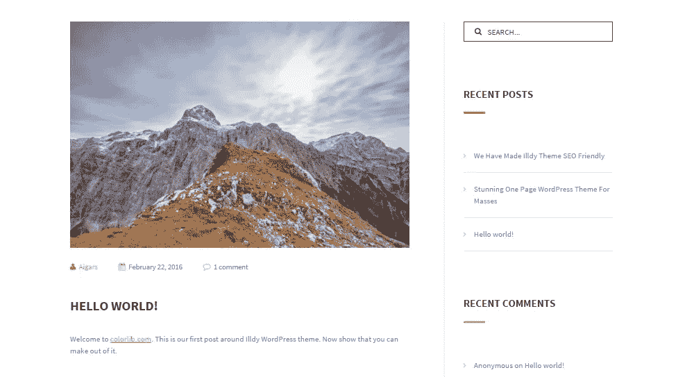
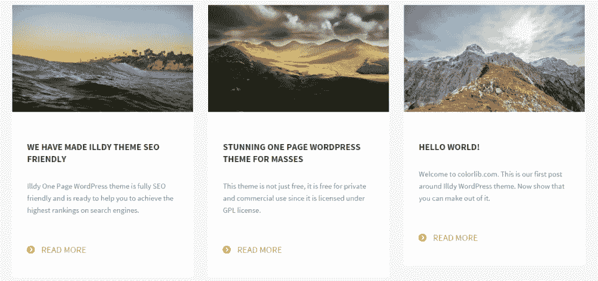
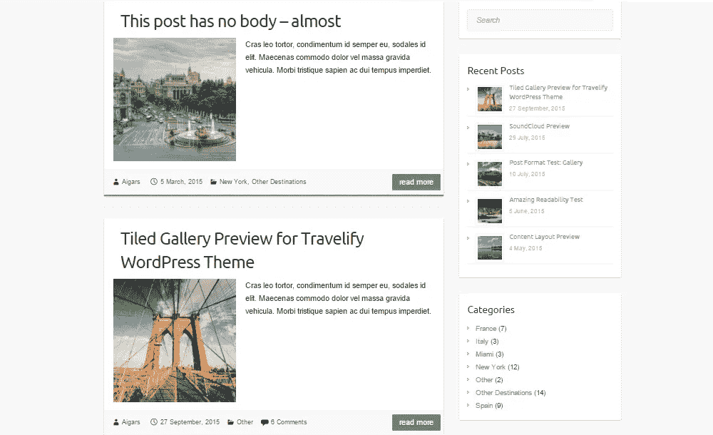
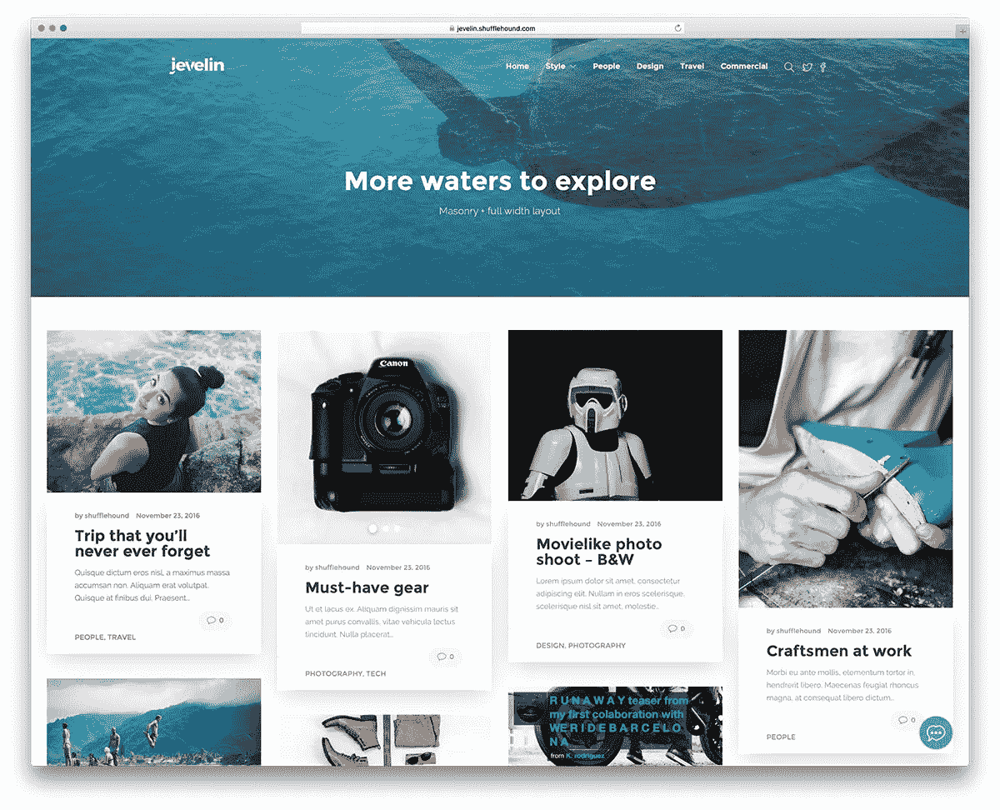
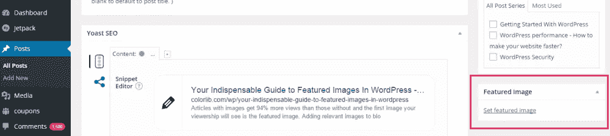
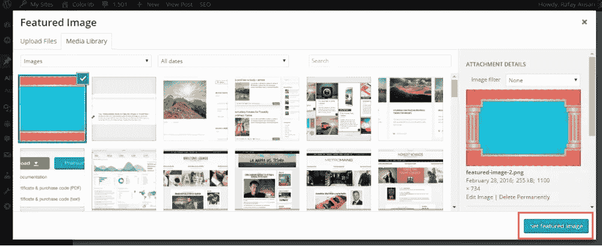
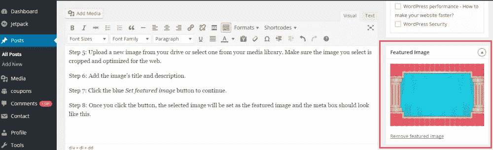

# 特色图片使用指南和重要性

> 原文：<https://medium.com/visualmodo/featured-image-usage-guide-and-importance-3fd9bc784756?source=collection_archive---------3----------------------->

现在看看如何在你的 WordPress 博客文章中正确地选择、编辑和使用特色图片，以及为什么你应该总是使用它。

有图片的文章比没有图片的文章多获得 94%的浏览量，你的观众看到的第一张图片是特色图片。

给博客文章和页面添加相关图片是博客的一个重要元素。还记得小时候你总是拿起一本插满插图的书吗？博客也是如此——图片密集的帖子比只有文字的帖子更具视觉吸引力。

在这篇文章中，我们将告诉你你需要知道的关于 WordPress 中特色图片的一切——它们是什么，你可以在哪里使用它们，以及如何使用它们来获得最大的利益。我们还将介绍在 WordPress 中添加和使用特色图片的最佳实践。

让我们先了解一些基础知识。

# 特色图像概述

你们都在博客中看到过特色图片，但可能不知道它们到底是什么。一般来说，WordPress 站点的博客页面有文章标题、简短摘录、作者姓名和缩略图。这个缩略图是文章的特色图片，显示在文章页面上的文字上方。

> 特色图像代表帖子或页面的内容、情绪或主题。文章和页面可以有一个单独的特色图片，许多主题和工具可以用它来增强你的站点的外观。——【WordPress.com 

显示在博客页面上的特色图片以缩略图的形式显示，大小会根据您使用的主题而有所不同。通常，它们被放置在文本的顶部或左侧。因此，特色图片也被称为[帖子缩略图](https://codex.wordpress.org/Post_Thumbnails)。

使用引人注目的特色图片来吸引潜在读者的注意力是为你的博客吸引更多流量的好方法。图片吸引读者，你在博客中使用的特色图片会被最多人看到——它会显示在博客主页、社交媒体帖子和帖子页面上。

# 关于特征图像重要性的一个注记

特色图片就像一本书的封面，正如古语所说，*永远不要以封面来判断一本书*，事实是很难不这样做。使用特色图片，给人留下最佳第一印象变得无比容易。一张图片胜过千言万语——为了让你的读者只看一眼就被吸引住，你不需要说一千个字。

与你实际添加到帖子和页面的图片不同，特色图片会传播得更远。从社交媒体网站分享到最近的帖子意见箱，你的特色图片将被发布在各种地方，供潜在订户偶然发现。

与特色图片的使用相关的突出特点之一是，它给你的博客带来了结构和一致性。假设你正在写一篇没有大量图片的文章。您可以依靠您使用的特色图像来确保它不会在没有单一视图的情况下在您网站的存档中丢失。

特色图片已经成为现代博客的一种规范，阅读没有特色图片的博客帖子似乎有点不妥。在下一节中，我们将深入探讨专业人士在选择、定制和添加特色图片时使用的最佳实践。

# 使用特色图像的最佳实践

特色图片很容易理解，到现在为止，你可能已经对它们是什么以及在哪里使用它们有了一个很好的想法。在这一节中，我们将探讨编辑在使用特色图片时采用的一些最佳实践。

# 大小

在添加你的第一张特色图片之前，你需要决定的第一件事就是你想要它的大小。您为第一个图像决定的大小将保持不变，以便您从这一点开始添加所有特色图像。这样做可以保持整个博客的一致性，并使其看起来更专业。

您为特色图片选择的尺寸应取决于两个因素:

*   你正在运行的主题。如果你的主题在设计上过于拥挤，选择较小尺寸的特色图片，而不是占据整个屏幕的图片。

请注意图片是如何与文章的标题和文本完全吻合的。

*   **你帖子的布局。**大多数网站管理员会调整特色图片的大小，使其整齐地放在文章正文的上方。如果他们文章的文字以 800 像素的宽度贯穿页面，那么特色图片的宽度也是 800 像素。

# 图像质量

特色图片通常尺寸很大，从 500 像素到全幅。记住这一点，最好使用高分辨率图像，而不是容易像素化的图像。网站管理员在股票图片网站上搜索相关的特色图片，或者雇佣内部设计师为每个帖子创建独特的特色图片。

不管你选择哪一个，记住在上传图片到你的网站之前，要对图片进行优化，以节省服务器的存储空间。像[北海巨妖](https://kraken.io/)这样的在线工具非常好用，如果你想安装一个插件，那么 [EWWW 图像优化器](https://wordpress.org/plugins/ewww-image-optimizer/)是一个受欢迎的选择。

# 关联

特色图片旨在捕捉与其相关的博客文章的精髓。但是，在哪里可以找到与您的内容*和*相匹配的相关图片，符合我们的最佳实践标准呢？如果你在运营一个高权威的网站，那么你的第一个行动计划应该是雇佣一个设计师来创建特色图片。如果你喜欢自己创作，像 [Photoshop](http://www.photoshop.com/) 、 [GIMP](https://www.gimp.org/) 和 [Illustrator](https://www.adobe.com/uk/products/illustrator.html) 这样的工具可以帮你大忙。

但是那些不愿意为特色图片倾家荡产的人可以在免费图片网站上搜索相关图片。

既然我们已经介绍了博客作者和编辑在特色图片上采用的一些最佳实践，那么让我们来看看在你的博客主页上显示特色图片的一些最流行的方法。

# 特色图像布局变化

在你的博客主页上显示特色图片有很多不同的方式，但主要取决于你所使用的主题的布局。让我们来看看不同类型的 WordPress 网站的一些不同的特色图片布局。

# 摘录顶部的特色图片

在文本上展示特色图片是最流行的博客页面布局之一。我们自己的 [Illdy](https://colorlib.com/wp/themes/illdy/) 主题将特色图片整齐地显示在博客主页上的帖子标题和帖子摘录的顶部。这种布局适合所有类型的 WordPress 网站——公司网站、普通博客或基于服务的网站。

# 侧面有特色图片

有时候，一个传统的特色图片在侧边布局正是你的博客主页所需要的。如果你想突出显示文章摘录或添加额外的文章细节，如作者姓名、发表日期以及文章所属的类别，这一点尤其重要。我们的 [Travelify](https://colorlib.com/travelify/blog/) 主题是这种特色图片布局的绝佳范例。

# 杂志风格特色图片

如果你的网站内容以图片为中心，那么最好是 Pinterest 风格的主题，并配以图片密集型、杂志风格的博客主页布局。我们的[墨水博客](https://visualmodo.com/theme/ink-wordpress-theme/)主题就是这样做的，不同大小的特色图片在主页上显示为帖子缩略图。

有一些主题不支持特色图片，尽管 WordPress CMS 支持它的 meta box。如果你运行的主题不支持特色图片，那么每次你在社交媒体网站或 RSS 订阅源上分享文章链接时，就会使用文章的第一张图片。如果帖子上的第一张图片缩小后很难查看，例如一张图表，这可能是个问题。

为了解决这个问题，大多数网站管理员会在主题文件中添加自定义代码，或者选择插件来添加特色图片。[默认特色图片](https://wordpress.org/plugins/default-featured-image/)和[快速特色图片](https://wordpress.org/plugins/quick-featured-images/)都是添加特色图片的绝佳选择。

# 如何在 WordPress 中添加特色图片

现在你知道什么是特色图片，以及为什么它对博客文章和你的 WordPress 网站很重要。在这一部分，我们将带你快速浏览如何在 WordPress 中添加特色图片的教程。

第一步:从 WordPress 仪表盘导航到*文章* > *添加新文章*来添加新文章。

第二步:给你的文章添加一些标题和内容。

第三步:向下滚动屏幕，直到你在右边栏看到一个标题为*特色图片*的元框。

特色图像元框

第四步:点击*设置特色图片*的链接。媒体上传器屏幕将弹出。

第五步:从你的驱动器上传一个新的图像或者从你的媒体库中选择一个。确保您选择的图像已针对 web 进行了裁剪和优化。

步骤 6:添加图片的标题和描述。

从您的媒体库中选择一个图像。

第七步:点击蓝色*设置特色图片*按钮继续。

第八步:一旦你点击按钮，选中的图片将被设置为特色图片，元框应该是这样的。

您选择的特色图像将出现在元框中。

这就是全部了！您已成功将特色图片添加到您的日志中。通过遵循相同的步骤，您可以轻松地将特色图像添加到页面和自定义帖子类型中。

# 包装它

特色图片很吸引人，也是一个有趣的功能——更不用说它们有很大的搜索引擎优化价值！将特色图片添加到您的博客帖子中是一个简单、直接的过程，并且很容易将其合并到您的博客帖子的发布前清单中。

让我们快速回顾一下本指南中涵盖的领域:

*   遵循特色图像最佳实践，找到正确的图像。
*   选择一个博客主页布局，为你的网站观众提供最好的价值。
*   如果你的主题不支持特色图片，安装一个插件来增加功能。
*   最后，但肯定不是最不重要的，使用上述步骤添加一个合适的特色图片来吸引读者的注意力。

你能给你的博客文章添加特色图片并为博客主页选择布局吗？你在寻找特色图片时遇到什么问题了吗？我们很想听到你的意见，所以请在下面留言联系我们吧！