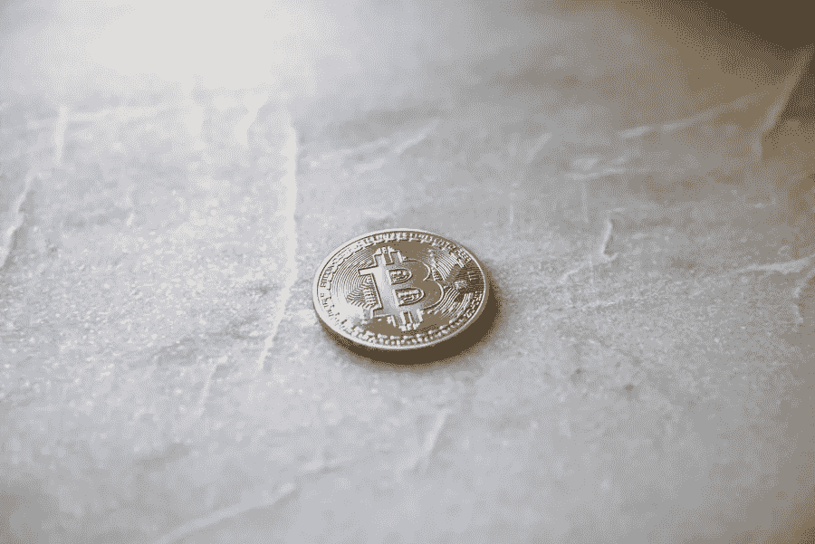

# 加密货币的特征

> 原文：<https://medium.com/visualmodo/features-of-cryptocurrencies-16bd2d4a940f?source=collection_archive---------0----------------------->

加密货币被定义为一种数字货币，它通过加密技术高度安全，因此任何人都几乎不可能伪造。世界上的许多加密货币都是基于区块链技术的分散式网络，这是一种由计算机网络实施的分布式账本。加密货币最显著的特点是，它们大多不受任何中央机构的控制，因此理论上可以抵御政府操纵或干预。

# 加密货币的显著特征

2008 年，一个名叫中本聪的人发明了第一种加密货币，即比特币，并发表了一份白皮书，题为“比特币:点对点电子现金系统”。除了比特币，以太坊，莱特币，Ripple，EOS，Cardana 是目前市场上流行的一些密码。截至 2020 年，有近 2900 种加密货币在交易，总资本超过 2210 亿美元。

比特币漏洞审查是加密世界的新成员，它已经在这个新兴领域建立了坚实的基础。最棒的是，它使用更快的处理和可持续的技术，并使用数学公式来计算准确的 nonce 或 nonce closer，以创建哈希并在挖掘期间完成交易。这使得整个过程比传统的采矿过程快四倍。

以下是让这些[加密货币](https://visualmodo.com/theme/cryptocurrency-wordpress-theme/)与众不同、备受追捧的几个关键特征:

# 分散和缺乏中央权威

在传统法定货币的情况下，银行和中央当局控制着金融系统。然而，对于比特币等加密货币，所有这些交易都由开放的分布式网络进行处理和验证。与这些机构不同，大多数加密货币在世界范围的计算机网络(节点)上没有中心。

这些交易被网络节点通过密码正确地验证，并被记录在被称为区块链的公共分布式账本中。事实上，该事务正确地存在于对等网络中，并且在每个节点上重复，从而在几秒钟内到达大部分节点。

# 加密货币的显著特征:最有效

使用特殊的对等数据库意味着不需要中央机构或第三方中介。处理和验证交易。所有用户可以通过一个没有中心的系统直接相互交易和交换密码。此外，每一笔交易都可以在区块链上进行验证。这意味着一个有互联网的人只需点击几下按钮就可以在世界各地交换贵重物品。此外，使用加密货币进行交易的成本低于通过洲际银行转账进行交易。

# 保持安全性和匿名性

因为需要一个中央机构，所以用户不需要表明自己的身份。同时使用加密货币进行交易。每当有事务请求时，网络就可以检验该事务。

核实它，并相应地记录在区块链上。加密货币的另一个特征是使用私钥和公钥系统来认证所有这些交易。这意味着用户可以制作匿名的数字身份。以及数字钱包，以便在分散式系统上进行交易。并且能够以安全的方式验证交易。

# 防止货币操纵

由于中央银行的发行，欧元和美元等受欢迎的法定货币有无限的供应。他们想要多少法定货币就有多少。央行通常操纵各国货币的价值，作为其金融政策的一个组成部分。大多数国家操纵货币，在一定时期内导致通货膨胀。法定货币的通货膨胀性质意味着货币价值随着时间的推移而减少。

因此，法定货币的持有者将不得不承担贬值的成本。以及面临货币操纵的模糊性。与法定货币相比，这些虚拟货币中的大多数都限制了加密货币的预定供应量。在任何时候都可以将代码嵌入到底层算法中。

# 加密货币的显著特征:不可改变和不可逆转

加密货币的交易是不可变的，不可逆的。因此，这意味着除了相应私钥的所有者之外，其他任何人都不可能。移动数字资产，交易记录在区块链上后就永远不能改变。而改变交易变得不可能。

安全加密使得任何修改都很困难。因为它需要改变区块链中的大多数节点。事实上，避免欺诈交易，不能保留。因此，交易在区块链被透明地记录下来，并向公众公开。