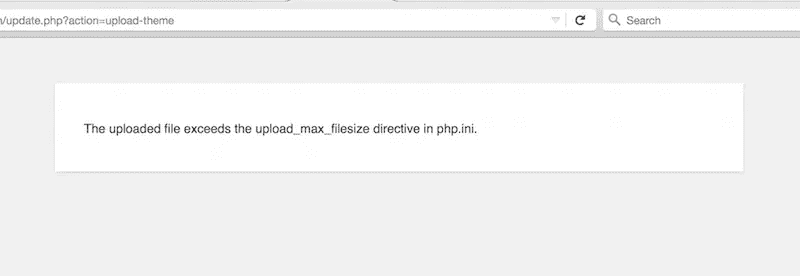
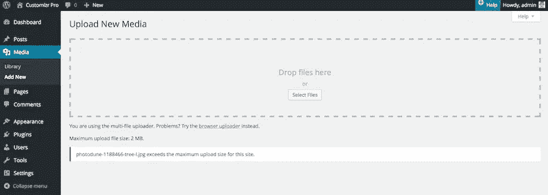

# 文件超过了上传最大文件大小

> 原文：<https://medium.com/visualmodo/file-exceeds-the-upload-max-filesize-b0e82b0ee226?source=collection_archive---------0----------------------->

如何修复 WordPress 中的最大上传和 PHP 内存限制问题？

# 与上传和内存限制相关的典型警告消息

在你的 WordPress 网站上工作时，你有时会看到以下类型的警告，与最大上传 PHP 内存限制有关。

*   警告帖子内容-字节长度超过限制…
*   上传的文件超过了 php.ini 中的 upload_max_filesize 指令…
*   超过了此网站的最大上传大小…
*   致命错误:在/home/your-username/public _ html/WP-includes/plugin . PHP 的第 1000 行耗尽了允许的 12345678 字节内存大小(试图分配 2345678 字节)
*   413 错误:请求实体太大
*   "[你确定要这么做吗？](http://docs.presscustomizr.com/article/303-how-to-fix-are-you-sure-want-to-do-this-in-wordpress)

**= >这些消息通常与你网站的服务器设置有关，比如最大上传大小或内存限制。**

# 文件超过了上传最大文件大小

安装 Customizr Pro 主题时，您可能会遇到以下错误信息。

> 上传的文件超过了 php.ini 中的 upload_max_filesize 指令

请看下面的截图。



或者在上传图像时出现以下错误。

> ..超过了此网站的最大上载大小。

请看下面的截图。



当 php.ini 文件中设置的 PHP Upload Max Filesize(Upload _ Max _ Filesize)小于 Customizr Pro 主题的文件大小或您试图上传的图像的文件大小时，会发生这种情况。

在撰写本文时，Customizr Pro 主题(zip 文件)的文件大小为 11.2M。

查看你的系统信息中 PHP 上传最大文件大小的值，你需要增加它到一个更高更健康的值。

# 内存限制的解决方案

以下是一些解决方案，可以修复你在 [WordPress](https://visualmodo.com/) 中超过上传最大文件大小的问题。

# 联系你的主机公司

是的，这是最好的方法。联系你的主机公司，给他们看你的错误截图，或者给他们写错误信息。请他们协助增加以下值，直到您能够安装您的 Customizr 主题或上传您的图像。您的托管公司可能对这些值有限制。

```
memory_limit
upload_max_size
post_max_size
upload_max_filesize
max_execution_time
max_input_time
```

优选为以下值。

```
memory_limit = 256M
upload_max_size = 64M
post_max_size = 64M
upload_max_filesize = 64M
max_execution_time = 300
max_input_time = 1000
```

# 参见视频教程

# 编辑 php.ini 文件

php.ini 文件是默认的 php 配置文件。大多数共享主机公司不允许访问这个文件。如果您确定您可以访问服务器上的 php.ini 文件，您可以继续下面的步骤。

1.  用你的 FTP 程序访问它。如何在 WordPress 上使用 FTP 软件？)
2.  在试图编辑此文件之前，请备份它的副本。
3.  打开它，找到下列值，一次一个(它们位于文件中的不同行)

*   内存限制上传最大大小发布最大大小上传最大文件大小最大执行时间最大输入时间

最好将它们编辑为以下值。

*   memory _ limit = 256m upload _ max _ size = 64M post _ max _ size = 64M upload _ max _ filesize = 64M max _ execution _ time = 300 max _ input _ time = 1000

# 使用。htaccess 文件

在 [WordPress](https://visualmodo.com/) 中，有一个. htaccess 文件。 [WordPress](https://visualmodo.com/) 使用这个文件来操纵 Apache(服务器)如何从它的根目录和子目录中提供文件。因此，这个文件非常重要。不要编辑该文件中的原始内容。您可以在文件末尾添加一些指令来增加 PHP 上传的最大文件大小。在这里了解更多关于 htaccess 文件的信息。

1.  使用你最喜欢的 FTP 程序来访问你的 WordPress 安装。
2.  转到根目录，这是你可以找到你的[wp-config.php 文件](https://codex.wordpress.org/Editing_wp-config.php)的目录。你应该能找到你的。htaccess 文件。
3.  下载一份到你的电脑上作为备份保存。
4.  打开它，并将以下内容添加到文件末尾的新行中。

*   PHP _ value memory _ limit 256 PHP _ value upload _ max _ filesize 64M PHP _ value post _ max _ size 64M PHP _ value max _ execution _ time 300 PHP _ value max _ input _ time 1000

1.  保存您的更改并覆盖。htaccess 文件。
2.  回到你的系统信息，检查你的值是否已经改变。如果没有，你应该联系你的主机公司来帮助你在 php.ini 文件中编辑这些值。

# 致命错误:内存耗尽

如果您的网站或不同的网页间歇出现白屏。[在你的 wp-config.php](https://codex.wordpress.org/Debugging_in_WordPress)中设置 WP_DEBUG 为真。如果您在屏幕上或服务器错误日志中看到类似以下错误消息的内容

> 致命错误:在第 1000 行的/home/your-username/public _ html/WP-includes/plugin . PHP 中，耗尽了允许的 12345678 字节内存大小(试图分配 2345678 字节)

这意味着你的 PHP 没有足够的内存来正常工作。

# 解决方法

以下是一些解决内存耗尽问题的方法。

# 联系你的主机公司

如上所述，这是首选方式。给他们看你的错误截图或者写下错误信息。请他们帮助增加 PHP 内存，直到你能够让你的网站正常工作。

# 修改您的 wp-config.php

你可以尝试在 WordPress 的 wp-config.php 中添加一个内存定义，但是如果你定义的内存超过了你实际的服务器分配的内存，这将不会起作用。

1.  使用你的 ftp 程序并导航到你的 WordPress 根目录。
2.  找到您的 wp-config.php 并下载一份拷贝到您的计算机上作为备份。
3.  使用纯文本编辑器或代码编辑器打开 wp-config.php。
4.  在文件末尾插入以下代码。

*   define('WP_MEMORY_LIMIT '，' 256m ')；

1.  保存你的 wp-config.php 并上传回你的 WordPress 安装。
2.  清除您的浏览器缓存并重新加载您的网站。
3.  如果您仍然遇到错误，您应该联系您的虚拟主机公司寻求帮助。

# 编辑 php.ini 文件

如果您可以访问 php.ini 文件。你可以试试下面这些。

1.  使用 FTP 程序，导航到您的主机服务器，并寻找 php.ini 文件。
2.  下载并保留一份备份。
3.  使用您的代码或纯文本编辑器打开它。
4.  找到以下内容。

*   内存 _ 限制

1.  将该值更改为更大的值。比如说。

*   内存限制= 256M

1.  保存并上传你的 php.ini 到你的 WordPress 安装中。
2.  清除您的浏览器缓存并重新加载您的网站。
3.  如果您仍然遇到错误，您应该联系您的虚拟主机公司寻求帮助。

# 使用。htaccess 文件

1.  使用你的 FTP 程序访问你的 WordPress 安装。
2.  转到根目录，这是你可以找到你的 wp-config.php 文件的目录。你应该能找到你的。htaccess 文件。
3.  下载一份到你的电脑上作为备份保存。
4.  打开它，并将以下内容添加到文件末尾的新行中。

*   php_value 内存 _limit 256

1.  保存您的更改并覆盖。htaccess 文件。
2.  回到你的系统信息，检查你的值是否已经改变。如果没有，你应该联系你的主机公司来帮助你在 php.ini 文件中编辑这些值。

这就是所有的文档。希望有帮助！