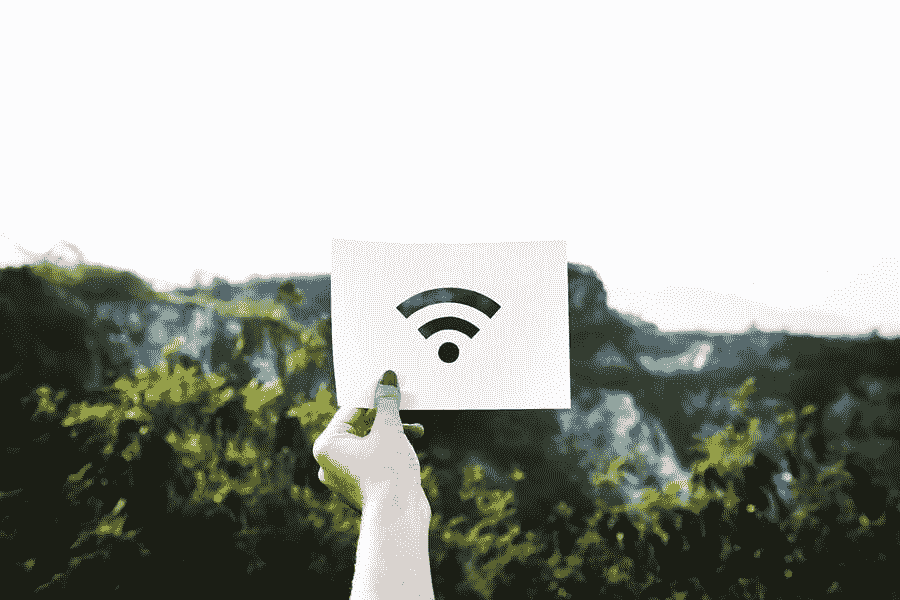

# 为您的路由器寻找最佳设置

> 原文：<https://medium.com/visualmodo/finding-the-best-setting-for-your-router-a0366b6aa5f8?source=collection_archive---------0----------------------->

很难找到没有最佳 Wi-Fi 信号接收的路由器，但这是一件好事，因为这一功能有助于无线通信。大多数人没有意识到他们路由器的设置是重要的，它会影响他们设备的性能。无线路由器的最佳设置是什么？这个问题可以用三个词来回答——WPA2。

WPA 是一种安全设置，通常位于 192.168.0.1 这样的设置下。这意味着没有用户的授权，网络不可能存在。如果您想知道 WPA2 安全性的最佳设置，这是一个设置最佳的实例。安全性是无线路由器最重要的标准之一。

# 选择路由器时需要考虑什么？

还有其他因素，以及你必须考虑当选择一个 WPA2 设置。例如，无线路由器将使用 SSIDs。每台设备都有一个唯一的编号，以便相互区分。唯一编号用于识别和访问系统设置。如果您想防止对无线路由器的未授权访问，该设置应该是安全的。

有时，您可能会使用制造商提供的计算机默认设置。但是，有时这些默认设置可能会产生问题。在这种情况下，最好使用最佳设置。这可以确保您的计算机得到最好的保护。

除了安全原因，WPA2 还为您的互联网连接提供额外的保护。这是因为该设置是为了防止对网络的攻击。因此，如果有人有恶意，如果 WPA2 设置生效，他们将不会使用网络。因此，设置到位至关重要。否则，您将面临遭受各种攻击的风险。

# 检查您的主要互联网资源设置您的路由器

选择最佳设置时，您应该考虑您的互联网连接的主要来源[是什么。如果您的主要来源是移动电话，您应该选择 WEP 或无线等效隐私。它提供了高级别的保护，并且易于使用。](https://visualmodo.com/open-source-benefits-and-why-we-love-it/)

在选择最佳设置时，您应该考虑的另一件重要事情是，该设置是限制还是允许所有传出流量。你可以选择一个最适合你需要的。此外，一些路由器支持使用 PPTP。这种类型的设置限制网络中特定人群的访问。这也是最安全的堵人方式之一。