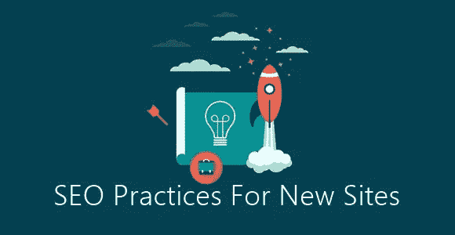

# 新网站的第一次 SEO 实践

> 原文：<https://medium.com/visualmodo/first-seo-practices-for-new-sites-5fc34fd6a2e7?source=collection_archive---------0----------------------->

简单而重要的第一次 SEO 实践和步骤进行一个新的网站，使其在搜索引擎中排名更好，并有一个更好的交通开始。

一个新网站如何开始排名？在你启动它之后，它会神奇地出现在谷歌上吗？你必须做些什么来开始在谷歌排名并从搜索引擎获得流量？在这里，我解释了在你的新网站发布后你需要采取的第一步。了解如何开始为一个新网站的搜索引擎优化工作！

# 7 —第一次 SEO 实践

# 1-外部链接

我的朋友推出她的网站后，她庆祝了一下，并问她的朋友们，包括我，他们对她的新网站有什么看法。我喜欢她的网站，但在谷歌上找不到她，即使我搜索了确切的域名也找不到。我问我朋友的第一个问题是:你有链接到你网站的另一个网站吗？她的回答是“不”。我从我的个人网站链接到她的网站，半天后，她的网站出现在搜索结果中。为一个新网站做 [SEO](https://visualmodo.com/category/seo/) 的第一步:*获得* *至少一个外部链接。*

谷歌是一个跟踪链接的搜索引擎。为了让谷歌知道你的网站，它必须通过另一个网站的链接找到它。谷歌找到了我朋友的网站，因为我在我的个人网站上放了一个那个网站的链接。当我把链接放在我的网站上后，谷歌来抓取我的网站时，它发现了我朋友的网站的存在。并将其编入索引。索引网站后，它开始在搜索结果中显示该网站。

# 2 —设置

在第一个链接之后，你的网站可能会出现在搜索结果中。如果它没有出现，可能是您的网站设置已打开，或者`noindex`仍被阻止。如果是这样的话，你是在告诉谷歌不要索引你的网站。有时候开发者在完成你的站点工作后会忘记关闭这些。

有些页面并不是最好的登陆页面。例如，你不希望人们登陆你的结账页面。你不希望这个页面与其他有用的内容或产品页面在搜索结果中竞争。你不想在搜索结果中弹出的页面(但这种情况并不多)应该有一个.`noindex`

Yoast SEO 也可以帮你设置这些页面`noindex`。这意味着谷歌不会将该页面保存在索引中，也不会出现在搜索结果中。

# 3 —关键词

我朋友的网站现在在她的域名上排名。大概就是这样。她还需要做一些工作来开始其他方面的排名。当你想提高一个新网站的搜索引擎优化，你必须进行一些适当的关键字研究。所以去发现你的观众在寻找什么吧！他们用什么词？

如果你正确地执行你的关键词搜索，你会得到一长串你想搜索的词。确保自己在谷歌上搜索这些术语。已经有什么结果了？对于这些[搜索](https://visualmodo.com/)术语，谁会是你的在线竞争对手？怎样做才能从这些结果中脱颖而出？

# 4 —写作

然后你开始写。写下所有对你的听众来说重要的话题。使用你在关键词研究中想到的词。你需要有关于你想要排名的主题的内容，才能在搜索[结果](https://icons.visualmodo.com/)中开始排名。

# 5-片段

一旦你开始排名，看看你在搜索引擎中的结果(所谓的片段)。那些元描述和搜索结果的标题吸引人吗？它们是否足够吸引你的观众去点击它们？还是应该写更好的？

# 6 —结构

哪些页面和帖子最重要？这些应该有其他网页和链接到他们的职位。确保链接到最重要的内容。谷歌会跟踪你的链接，拥有最多内部链接的文章和页面很可能在搜索引擎中排名靠前。建立这样的结构基本上是告诉谷歌哪些文章重要，哪些不重要。我们全新的文本链接计数器可以很好地帮助你查看你是否经常链接到你最重要的内容。

# 7-链接构建

谷歌关注链接。[链接](https://visualmodo.com/wordpress-themes/)很重要。所以把话传出去。联系其他网站所有者——最好是与主题相关的网站——让他们写一些关于你的新网站的内容。如果谷歌跟踪多个链接到你的网站，它会更频繁地抓取它。当你为一个新网站做 SEO 的时候，这是至关重要的，并且最终会对你的排名有帮助。不要过分追求搜索引擎优化的链接建设，购买链接仍然是一个禁忌:

# 结论

我希望这篇关于第一次 SEO 实践的文章给你一个在你的新网站中搜索引擎优化“从哪里开始”的想法，如果你有任何问题，请随时使用下面的评论部分。