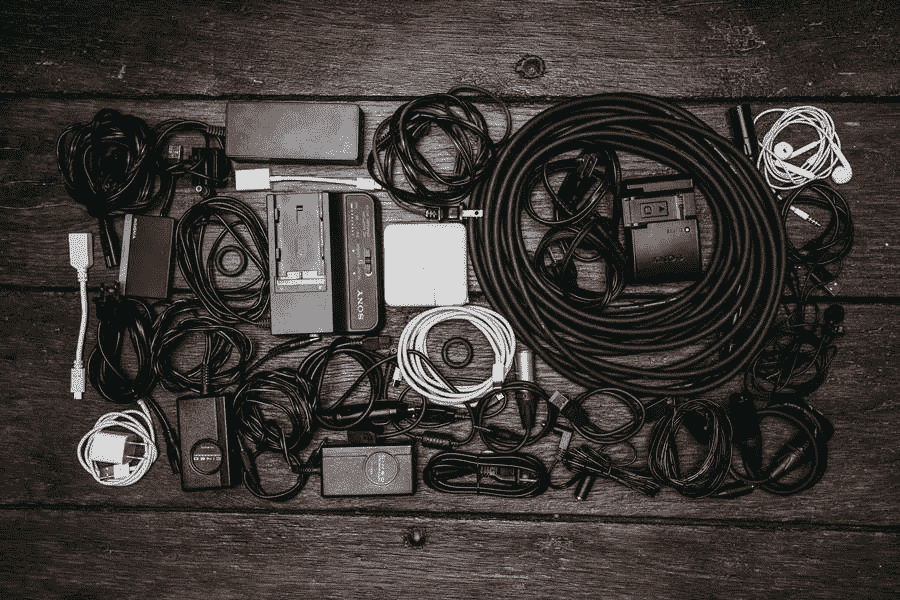

# 固定充电器电缆，防止其断裂

> 原文：<https://medium.com/visualmodo/fix-and-keep-charger-cables-from-breaking-935095d27b92?source=collection_archive---------0----------------------->

如果充电器电缆磨损或电线断裂，不仅会影响设备的性能，还会损坏设备。这也将导致低效率的收费，从而增加你每月的水电费。因此，如果你想让你的充电器保持同步，并[保护你的移动设备，修理和保护你的 iPhone 充电器线，以防止它们在第一时间断裂。这里有一些简单有效的方法。

# 充电器电缆固定技巧

# 电缆笔弹簧

你可以用笔簧保护你的[苹果充电器线](https://www.moarmouz.com/)不被折断。你可能会觉得这会让充电器看起来很丑，但它可以有效地保护你的电缆免受破坏，这也是一个经过时间考验和荣誉的技巧。这是一个简单的过程。

*   如果你有几支旧钢笔，打开它们
*   拆下弹簧并
*   在顶部和底部都缠绕在你的 iPhone 线上。
*   确保连接器正下方稍厚的部分被很好地覆盖，以防止其断裂。

弹簧将有助于防止绳索过度弯曲，并将其保持在一起。

# 使用降落伞

你也可以用伞绳保护你的充电器电缆。这是一个[创造性的](https://visualmodo.com/wordpress-themes/)方法来保护你的充电器电缆不被折断。

*   取一段合理长度的降落伞，取出内脏
*   融化两端以防止磨损
*   将整个降落伞缠绕在你的充电线上
*   继续前进时使用“眼镜蛇”结。

与弹簧笔相比，末端不会那么难看，而且更加丰富多彩，可以定制。然而，这里的关键是要打好降落伞结。有很多[网站](https://awards.visualmodo.com/)会为它提供一步一步的指导。从这些中获得帮助。

# 使用绝缘胶带

这是防止充电器电缆断裂的最好方法。电工胶带容易获得，是一种强有力的保护材料。

*   拿一段电工胶带
*   用它缠绕绳子的两端
*   确保在电缆与插头连接的地方尽可能拧紧，这样就完成了。

如果你想要一种廉价的方法来保护你的电线，这个过程将会非常有效，但被告知这将是一个短暂的过程，因为随着时间的推移，胶带会变得松散，并留下令人讨厌的粘性残留物。

# 热收缩管

如果你不想有任何混乱，那么使用热缩管是保护或修复充电器电缆的最佳和最性感的选择。这东西是:

*   便宜的
*   很容易在当地五金店买到
*   有多种颜色。

将管子滑到电缆上，用吹风机加热，使其收缩以适合电线，从而为电线提供良好的加固。如果你先在电线上使用一个弹簧，然后在上面用热缩管包裹，你会得到额外的保护。