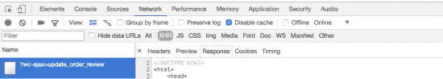

# 固定 WooCommerce 循环加载旋转器

> 原文：<https://medium.com/visualmodo/fix-woocommerce-endless-loading-spinner-2c97b1951f3?source=collection_archive---------0----------------------->

修复 WooCommerce 无休止的加载微调器，结帐页面通过 ajax 加载支付方式/总额——这简单地显示了一个加载微调器。如果在使用 WooCommerce WordPress 插件的结帐页面上使用它时出现问题，这一部分可能无法加载，或者微调器可能会保留。

# WooCommerce 循环装载纺纱机

首先，你应该检查 **WooCommerce >系统状态**是否有错误——通常错误会被突出显示。

还有问题吗？下面列出了常见原因和解决方法。

# 由于 WordPress 设置导致的 AJAX 错误。

在**设置>常规**中的 URL 需要匹配——这是因为 AJAX 请求不能跨域工作:

# 其他 JavaScript 错误和冲突

主题和插件经常会引起问题(尤其是编码很差的！)用 JavaScript。使用浏览器的错误控制台检查错误。

AJAX 调用的响应无效

在浏览器的开发人员控制台上查看“XHR”选项卡，并查看响应。预期的响应应该是 JSON。如果响应是 HTML，这可能是由几个不同的原因造成的。这通常是由 WordPress 安装目录下的 index.html 文件引起的

这可以通过删除 index.html 文件或调整服务器配置上的索引指令并优先考虑 index.php 而不是 index.html 来解决。一些缓存插件也会在 JSON 响应前添加 HTML。

您还可能看到-1 的响应，这是一个安全故障，是由缓存的[随机数](https://codex.wordpress.org/WordPress_Nonces)引起的。

你也可以通过关闭其他插件并切换到默认的 WordPress 主题来检查冲突——这通常会发现问题。

# WP 内存限制

我们建议至少 64MB。参见:[增加 WP 内存限制](https://visualmodo.com/fix-maximum-upload-php-memory-limit-wordpress/)

如果你有这个问题，并以另一种方式解决，或者有任何问题，请在评论区写下来