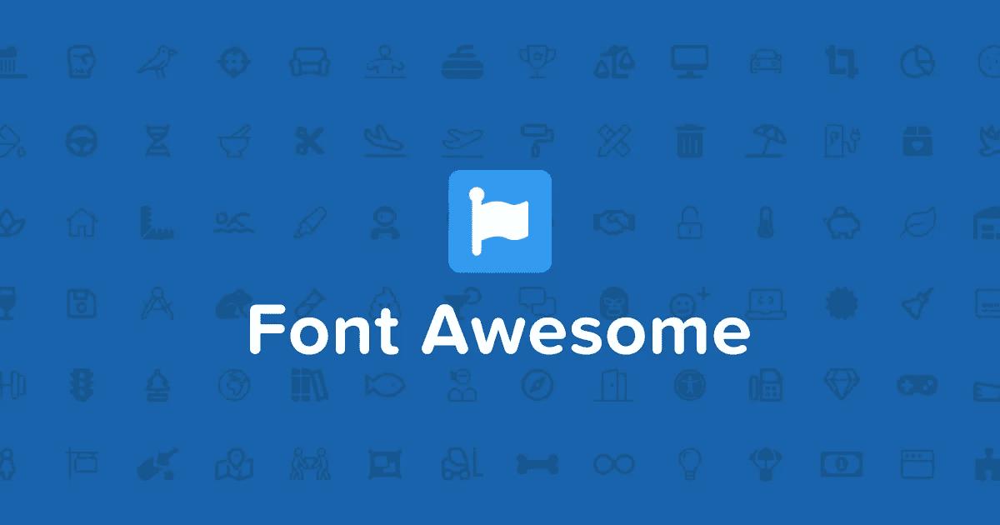
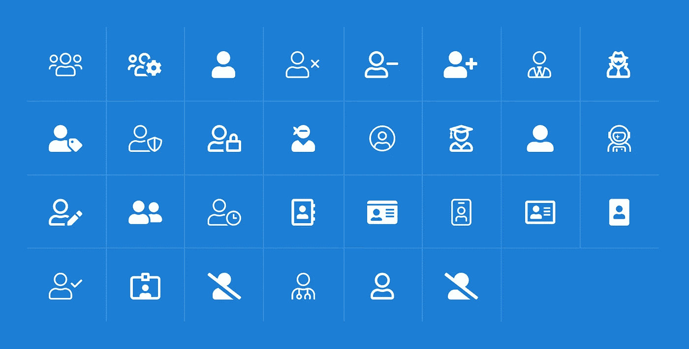

# 字体 Awesome WordPress 使用指南

> 原文：<https://medium.com/visualmodo/font-awesome-wordpress-usage-guide-45a9d2c27420?source=collection_archive---------0----------------------->

有兴趣用一种有趣的方式让你的 WordPress 网站的设计更吸引人吗？字体图标通过包含醒目的图标，让你的文章、页面或菜单更加生动。说到字体图标，字体牛逼绝对是最大的名字之一。如果你想要一个字体很棒的 WordPress 使用指南，为你的 WordPress 站点收集大量的图标，继续阅读来学习更多关于它们的知识，以及两个快速简单的方法来添加这些图标到 WordPress。

# 字体 Awesome WordPress 用法

在建立一个[网站](https://visualmodo.com/)的时候，图标曾经是一个大问题。你很难找到合适的——尤其是如果你需要不止一对相同风格的鞋子。(十个设计一致的图标？算了吧！)而且即使你*通过某种方式*找到了它们，如果你想用不同尺寸的图标，质量也不一样。长话短说，要得到正确的图标，你需要自己设计它们。

随着时间的推移，事情有了一点改善，各种图标包到处涌现(市场、小网站)。但这仍然不是完美的。即使有了这些网站，你仍然不得不自己出去寻找图标，而不是拥有某种易于访问的库。这就是字体牛逼发挥作用的地方，也是我们的字体牛逼 WordPress 使用指南的基础。

一旦你把你的网站链接到字体 Awesome，你就可以通过一个简单的 HTML 标签访问每个图标。例如，为了得到这个很酷的图标。我需要做的就是使用这样一段代码:

`<i class="fa fa-car"></i>`

字体牛逼会把它转换成一个活图标。你也可以定制这些图标。你可以改变尺寸、颜色和阴影——基本上，你可以做任何通过 CSS 可以实现的事情。据你所知，这些图标的行为就像任何其他字体。字体牛逼也给你一些独特的东西，如动画图标的可能性。所以，不是像这样的静态版本:

这可以用任何字体牛逼的图标来完成。

因此，问题是:

# 好吃吗？

在我看来，字体[牛逼](https://visualmodo.com/wordpress-themes/)的主要优点是:

*   这个图书馆真的很大，目前拥有超过 630 个图标
*   一旦你把你的站点和主库整合在一起，每个图标都很容易访问
*   这都是向量，所以你可以随意改变图标的显示方式
*   在任何地方添加图标都非常容易。

坦白地说，字体牛逼确实做得很好。最重要的是，没有太多的学习曲线。一旦你的网站上安装了字体牛逼，你所要做的就是:

*   [浏览可用图标](http://fontawesome.io/icons/)以便更好地了解那里有什么
*   [查看示例](http://fontawesome.io/examples/)(将它们视为快速操作指南)。

图标本身的视觉质量也非常高。网络上许多图标包的一个常见问题是，由于细节过多或过少、形状不清晰等原因，它们往往只有在特定的尺寸下才看起来不错。但是字体牛逼的图标根本不是那样的。似乎它们被设计成可以在任何地方使用，无论你想用多大的尺寸，看起来都很棒。另外，让我们记住它们都是向量，所以缩放也不是技术问题。

最重要的是，字体牛逼图标在设计上实现了三个主要目标:

*   每个图标的设计都是一致的，所以一切都很协调。
*   设计非常简洁，这有助于图标适应各种用途(它们看起来特别适合导航元素)。
*   数量变成了质量——无论你需要多少图标，Font Awesome 都能提供。

好了，让我们进入复习的操作部分:

# 字体 Awesome WordPress 用法

抛开这些赞美，让我们看看如何在 [WordPress](https://visualmodo.com/blog/) 中使用字体牛逼。或者说，如果你没有去过 *wp-admin* 的“*外观/编辑*”部分，那就有问题了。要在你的 WordPress 站点上安装字体 Awesome，你有两个选择:

*   手动安装
*   通过插件

这里有一个问题:字体牛逼是少数几个用手动方式做事情实际上比使用插件更好的例子之一。让我们稍微偏离一下我们的主要评论，向你展示:如果你正在寻找一个字体很棒的插件，那么你可能会偶然发现这两个:

*   [字体更棒](https://wordpress.org/plugins/better-font-awesome/) —在博客内容的任何地方显示字体棒图标。
*   [字体超赞 4 菜单](https://wordpress.org/plugins/font-awesome-4-menus/) —在菜单中显示字体超赞图标。

虽然两者在技术上各司其职，但还是存在一些问题。正如你所想象的，从更好的字体牛逼开始，获得功能很简单——只需安装并激活插件(你不需要去字体牛逼本身或任何东西)。你需要的只是插件。

安装完成后，你会在你的文章编辑界面中看到这个框:点击它将允许你选择一个字体很棒的图标，并把它作为一个短代码包含进来。酷毙了。

从评论来看，这在大多数时候是有效的。但并不总是如此。例如，对我来说，它完全搞乱了我的 CSS 就像，我的整个主题样式停止工作(这是默认的 215 主题，我们在这里讨论，所以没有什么花哨的)。

现在，我并不是说插件*也会*给你带来这些问题，但是随着时间的推移，你很可能会遇到各种各样的问题——尤其是当新版本的 Font Awesome 或 WordPress 发布的时候。这可能不值得。想象一下，有一天你更新了你的网站，而你的 CSS 却不见了。你需要多长时间才能将问题追溯到一个特定的插件？在此期间，有多少访问者会看到网站被拆除？

现在谈谈另一个插件，字体真棒 4 菜单。这确实有效，而且似乎表现得相当不错。您所要做的就是安装它，然后您可以将自定义类添加到您的菜单项中，就像这样:

这些类与官方字体 Awesome 文档中列出的相同。该插件负责图标的颜色，以匹配菜单，间距，一切。

如果你的菜单只需要字体，这是非常好的，但是，不幸的是，如果你想在内容中显示图标，这是不可行的。附件(a):

# 综合

本质上，正如这里详述的，你可以用两种不同的方式做到这一点:

*   直接从字体 Awesome 获得直接嵌入代码。
*   下载软件包，然后通过 FTP 将其上传到您的服务器。

最初，我很想下载它并把它放在我自己的主机上，但后来我意识到那只会意味着额外的工作。当然，获得包本身并通过 FTP 上传它并不是*那么多工作(懒惰)，但是你也必须注意保持它的更新。*

另一方面，在处理嵌入时，一切都会为您处理好。除了所有的维护工作，您还可以从 CDN 获得服务包，这对性能也有好处。

# 账户

how-to 部分非常简单，只需输入您的电子邮件，嵌入式代码就会发送给您:

Font Awesome 将向您发送一封欢迎电子邮件，其中包含您嵌入代码，以及一个注册该代码的选项，这会给您带来一些额外的好处。(注意:这不是强制性的，你不需要注册就可以获得主字体 Awesome 功能。)

所以，一旦你有了你的代码，只要进入你的 *wp-admin* 的“*外观/编辑器*”部分(**在做任何改变**之前总是备份你的整个网站和任何单独的文件)，然后把代码添加到你的主题的`<head>`部分。这通常是在*header.php*文件中，像这样:

注意:请记住，如果你更新了你的主题，这个字体集成将会消失，你必须重做。然而，当使用子主题时(如前一篇文章所述)，就没有这样的问题了。

在你包含了嵌入代码之后，你就在你的站点上启用了字体牛逼。Job 做到了——你现在可以随心所欲地使用所有图标了！

正如我提到的，当得到嵌入代码时，你也有机会用字体注册你的帐户。这不是必需的，但是我建议您这样做。这个账户是免费的，你会得到一些回报:

*   配置您嵌入的能力。
*   一些你正在使用的图标的统计数据。

# 为什么要溢价？

我起初不知道的是，Font Awesome 还提供了他们产品的高级版本，名为 [Fort Awesome](https://fortawesome.com/) 。

关于这一点，需要了解的关键是:

*   它有成千上万个图标。有了 Fort Awesome，你可以得到大量的附加图标，这些图标被分成不同的组(主题，不同的设计风格，等等。).这让你可以通过一个工具来满足你网站的所有图标需求——特别是当你需要一组非常特殊的东西来通过图标表现的时候。
*   你可以上传和使用你自己的图标。这很酷，因为它允许你上传东西，如你的标志，产品图标，或任何其他有意义的东西，并把它们添加到你的字体真棒库。这里的优势是你可以像使用其他字体图标一样使用这些图标——不管来源是什么，你所有的图标都可以一致地工作。
*   你得到自定义设置。您可以设置可以使用图标工具包的域，等等。
*   您可以在工具包中包含字体。你可以从一些最好的免费字体中选择或者上传你自己的字体。这使得你的网站排版资产都在一个地方。
*   您可以通过 MaxCDN 提供的优化 CDN 来加载所有这些内容。

最后，Font Awesome 的优质产品的核心是它的易用性、性能改进以及对所有图标和字体的整体轻松管理。

话虽如此，这种优质服务可能只有更大的网站、电子商务商店或主题网站才会受益。在一天结束的时候，你可能只需要你的网站上的少数几个图标，并且你不会非常频繁地更新它们——至少如果我们谈论的是标准的 WordPress 博客。

另一方面，像电子商务商店可以为个别产品创建自定义图标，或使用各种图标套件使其页面对买家更具吸引力。但这仍然是所有关于体积。小型产品目录可以很好地使用为每个产品手动创建的图标，没有令人敬畏的字体，所以他们仍然不会从[高级](https://visualmodo.com/wordpress-membership/)包中受益太多。

此外，值得指出的是，字体真棒保费不是一个'全包'式的软件包。还有额外的付费图标套件(每件高达 50 美元)，所以你可能会发现即使在你获得高级服务后，你仍然要掏钱包。

归根结底，Fort Awesome(字体 Awesome premium)并不一定是大多数 WordPress 博客的最佳选择。我真诚地相信，99%的情况下，选择免费服务可能会满足你的需求。

当谈到溢价时，只有当你运行一个依赖于各种项目、产品或菜单的视觉表示并频繁地向库中添加新元素的大型网站时，它才可能是一个好的投资。在这些情况下，你也将受益于 Font Awesome 的 CDN 交付，使你的网站在这个过程中更快。

# 结论

我们真的认为字体真棒是一个伟大的产品，字体真棒 WordPress 的使用是值得推荐的。在你的网站中加入酷的、设计精美的图标从来没有这么容易。你实际上只差一个标签(几乎？)是你想看到的任何东西的完美图标。

字体牛逼 WordPress 用法简单来说:

*   字体真棒免费使用:是，是，是。
*   字体 Awesome premium(牛逼堡):Meh。
*   各种字体牛逼的 WordPress 插件:还行，但不惊艳。

最后，让我们也强调一下，Font Awesome 是一个完全开源的项目，你可以用于任何目的，包括商业目的——你既不用支付额外的费用，也不用征求任何人的许可。如果你有什么想说的，请随意使用下面的评论区。