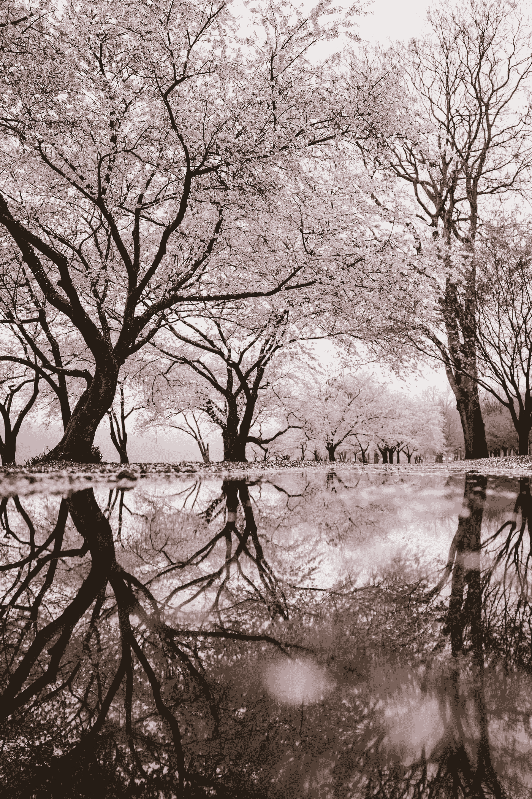
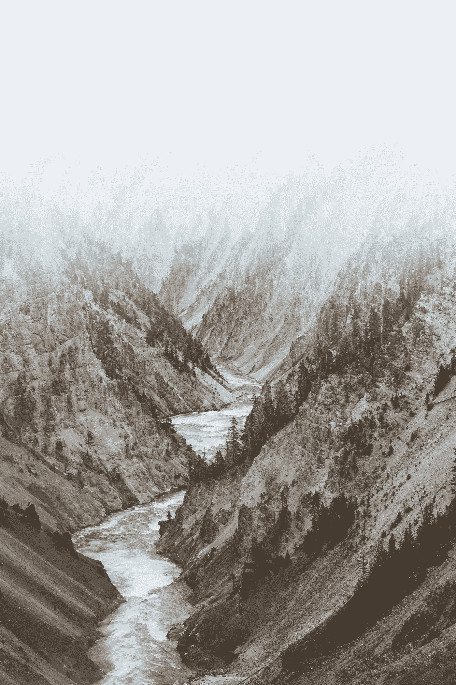
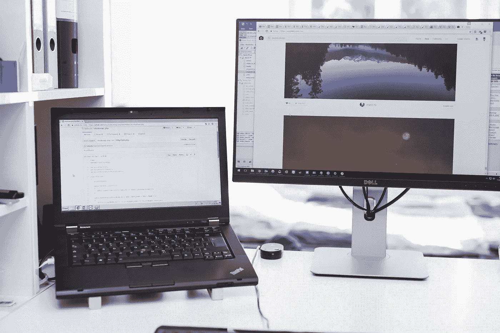

# 免费高质量的图片将被用作你的网站第 2 卷的插图

> 原文：<https://medium.com/visualmodo/free-high-quality-images-to-be-used-as-illustration-on-your-site-vol-2-e9c32fe6c7e8?source=collection_archive---------11----------------------->

免费高质量的图片作为你网站的插图 Vol. 1，如果你是一个设计师，经营一个博客或控制一个社交网络，你可能已经知道你需要用图片填充你的网络空间的内容，并已经搜索了一些好的免费图片集作为你项目的插图，这里是地方，随时下载！

公共领域图像被定义为版权已经过期或根本不存在的照片、剪贴画或矢量。这些图片几乎可以被任何人用于个人和商业目的。公共领域图像有三种出现方式:

1.  该图像通过[知识共享零](https://creativecommons.org/share-your-work/public-domain/cc0/) (CC0)许可或类似的发布被分配给公共领域
2.  图像是[没有版权](https://blog.99cluster.com/blog/tips/public-domain-images-allowed/)
3.  该图像的版权已经过期

厌倦了“传统”库存照片的博物馆、图书馆和摄影师已经在网上发布了数以千计的公共领域图片，使它们更容易被公众获得(是的！)那也是指设计师。在这篇文章中，我们整理了一个网站列表，这些网站提供免费的公共领域图片和高质量的库存照片，可供世界各地的任何人免费使用。

这里有一个很棒的免费高质量图片的 Visualmodo WordPress 主题集合，用来作为你的网站的插图，使它变得漂亮

来源:[https://visualmodo.com/](https://visualmodo.com/)