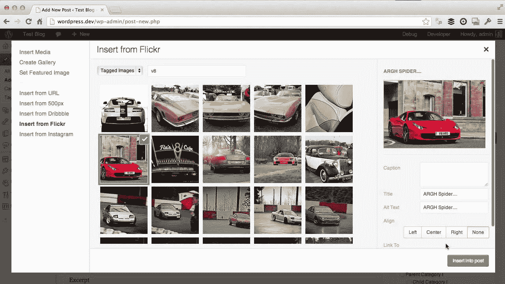

# 免费管理图片插件

> 原文：<https://medium.com/visualmodo/free-managing-images-wordpress-plugins-a8d28d965412?source=collection_archive---------0----------------------->

在本帖中，我们将展示一些最好的图片，以便在你的网站上更有效地使用图片。请查看我们的建议来提高你的 WordPress 站点图片的使用率。

开箱即用，WordPress 使得管理你的网站的图片变得容易，但是仍然有改进的空间。

在这篇文章中，我们将讨论三个图片插件，它们解决了与 WordPress 和图片管理相关的最常见的问题和请求。基本上，这些插件可以让你的网站看起来和运行起来更好。

特别注意:这些插件都易于安装和使用，但如果你正在寻找关于在页面或帖子中处理图像的基本信息。

# 管理图片 WordPress 插件

# [Envira Gallery Lite](https://wordpress.org/plugins/envira-gallery-lite/) (免费)

Envira Gallery Lite 是 Envira Gallery 高级插件的免费版本。高级版有更多的特性和功能，但对于一个基本的博客或摄影网站来说，Envira Gallery 的免费版提供了您轻松创建漂亮、响应迅速的图库所需的所有功能。

根据插件在 WordPress.com 的页面，Envira Gallery 和 Envira Gallery Lite 已经被下载了超过 300，000 次，使它们成为最受欢迎的图片库插件之一。

# 插件功能

*   拖放功能
*   灯箱图像展示
*   快速加载和优化搜索引擎优化
*   选择列数
*   页码
*   图像校对

# 为什么我们喜欢它

*   **Lightbox 功能:** Envira 图像库都带有 Lightbox 功能，这使得图像体验更加流畅、愉悦。有了 Lightbox，访问者可以点击你的图片，以更大的尺寸观看。
*   **易于使用:**安装完插件后，只需点击“添加新插件”即可。然后你上传或拖放你的照片，调整画廊和灯箱设置，你的画廊就创建好了。然后转到你的页面或帖子，点击新的“添加图库”按钮。选择要添加的图库，就大功告成了！
*   **比默认的 WordPress 图库功能更多的选项:**WordPress 的默认图片功能允许你在页面或文章中插入图库，但是 Envira Gallery 为你提供了更多的定制选项(如列和行大小)，并确保你的图片是移动友好的，并具有 Lightbox 功能。

# [WP Smush](https://wordpress.org/plugins/wp-smushit/) (免费)

图片在网络服务器上占据了很大的空间，会严重降低网站的性能。WP Smush 是一个免费的插件，通过压缩减少(或“Smush”)图像文件的大小，并改善网站的加载时间，这是一个主要的 SEO 性能因素。

根据插件页面，WP Smush 已被下载超过 40 万次，成为最受欢迎的图像压缩插件。

# 插件功能

*   使用高级无损压缩技术优化您的图像。
*   设置最大宽度和高度，大图像将在添加到媒体库之前自动缩放。
*   上传时自动推送附件。
*   在媒体库中手动逐个推送附件，或者一次批量推送 50 个附件。

# 为什么我们喜欢它

*   **非常容易使用:**一旦插件安装完毕，你只需要按下“批量刷新”按钮就可以压缩你所有的图片。几乎所有网站的默认设置都是正确的。
*   **图像质量没有损失:**该插件压缩你的图像尺寸，不会降低图像质量，导致像素化，或裁剪你的图像。

# [响应式灯箱](https://wordpress.org/plugins/responsive-lightbox/)(免费)

Responsive Lightbox 允许您将移动友好的 Lightbox 功能添加到您网站上的所有图像中，从而为桌面和移动设备上的网站访问者带来更好的图像体验。

该插件有超过 200，000+的下载量，使其成为最受欢迎的 Lightbox 插件之一。

# 插件功能

*   自动将 lightbox 添加到 WordPress 图片库。
*   自动添加 lightbox 到 WordPress 图片链接。
*   自动添加 lightbox 到 WordPress 视频链接(YouTube，Vimeo)。
*   WooCommerce 产品图库支持。
*   从图片标题，说明，alt 或描述中设置图库图片标题的选项。
*   选项，有条件地加载脚本和风格，只有在网页上有图片或画廊的文章内容。

# 为什么我们喜欢它

选项加载: Responsive Lightbox 比其他任何可用的 Lightbox 插件都有更多的选项，特别是能够将 Lightbox 功能添加到链接中，并且可以选择仅在某些页面上启用 Lightbox。

**添加 Lightbox 到所有图片:**默认情况下，WordPress 图片没有 Lightbox 功能。如果您使用 Envira Gallery Lite，灯箱功能仅适用于画廊中的图像。有了 Responsive Lightbox，你可以为网站上的每张*图片添加 Lightbox 功能，无论图片是否在图库中。*

# 结论

图片一直是运营一个网站的一个挑战，但是 WordPress 和网络社区一直在尽他们所能改进这个平台。我们希望你试用这些图片插件，并看到你的 WordPress 站点在性能和使用上的改进。