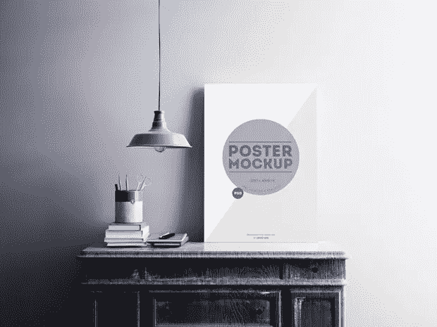
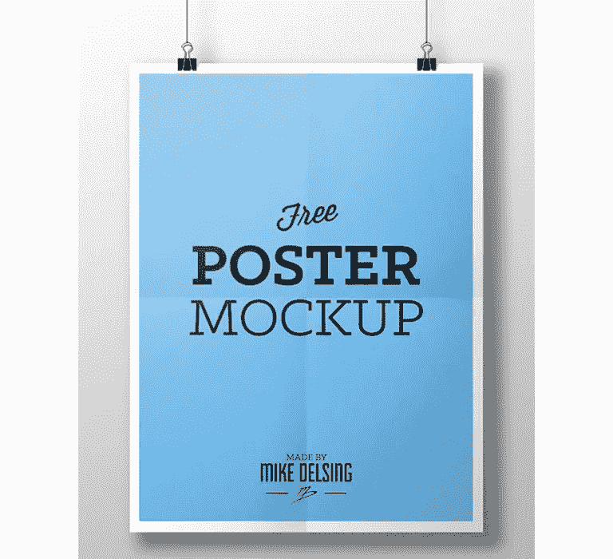
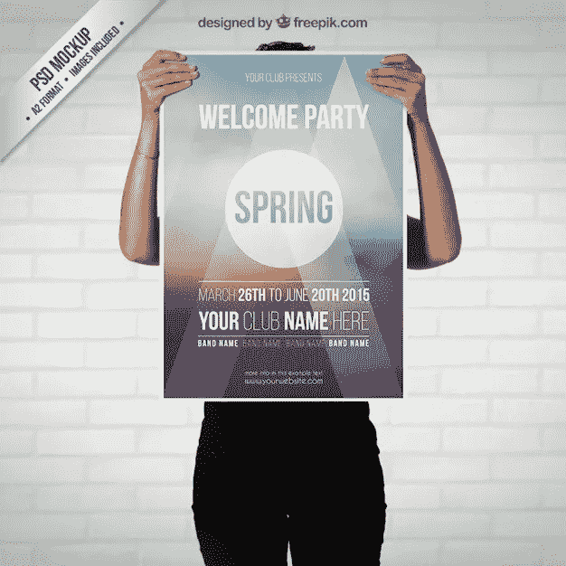
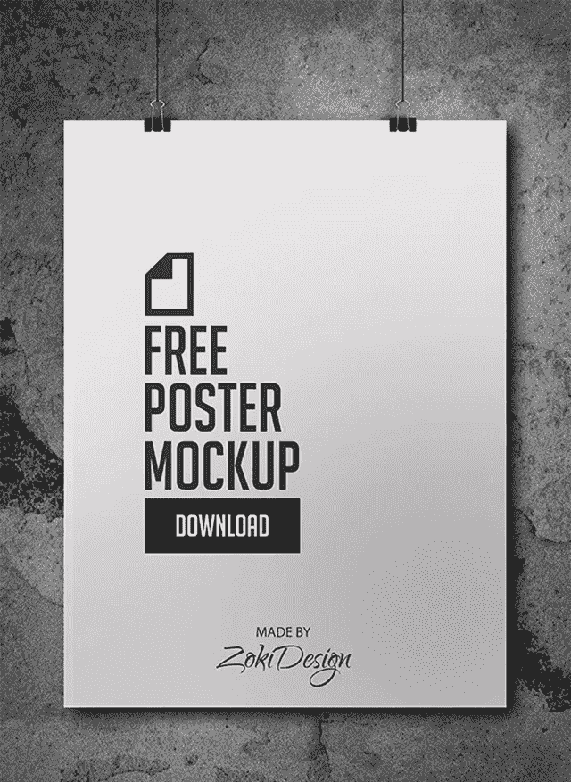

# 设计师免费 PSD 模型

> 原文：<https://medium.com/visualmodo/free-psd-mockups-for-designers-ef819006a211?source=collection_archive---------0----------------------->

你刚刚制作了一张海报，现在是展示的时候了。当你的努力工作被专业地印刷成一张有形的海报时，它会令人满意。但这可能会相当昂贵。现在看到一个免费的 PSD 样机列表，让它变得容易。

对于设计师来说，为室内或室外广告制作海报是一个非常有趣的项目。使用 Photoshop PSD 海报模型，您可以实际看到您的设计将如何呈现为带边框的印刷品、包装的画布甚至户外广告牌。在这篇文章中，我收集了 12 个免费的 Photoshop PSD 海报样板，你可以用它们来展示你的作品。

幸运的是，其他设计师制作了许多高质量的免费海报模型，可以帮助您或客户在真实的环境中看到您的海报设计。正如你在这篇文章中所看到的，我已经收集了一份**免费 PSD 海报模型**的清单，包括装裱、手持、透视、墙壁、[工作区](https://visualmodo.com/)、博物馆、户外、广告牌、不同照明选项等。

所有这些都易于使用，并配有智能物件，因此您只需放置自己的海报，就可以自动模拟出来。

# 设计师免费 PSD 模型

# 迈克·德尔辛的免费海报模型

[下载这张海报模型](https://www.behance.net/gallery/10249145/Free-Poster-Mockup)

# Freepik 的免费春季派对海报模型

[下载这张海报模型](https://www.freepik.com/free-psd/spring-party-poster-mockup_766469.htm)

# Zoki 设计的免费海报模型

[下载这张海报模型](https://www.behance.net/gallery/12703795/Free-Poster-Mockup)

# Freepik 的免费框架模型和海报

[下载此框架模型](https://www.freepik.com/free-psd/frame-mockup-with-poster_772920.htm)

# BlueMonkeyLab 的免费框架模型

[下载此框架模型](http://bluemonkeylab.com/portfolio/free_frame_mockup/)

# Zlatko Plamenov 的免费街头海报模型

[下载这张海报模型](https://www.freepik.com/free-psd/street-poster-mock-up-design_1076458.htm)

# 免费海报框架样机由原来的样机

[下载此海报框架模型](https://originalmockups.com/mockups/flyer-poster-frame-mockups-01-994393)

# Pixelentity 的免费海报模型

[下载这张海报模型](http://pixelentity.com/freebies/poster-mockup-template-psd/)

# 蒂姆·伊斯利的免费海报设计模型

[下载这张海报设计模型](https://www.behance.net/gallery/16885203/Free-Poster-Design-Mockup)

# Pixeden 的免费海报框架模型

[下载此海报框架模型](https://www.pixeden.com/psd-mock-up-templates/psd-poster-frame-mockup-vol6)

# Pixeden 制作的免费 A4 传单模型

[下载此传单模型](https://www.pixeden.com/psd-mock-up-templates/a4-psd-flyer-mock-up)

# Pstutorialsws 提供的免费纸质模型

[下载本文模型](https://pstutorialsws.deviantart.com/art/Clean-and-Contemporary-Paper-Mockups-427694652)

如果你知道更多的例子并想分享，请随意使用下面的评论区，让我们了解你的想法，也请随意提问或写下经验和技巧。