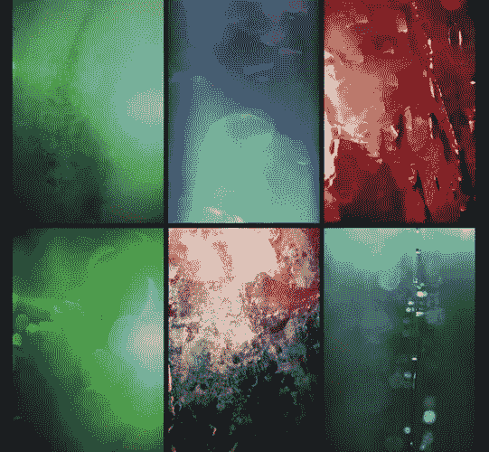
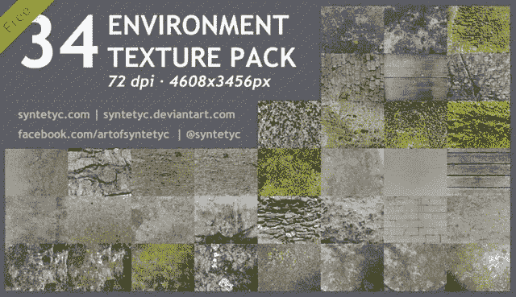

# 免费质量纹理包

> 原文：<https://medium.com/visualmodo/free-quality-texture-packs-5761b6aedc15?source=collection_archive---------0----------------------->

为了你的项目

现在下载美丽的免费插图和纹理为您的项目使用，看看如何将这些纹理应用到您的网页设计和帮助的内容，并使其在视觉上具有吸引力。

在 Photoshop 或 Cinema 4D 等图形或像素编辑器中添加纹理可以为您的设计带来真实的触感。不同的纹理需要使设计在视觉上更有吸引力。想想木头、卵石、金属或其他任何结构。在本帖中，我们展示了 20 个纹理包的集合，这些集合构成了少量不同的纹理和表面。你最有可能在这个系列中找到你想要的任何东西。

# 为您的项目提供免费的高质量纹理包

# [五颜六色的垃圾纹理](http://gomedia.com/zine/insights/free-download-25-colorful-grunge-textures/)

# [纹理包](http://sirius-sdz.deviantart.com/art/Texture-Pack-40-517969980)

# [环境](http://syntetyc.deviantart.com/art/FREE-34-Environment-Textures-365899771)

# [矢量垃圾纹理](http://blog.spoongraphics.co.uk/freebies/12-free-vector-grunge-textures-to-erode-your-artwork)

# [自由低多边形纹理](http://roundedhexagon.deviantart.com/art/30-Free-Polygonal-Low-Poly-Background-Textures-457811821)

# [背景纹理](http://krakograff.deviantart.com/art/Background-Textures-10-139610186)

# [200 种不同的纹理](http://saltaalavista.deviantart.com/art/200-Free-Textures-for-personal-and-commercial-use-534843072)

我们喜欢网络上的纹理有很多原因。设计决策不应该简单地基于“哦，好吧。挺好看的。”设计应该服务于一个目的，每一个关于纹理的决定都应该通过权衡利弊来做出。让我们从一些主要优势开始。纹理可以**突出元素**，如标题、小标题、图标和按钮。它将注意力吸引到行动号召和主要标题上。这也许是纹理趋势正在流行的最明显的方式。

使用这种插图是给网页设计增加深度、细节和趣味性的好方法。无论是大剂量还是一些细微的修补，它都可以给你的网站带来个性。因此，在这篇文章中，我们收集了一些网页设计中插图使用的优秀例子，在这些例子中，你会看到各种各样的纹理应用——为你的下一个项目提供大量的灵感[。](https://visualmodo.com/wordpress-themes/)