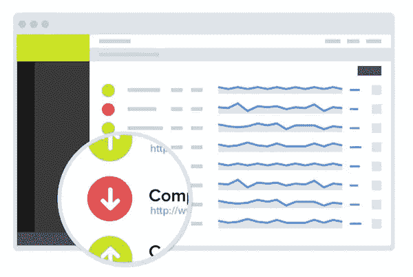

# 免费站点监控服务

> 原文：<https://medium.com/visualmodo/free-site-monitor-services-9ed6da134adb?source=collection_archive---------0----------------------->

## 正常运行时间/停机时间

即使您已经采取了所有必要的预防措施来维护和保护您的站点，有时您的站点仍然会因为您无法控制的原因而关闭。你需要为这种情况的发生做好准备，以便迅速恢复秩序，因为你等待的时间越长，你留在桌面上的钱就越多。幸运的是，有一些很好的站点监控服务和工具可以为您监控正常运行时间和停机时间，所以您不必手动检查。

是否可以全天监控您的[站点](https://visualmodo.com/)以检查是否有任何停机时间？

不，除非你是机器人。但是，你必须知道什么时候有停机时间来修复它。网站宕机意味着失去访客、失去客户、失去收入、失去声誉等等！

如果你不想失去它们中的任何一个，你必须找到一些东西来检查你的站点停机时间。幸运的是，有一些在线服务可以反复检查网站，让你知道什么时候有停机时间。此外，它将帮助你了解你是否使用正确的虚拟主机和 [CDN](https://visualmodo.com/blog/) 服务。

在这篇文章中，我将分享一系列在线服务和工具来监控你的网站正常运行时间和停机时间。其中大多数都有免费版和高级版。我建议你至少注册一两项服务，成为第一个知道你的网站何时关闭的人。

# 免费的现场监控正常运行时间/停机时间服务

# [正常运行时间机器人](http://uptimerobot.com/)

UptimeRobot 每 5 分钟监控一次您的站点，并在出现停机时提醒您。完全免费。它监控 HTTP(s)，Ping，端口并检查关键字。如果你的网站出现问题，我们会通过电子邮件、短信、Twitter、web-hooks 或 push 通知你。您可以从仪表板上查看所有正常运行时间和停机时间。

*   最大值要监控的站点数量:50
*   频率:5 分钟
*   通过电子邮件，短信，推特，网络挂钩，推送来提醒。

# [监视器。美国](http://www.monitor.us/)

监视器。美国是我个人最喜欢的。这是一个非常棒的免费网站监控软件。这些基于云的监控工具可以快速识别任何影响您网站的问题，并通知您。通过其仪表板，您可以检查网站正常运行时间和响应时间、服务器健康状况、网络性能、自定义指标等。

*   最大值要监控的站点数量:1
*   频率:30 分钟
*   通过即时消息、短信、电子邮件、RSS 发出警报

# [SiteUptime](http://www.siteuptime.com/)

SiteUptime 是一种网站监控服务，它会定期检查您的网站或服务器，并在出现问题时通过电子邮件或短信通知您。它有免费和收费计划。

*   最大值要监控的站点数量:1
*   频率:30/60 分钟
*   通过电子邮件、短信发出警报

# [现场 24×7](http://site24x7.com/)

Site 24×7 让网站监控变得简单快捷。它通过即时警报快速通知停机时间。它提供多种监控服务，如服务器监控、网站性能和正常运行时间监控、应用程序性能监控、云监控、邮件服务器监控等。

*   最大值要监控的站点数量:1
*   频率:60 分钟
*   通过短信、语音、电子邮件、Twitter、RSS 源或推送发出警报。

# [超频](http://www.hyperspin.com/en/index.php)

Hyperspin 从全球 16 个监测站监测网站。它一年 365 天，一周 7 天，一天 24 小时监控你的网站。它通过短信、电子邮件和推送来改变停机时间。它还显示正常运行时间报告。

*   最大值要监控的站点数量:1
*   频率:60 分钟
*   通过电子邮件、短信、推送提醒。

# [HostTracker](http://www.host-tracker.com/)

HostTracker 将以特定的时间间隔从全球不同的位置检查您的站点或服务器。如果有任何错误，您会立即得到通知。您还将获得您的正常运行时间报告。

*   最大值要监控的站点数量:2
*   频率:30 分钟
*   通过短信、Skype、语音、电子邮件和 Gtalk 发出警报。

# [基础状态](http://basicstate.com/)

基本状态每 15 分钟检查一次您的网站，如果有问题，会提醒您。这是一个非常简单的工具。它有免费版和高级版。

*   最大值要监控的站点数量:1
*   频率:15 分钟
*   提醒方式:电子邮件

# 结论

这些都是很棒的网站监控工具。但这不是最终的名单。如果您正在使用任何其他工具，请与我们分享。请在脸书、推特和 Google+上分享这篇文章来帮助我。