# 免费的网络开发指南和教程

> 原文：<https://medium.com/visualmodo/free-web-development-guides-tutorials-376b411c8e5?source=collection_archive---------0----------------------->

现在，您可以看到一个特别的免费网页开发指南和教程列表，网页设计者和网页开发人员都可以从中受益，提高他们的前端和后端开发能力，并改善用户体验。开发人员和设计师有一些共同点，他们都必须至少偶尔一起工作，尤其是那些专注于应用程序和前端 web 开发的人。无论是学习如何在你的应用程序设计中使用排版，还是决定我们应该为哪种设备建立我们的网站，两者都可以通过多种方式相互学习。

Web 设计人员经常需要使用 HTML5 和 CSS3 等技术来完善他们的设计，而开发人员则希望更多地探索用户体验和用户界面，以确保他们构建的软件符合这两种标准的标准要求。而浏览器呢？设计人员和开发人员都与浏览器密切相关，这也有助于在该领域获得一些指导和见解。下面的开发指南资源将涵盖最流行的脚本语言的基础知识，以及一些可能因为使用方便而成为您新宠的工具。

# Web 开发指南列表:

[网络标准组织者](http://webstandardssherpa.com/)

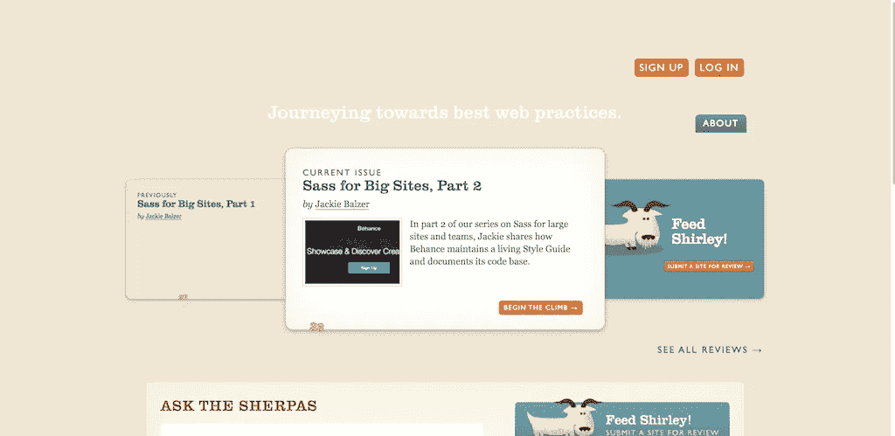

web 是一个很大的概念，它包含了太多的内容，以至于有时很难从开发者和/或设计者的角度找到关于如何使用 Web 的好内容。Web Standards Sherpa resource 是一个文章和指南列表，其中讨论了 CSS、设计、内容、JavaScript、Web 性能、Web 构建的业务方面，以及关于如何在许多其他主题和类别中完善您的工作流的提示。如果您作为前端人员需要最佳实践，这是获得它们的地方。

# [UX 神话](http://uxmyths.com/)

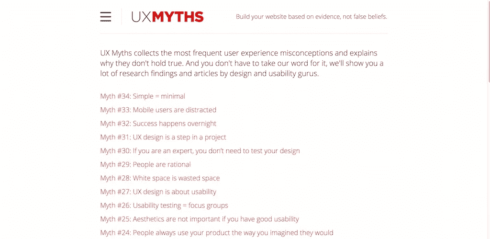

UX 神话揭穿了关于用户体验的错误信念，并给读者一个机会获得新鲜和有见地的观点，关于你应该如何在你的应用程序，网站和软件中接近 UX。每一点都得到了充分的解释，并给出了一些例子来展示相反的可能性。

# [错别字袖珍指南](http://www.typogui.de/)

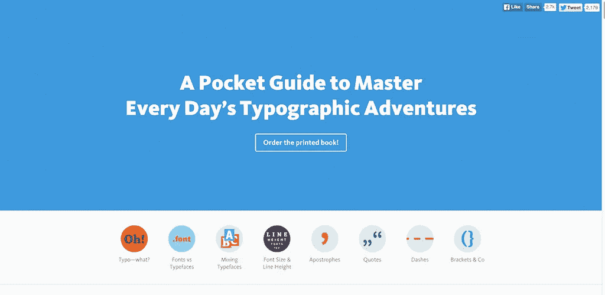

这本排版袖珍指南是热衷于学习排版技术细节的设计师的完美伴侣。这个特殊的指南涵盖破折号，撇号，字体，字体和更多的基础知识。

# [网页类型的状态](http://stateofwebtype.com/)

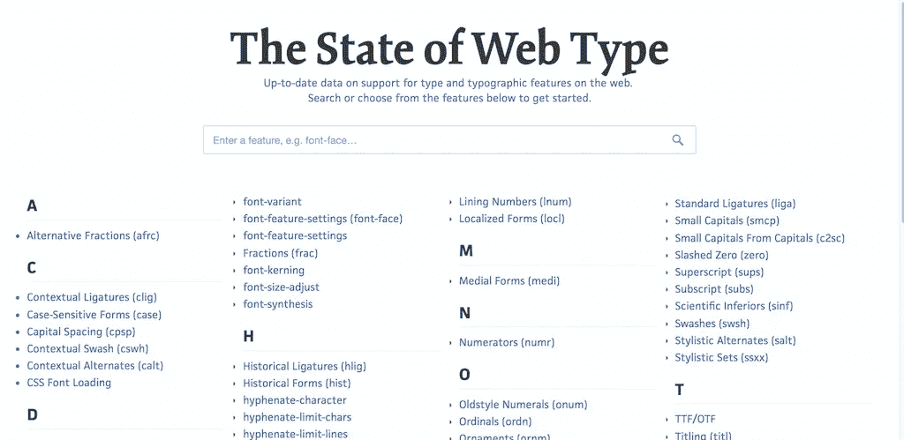

字体总是在进化，但浏览器却没有。这意味着有时我们需要分别探索每个浏览器上每个功能的能力，这种资源使它变得特别容易。只需选择您希望使用的功能类型，并探索其在不同浏览器上的功能。

# [怪癖模式](http://www.quirksmode.org/)

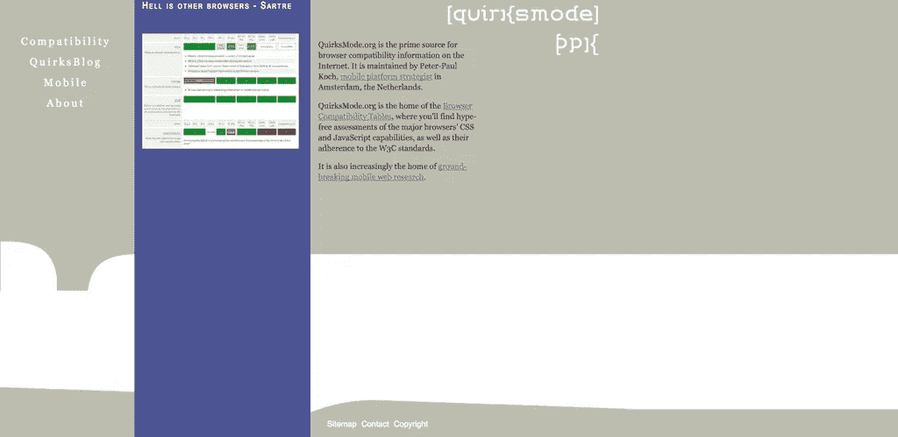

QuirksMode 是一个关于互联网上浏览器兼容性信息的惊人指南。虽然你不会以书面内容的形式获得很多信息，但是当涉及到 web 开发时，有很多事实是有用的。兼容性列表让任何人都可以探索 JavaScript、CSS 和 HTML 等技术的浏览器功能。

# [Photoshop 礼仪](http://photoshopetiquette.com/)

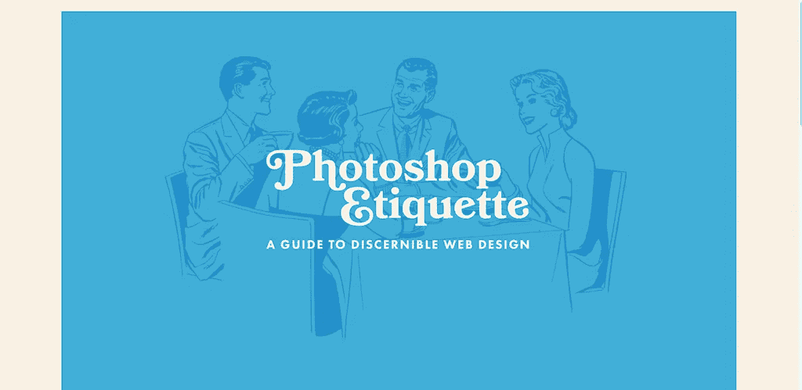

毫无疑问，Photoshop 是设计师中最受欢迎的图形设计工具，即使你在过去几年中一直使用 Photoshop，也总会有新的东西需要学习和探索。Photoshop 礼仪指南分为六章，讲述了 Photoshop 最佳实践的几个方面，包括图层、效果和设计质量。所有章节的篇幅都很合理，所以你不会花几个小时学习新东西。

# [我的设备](http://mydevice.io/)

找不到您设备的屏幕分辨率大小？这个小小的平台将告诉你所有你需要知道的关于你的设备大小的细节，以及你的浏览器可以执行的功能。非常适合经常出差的开发人员。

# [屏幕尺寸](http://screensiz.es/phone)

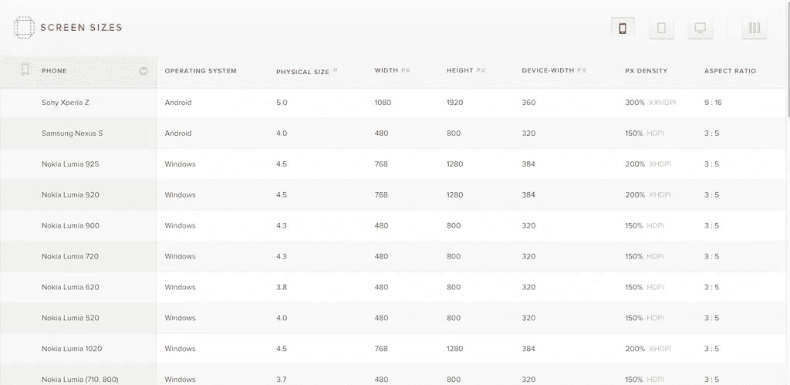

屏幕尺寸采用不同的方法，而是输出关于不同屏幕尺寸、其操作系统以及其独特纵横比的硬数据。您可以通过单击右上角的单个图标来查看平板电脑和电脑的相同信息。对网页设计者和网页开发者来说都非常有用。

# [设备指标](https://design.google.com/devices/)

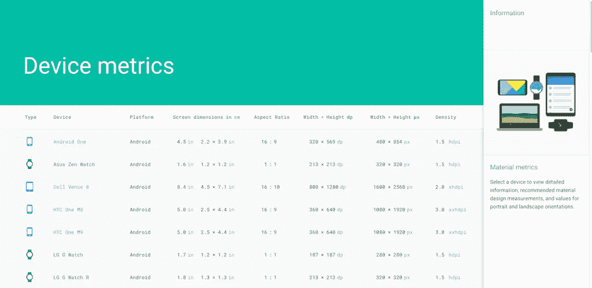

来自 Google 的 Device Metrics 类似于上面的两个网站，但是在列表中添加了一些额外的设备，并且还概述了每个设备的一些重要开发信息。如果你知道你的应用和网站是为哪种设备开发的，了解这些信息是至关重要的。

# [开发工具的秘密](http://devtoolsecrets.com/)

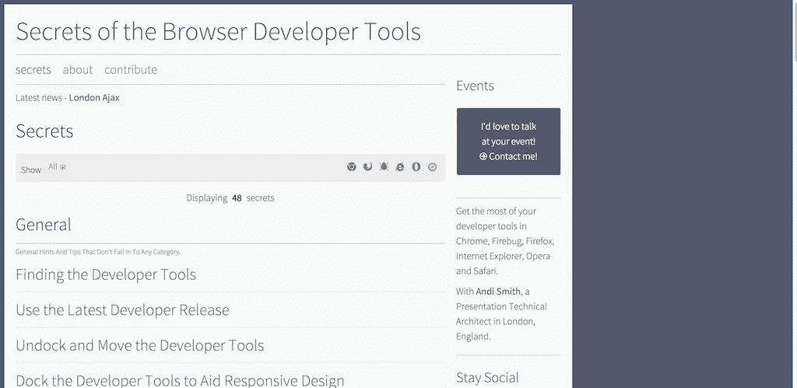

今天的每个浏览器都预装了一个叫做开发者工具的东西。这是一个单独的浏览器控制台面板，允许任何人从开发者的角度探索每个网站。您可以使用 JavaScript 控制台来执行定制的客户端代码，可以检查网站结构的元素，还可以做诸如监控网络和文件活动之类的事情。每个浏览器的开发者工具都是不同的，这个资源是一个具体的文章和教程列表，告诉你如何充分利用你最喜欢的浏览器的开发者工具。

# [CSS 指南](http://cssguidelin.es/)

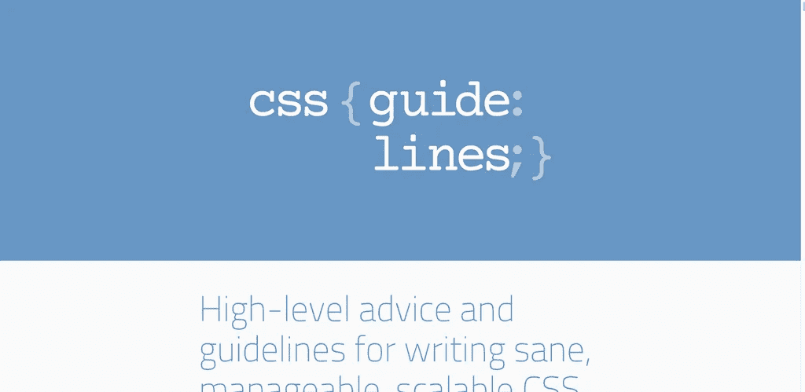

CSS 是网络的外衣。没有 CSS，网络是赤裸的，就像我们人类没有衣服一样。因为我们周围有如此多的 CSS，所以了解非常实用的基础知识和标准规则是很重要的，这可以确保我们在网络上发布的 CSS 是优化的，并且符合最新的标准。这个特殊的样式指南并不意味着是一个样式指南，而是深入了解标准化的 CSS 如何工作，以及开发人员和设计人员可以做些什么来确保他们制作的 CSS 具有尽可能高的质量，使其更容易大规模制作和维护。

# [CSS 小抄](http://adam-marsden.co.uk/css-cheat-sheet/)

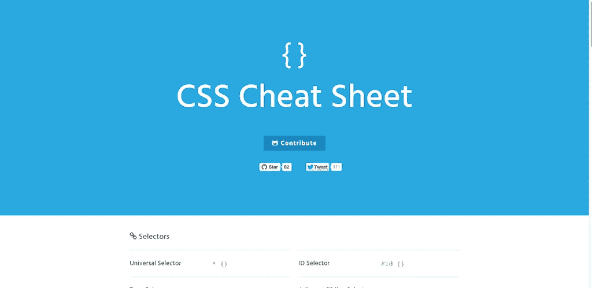

CSS 是一种庞大的脚本语言，并且每年都在增长。有时候，随着事情的发展，我们可能会忘记语言的最基本的语法，这时像 CSS cheat sheet 这样的网站真的会变得很有用，你只需要将它标记一次就可以随时返回。强烈推荐新手使用。

# [浏览器黑客](http://browserhacks.com/)

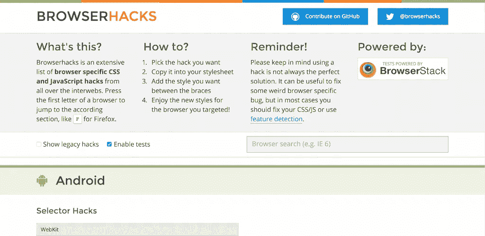

前端 web 开发人员花费大量时间在浏览器上，进行试验、执行代码、修改等等，随着每个开发人员多年来的进步，他们留下了一些有趣的片段和技巧，任何人都可以使用它们来简化开发工作流程。了解针对媒体查询的技巧、选择器技巧，甚至是针对所有您喜爱的浏览器的一些很酷的 JavaScript 技巧。您也可以使用 GitHub pull 请求分享您自己的技巧和诀窍。

# [浏览器饮食](http://browserdiet.com/en/)

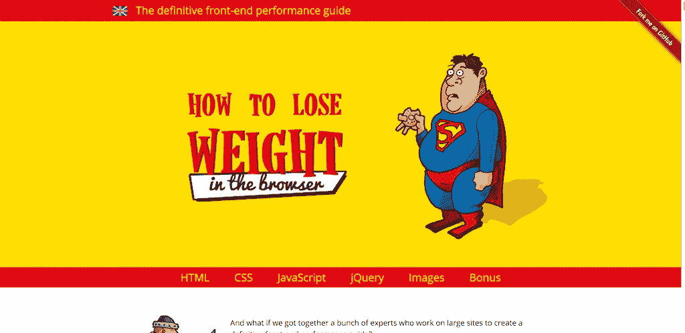

当前 web 开发的趋势很大程度上与性能有关；如何在不损失质量的情况下优化最佳性能。这就是浏览器饮食指南的全部内容——如何为网络优化。这是一个有见地的技巧和经验报告的列表，记录了不同的 JavaScript，HTML 和 CSS 特性，这些特性可以改变，也可以完全删除，而不必做出任何妥协。

# [&什么；](http://www.amp-what.com/)

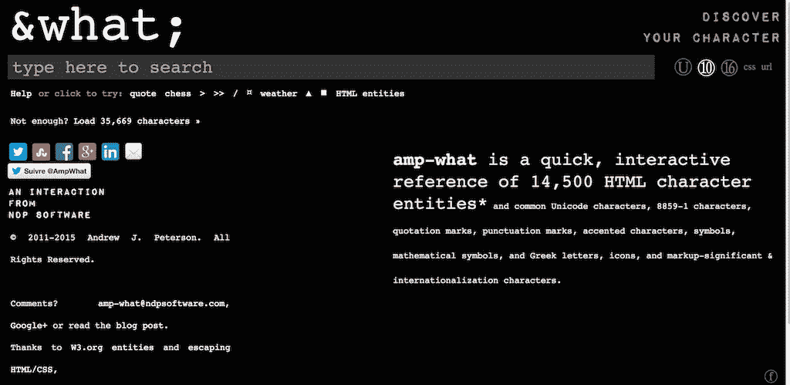

amp-这是一个快速的交互式参考，包含 30，000 多个 HTML 字符实体和常见的 Unicode 字符、8859–1 字符、引号、标点符号、重音字符、符号、数学符号以及希腊字母、图标和标记重要的国际化字符。它的工作方式是你点击网站顶部的加载按钮，然后使用搜索功能找到你希望在你的项目中使用的字符类型，或者你计划使用它的任何地方。如此广泛的资源，你可以花几个小时玩独特的图标和字符，可以增加你的应用程序和设计的趣味。

> 如果你想让一切变得更容易，你可以使用我们的 WordPress [主题](https://visualmodo.com/wordpress-themes/)，让我们为你开发一切。