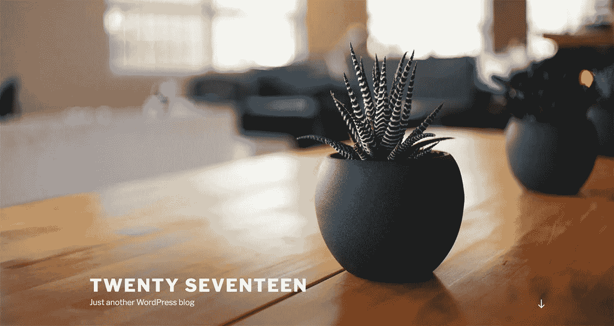
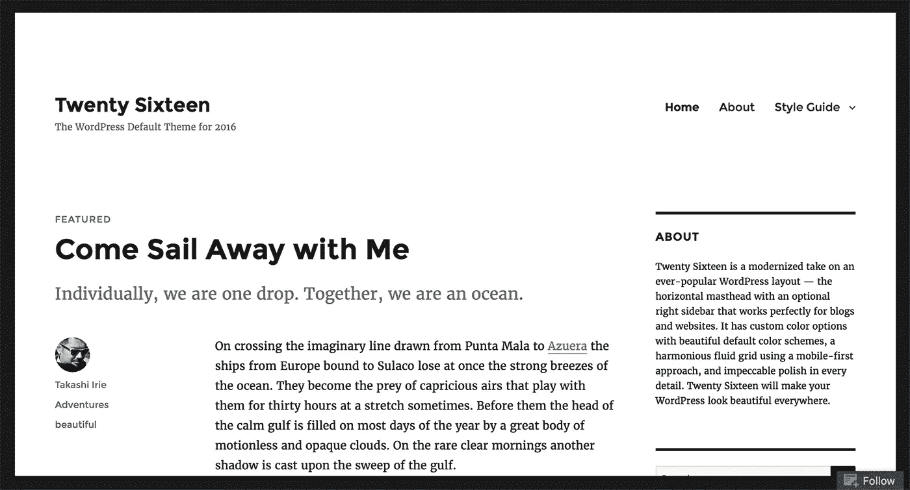
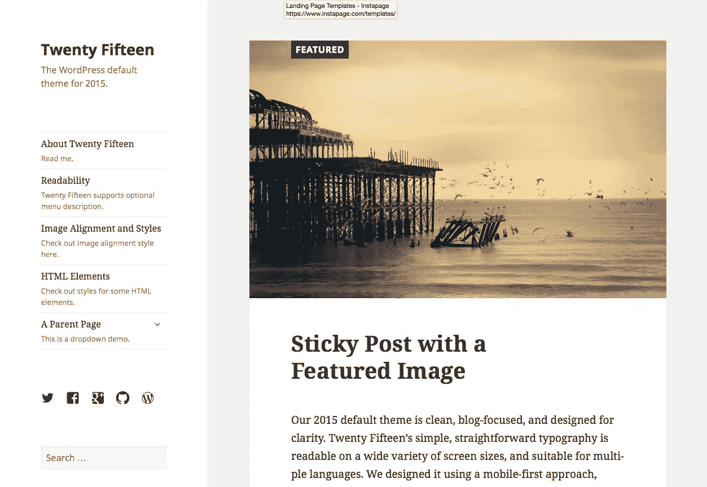
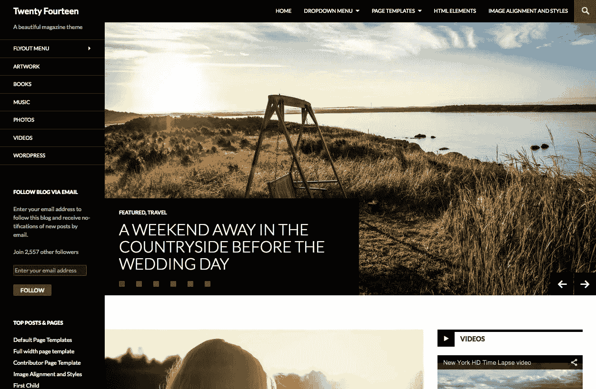
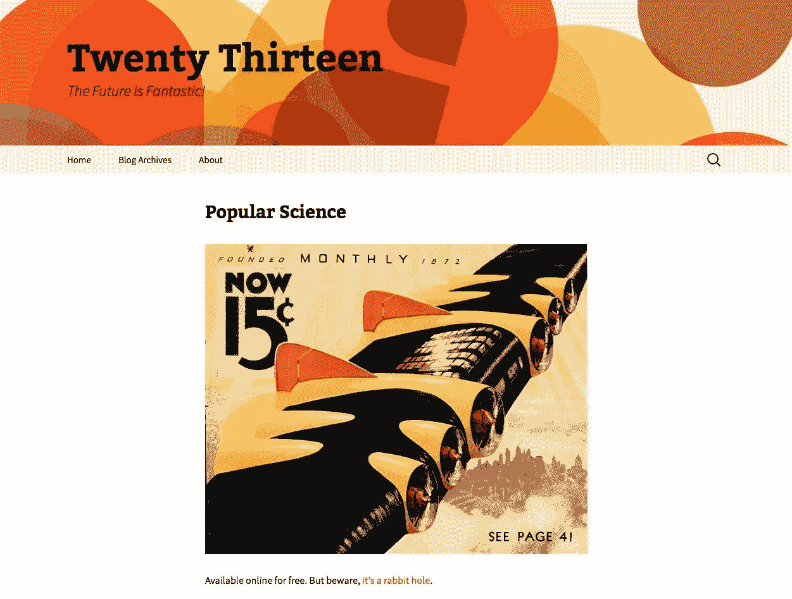
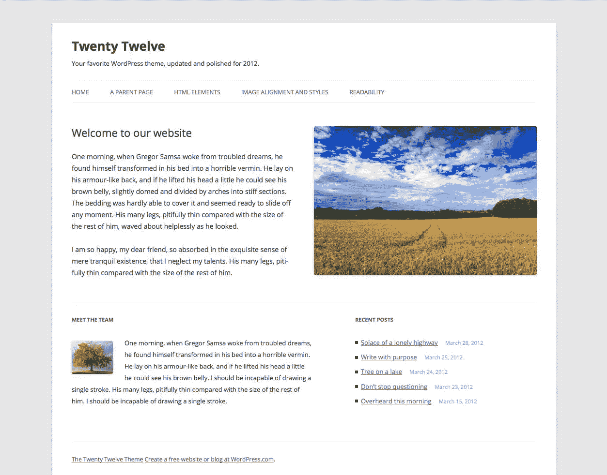
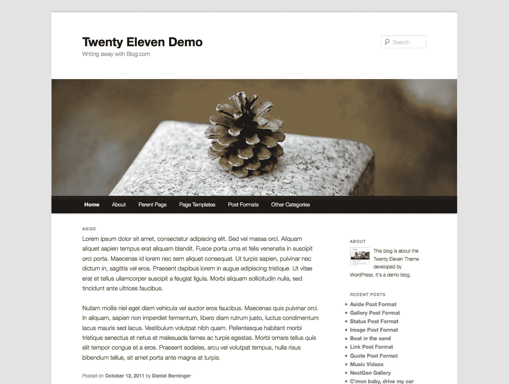
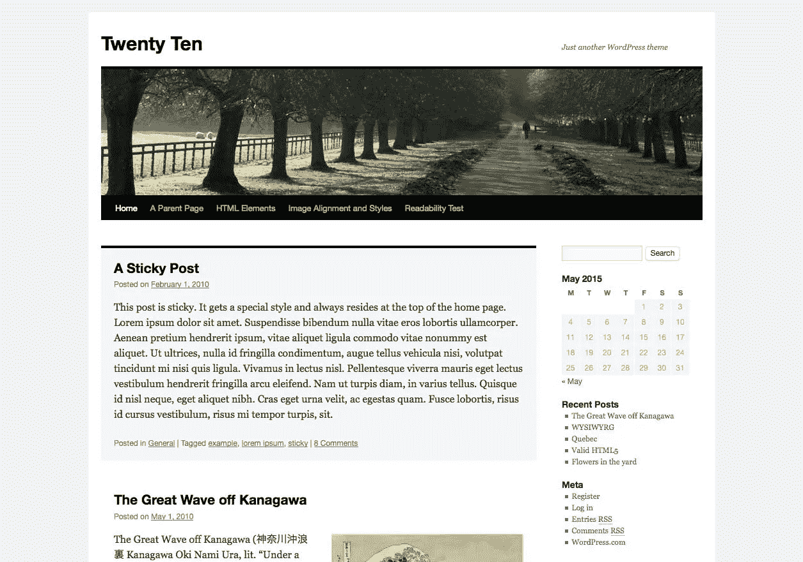
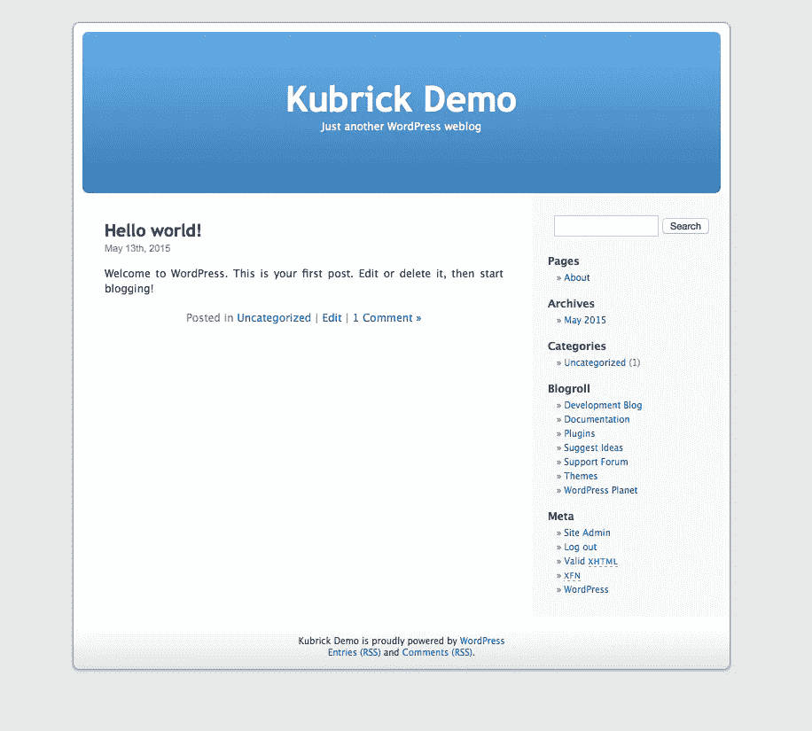

# 免费 WordPress 本地主题组合

> 原文：<https://medium.com/visualmodo/free-wordpress-native-themes-portfolio-5692ef4e8e58?source=collection_archive---------0----------------------->

今天，5 月 27 日，WordPress 将迎来 15 岁生日，这是一个神奇的网站，免费的 WordPress 主题，插件和社区。为了庆祝这个不可思议的开源软件自 2003 年问世以来所取得的成就，我们列出了几个世纪以来的原生主题。

通过各种不同的默认主题的历史，再一次直观地回顾过去。

# 15 岁生日快乐！

# 免费 WordPress 本地主题组合

# 2017 年(2016 年 12 月)

[详情](https://en-gb.wordpress.org/themes/twentyseventeen/)

–与 WordPress 版本一起发布。

[下载](https://en-gb.wordpress.org/themes/twentyseventeen/)

# 2016 年(2015 年 12 月)

[详情](https://wordpress.org/themes/twentysixteen/) | [现场演示](https://twentysixteendemo.wordpress.com/)

–与 WordPress 版本一起发布。

[下载](https://wordpress.org/themes/twentysixteen/)

# 2014 年 12 月 25 日

[详情](https://wordpress.org/themes/twentyfifteen/) | [现场演示](https://twentyfifteendemo.wordpress.com/)

–与 WordPress 版本一起发布。

[下载](https://wordpress.org/themes/twentyfifteen/)

# 二十四(2013 年 12 月)

[详情](https://wordpress.org/themes/twentyfourteen/) | [现场演示](https://twentyfourteendemo.wordpress.com/)

–与 WordPress 版本一起发布。

[下载](https://wordpress.org/themes/twentyfourteen/)

# 2013 年 8 月

[详情](https://wordpress.org/themes/twentythirteen/) | [现场演示](https://twentythirteendemo.wordpress.com/)

–与 WordPress 版本一起发布。

[下载](https://wordpress.org/themes/twentythirteen/)

# 2012 年 12 月

[详情](https://wordpress.org/themes/twentytwelve/) | [现场演示](https://twentytwelvedemo.wordpress.com/)

–与 WordPress[3.5 版](https://wordpress.org/news/2012/12/elvin/)一起发布。

[下载](https://wordpress.org/themes/twentytwelve/)

# 2011 年 7 月

[详情](https://wordpress.org/themes/twentyeleven/) | [现场演示](http://twentyelevendemo.blog.com/)

–与 WordPress [版本 3.2](https://wordpress.org/news/2011/07/gershwin/) 一起发布。

[下载](https://wordpress.org/themes/twentyeleven/)

# 2010 年 6 月

[详情](https://wordpress.org/themes/twentyten/)

–与 WordPress 版本一起发布。

[下载](https://wordpress.org/themes/twentyten/)

# 库布里克(2005 年 2 月)

[详情](https://wordpress.org/themes/default/)

–与 WordPress 版本一起发布。

现已退役(下载[库布里克 2014](https://wordpress.org/themes/kubrick-2014/) )

库布里克与这份名单上的其他人有些不同——如果你有兴趣阅读更多关于这一特定主题的历史，请查看《赫芬顿邮报》上的这篇精彩文章。更重要的是，库布里克并没有出现仅仅一年[时间](https://visualmodo.com/):哦不，库布里克从 2005 年 2 月(主题首次被添加到 WordPress 1.5 版本)到 2010 年 6 月一直是默认主题！

# 在库布里克之前？

就这样吗？库布里克之前什么都没有？嗯，实际上有，在库布里克(第一个官方默认的“主题”)之前，还有另一个真正重要的默认“设计/模板”注意:经典(现在也退休了)。

如果你需要更多的功能和设计选项，你可以在这里下载高级主题。

那么默认主题的下一步是什么？对 2018 有什么想法吗？或许是一个以电子商务为中心的主题？或者也许事情完全与****不同？****