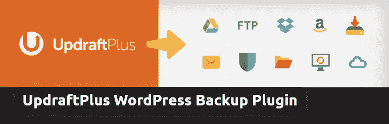

# 免费 WordPress 插件

> 原文：<https://medium.com/visualmodo/free-wordpress-plugins-4474deb30c23?source=collection_archive---------1----------------------->

插件推荐

在这篇文章中，你会看到一些惊人的免费 WordPress 插件推荐给每个网站和博客。你可以在你的网站上安装和选择你最喜欢的插件。

所有的 [Visualmodo WordPress 主题](https://visualmodo.com/wordpress-themes/)都被优化为更好的插件性能和使用，所以不用担心插件和你的主题之间的兼容性

# [喷气背包](http://justlearnwp.com/go/jetpack)

JetPack 是使用最广泛的 WordPress 插件之一。这是一个免费的插件，提供了 30 多个模块。您可以启用或禁用常规、雇佣、安全、外观和写作类别中的任何模块。

**更好的书写体验**你可以非常轻松地添加一个联系人表单。启用降价和拼写和语法模块，以获得更好的写作体验。通过电子邮件发布功能，您可以通过发送电子邮件来发布新的博客文章。

**视频托管:**如果您想在您的网站上发布视频，您可以升级您的计划以在您的网站上激活视频托管。这是上传无广告无品牌视频到你的网站的最简单的方法之一。你可以获得视频播放和分享的统计数据，播放器是轻量级的，反应灵敏。

**平铺图片库和轮播**:如果你在博客上发布了大量图片，使用轮播和平铺图片库功能，任何标准的 WordPress 图片库或你嵌入到帖子或页面中的单幅图片都会启动带有评论和 EXIF 元数据的全屏图片浏览体验。

**安全扫描和备份**:永远不要损害你博客的安全。JetPack 可以自动备份和监控您的网站。基本计划从每月 3.50 美元开始，我们也用这个计划来支持 JustLearnWP。

**用 JetPack 赚钱** JetPack 广告是一个很好的付费功能，可以从你的博客中赚取额外的钱。这是一项高级功能，您必须升级您的计划。

还有许多其他功能可用，如搜索引擎优化工具，谷歌分析，网站验证，移动主题，社会共享等等。

必须有免费的 WordPress 插件

# [谷歌认证器](https://wordpress.org/plugins/google-authenticator/)

这是一个免费的 WordPress 插件，为你的 WordPress 站点增加了双重认证，以获得更好的登录安全性。WordPress 的 Google Authenticator 插件允许你使用 Android/iPhone/Blackberry 的 Google Authenticator 应用程序进行双重认证。

启用此功能后，您将需要输入一个额外的代码，您可以在 Google Authenticator 应用程序上看到该代码。否则，您将无法登录到您的网站。这对于防止黑客攻击登录页面非常有用。

# [惰性负载](https://wordpress.org/plugins/lazy-load/)

延迟加载图片和视频是一种非常流行的改善页面加载时间的现代方法。这个免费插件使用 jQuery.sonar 来加载一个在视窗中可见的图像。

> 这个插件是由 Automattic 的 WrdPress.Org 团队、TechCrunch 2011 重新设计团队和 Jake Goldman(10up LLC). wrd press . org 编写的代码的合并

# [相扑](http://sumo.ly/Gfb9)原名相扑

> 大多数博客是为打了就跑的读者设计的。人们找到你的博客，阅读你的文章，然后离开。如果这些人中的一些人订阅或分享你的惊人帖子，那不是很好吗？SumoMe

Sumo 是最好的免费 WordPress 插件之一，它提供了你需要的免费工具来增加你的订户和社交分享。

通过不同的电子邮件注册形式(弹出窗口、欢迎垫), Sumo plugin 使您的读者可以非常简单方便地加入您的电子邮件列表，在 Twitter、FaceBook、Pinterest 和其他社交网站上分享您的博客文章，并通过分析进行优化。

# [WP 超级缓存](https://wordpress.org/plugins/wp-super-cache/)

启用缓存后，您的网站将加载得更快。这是一个免费的、使用最广泛的缓存插件，可以从你的动态博客中生成静态 HTML 文件。

在一个 HTML 文件生成后，你的网络服务器将服务于该文件，而不是处理相对繁重和昂贵的 WordPress PHP 脚本。

超过 100 万个网站已经在使用这个缓存插件。网站的速度对博客读者和搜索引擎来说也很重要。

你不需要花几百块钱，只需要安装并激活这个免费插件，就可以让你的网站快速运行。

# [Yoast SEO](https://wordpress.org/plugins/wordpress-seo/)

如果你打算在你的个人、商业或公司博客上发布内容，千万不要发布未经搜索引擎优化的博文。

为 WordPress 用户优化一篇博客文章最简单的方法是什么？一个 SEO 插件。有很多免费的 WordPress SEO 插件，你可以选择安装任何插件。

我们个人使用 Yoast SEO 来优化我们发布的每个博客。免费插件有很多好的特性来优化每篇博客文章，以获得更好的搜索引擎排名。

# [联系方式 7](https://wordpress.org/plugins/contact-form-7/)

JetPack 有一个联系表单模块，但是如果你不想使用它，你可以安装联系表单 7，这是 WordPress 最流行和广泛使用的免费联系表单插件。

使用这个免费的联系表单插件，你可以为不同的页面创建和管理多个联系表单。还提供了其他附加组件，让您可以增强 Contact Form 7 的功能。

# [LH 零垃圾邮件](https://wordpress.org/plugins/lh-zero-spam/)

> 为什么你的用户要通过填写验证码来证明他们是人类？让机器人用 LH 零垃圾插件证明他们不是机器人。零垃圾邮件

Akismet 是 WordPress 最流行的反垃圾邮件插件，但我真的很讨厌 Akismet。它可以检测垃圾评论，但你必须从队列中手动删除所有垃圾评论，有时它会使 WordPress dashboard 非常慢。有时，我无法删除垃圾评论。

如果你在你的博客上启用了评论，你应该安装 LH 零垃圾插件，相信我，我发现这是最好的插件，可以将垃圾评论从几十条减少到零条。

如果你已经在使用 Akismet 或其他插件来阻止垃圾邮件，只要试试这个插件，相信我，你永远不会使用其他反垃圾邮件插件。

# [上升气流加](http://justlearnwp.com/go/updraftplus)

UpDraftPlus 是个不错的选择。这个免费插件提供完整的手动或定时备份到亚马逊 S3，Dropbox，Google Drive，Rackspace，FTP，SFTP，电子邮件和其他服务。

# [谷歌分析仪表板](http://justlearnwp.com/go/googleanalyticswd)

Google Analytics 是一个非常受欢迎的免费服务，它可以发现每天有多少人访问你的博客，以及他们在做什么。你可以很容易地找到你的热门内容和其他统计数据。

谷歌分析免费插件

谷歌分析 WD 是一个免费插件，可以轻松连接谷歌分析和 WorPress 网站。你将能够在 WordPress dashboard 中看到所有必要的统计数据，这意味着无需登录你的谷歌分析账户。