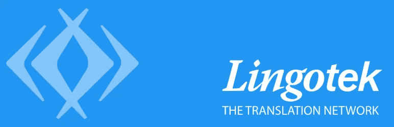

# 免费 WordPress 翻译插件:最佳插件列表

> 原文：<https://medium.com/visualmodo/free-wordpress-translation-plugin-the-best-plugins-list-f5ceeab608f9?source=collection_archive---------0----------------------->

一个主题很棒的 WordPress 站点真的可以为你的商业企业或努力创造奇迹。安装一些有用的 WordPress 翻译插件也是一个好主意。他们将改进、**宣传和扩展**你的 WordPress 网站的功能。

你肯定会希望借助你的 WordPress 网站来拓展全球市场。在全球市场上开拓一个利基市场将确保你的业务运作更顺畅，利润更高。为了达到这个目的，使你的 WordPress 网站成为多语言网站是一个先决条件。在这里，你会发现 WordPress 翻译插件非常方便和有用。

有上百个 WordPress 翻译插件供你选择。我们在这里为你快速回顾了十大 WordPress 翻译插件。这肯定会帮助你为你的 WordPress 站点选择正确的翻译插件。

# 选择您的翻译插件:

# 1.谷歌语言翻译

谷歌语言翻译将是一个伟大的选择。在这个翻译插件的帮助下，你可以在瞬间完成翻译。翻译以各种语言提供。因此，你可以很快地将整个网站转换成你想要的语言，而不会有太多的麻烦。

**让我们来看看这个插件的一些伟大特性。**

*   在这个插件的帮助下，你可以**将你网站**的网页**翻译成 60 多种语言**。
*   这个插件**在谷歌语言 API** 上运行。
*   一个**语言选择框**出现在页面顶部。它可以用来非常容易和方便地转换到一种新的语言。
*   出现在页面顶部的**谷歌工具栏**也可以隐藏。
*   您可以选择**水平布局或**垂直布局。
*   [**短码**](https://www.inkthemes.com/plugin/shortcode-plugin/) **可以很容易地**添加到页面、帖子和小工具中。

总而言之，这是一个很棒的翻译插件，它一定会让你的商业网站为全球市场做好准备。

这个翻译插件的高级版本以 30 美元的低价出售。

[下载并安装](https://ltz.wordpress.org/plugins/wp-google-language-translator/)

# 2.Lingotek 翻译

使用这个伟大的插件一定会让你的 WordPress 站点多语言化。借助这个翻译插件，可以以最简单、最有效的方式拓展全球市场，并在海外客户中树立品牌意识。它有许多很棒的功能，翻译可以通过基于云的本地化和翻译方便地完成。

**下面是这个插件的一些关键特性。**

*   **翻译工作流程可定制**。您可以使用免费的自动、专业或社区翻译解决方案。
*   借助**基于云的 Lingotek 翻译管理系统**，您可以轻松进入新市场并接触客户。
*   这个插件**自动下载和更新 WordPress 语言包**。
*   它还**支持 RTL 语言脚本**。因此，你可以使用任何你想要的语言。
*   url 或内容中的**语言代码设置语言**。
*   **不同的域和子域也可以用于每种语言**。
*   每个帖子、帖子标签、页面、小工具和菜单的语言都可以很容易地**定义和翻译**。
*   **自动复制选项**会在添加新帖子或页面翻译时复制类别、帖子标签和其他元。
*   导航菜单有一个可定制的语言切换器。
*   **多语言管理界面**允许你设置 WordPress 的管理语言。

这个超棒的翻译插件和它的超级功能肯定会提高你的 WordPress 网站的功能和可见性。

[下载并安装](https://wordpress.org/plugins/lingotek-translation/)

# 3.Ceccepa 多语种

如果你正在寻找一个易于使用并允许多语言内容管理的翻译插件，那么这个插件就是适合你的网站的。这个插件提供了一系列非常简单和方便使用的特性，可以实现快速和流畅的语言翻译。

让我们来看看这个主题的一些重要特性。

*   不同的搜索引擎优化和网址可以用于每种语言，从而使你能够为每种语言创建单独的帖子和页面。
*   您可以使用**快速编辑模式**轻松编辑主要内容及其翻译。
*   **小部件可以通过语言**进行过滤。
*   **小工具标题也可以翻译**。
*   只需轻轻一点，你就可以在语言和翻译之间切换。
*   **每种语言**都配有**不同的菜单**。
*   每种语言的**导航标签可定制**。
*   你也可以**翻译你网站的标语或标题**。
*   可用语言的**列表标记显示在页面或帖子的顶部或底部。**
*   **阅读量最少、阅读量最多或评论最多的帖子以用户选择的语言显示。**
*   可以根据当前语言更改 **WordPress 区域设置。**
*   **浏览器根据用户语言**进行重定向。

这个易于使用的翻译插件肯定值得一试。这个插件强大的功能和方便的使用使它成为用户的最爱。

[下载并安装](https://wordpress.org/plugins/ceceppa-multilingua/)

# 4.BestWebSoft 的多语言

多语言 WordPress 插件是一个质量非常好的插件，它可以确保你的 WordPress 站点的简单流畅的翻译。这个 [**分析插件**](https://www.inkthemes.com/plugin/wordpress-analytics-plugin/) 有一套对每个用户都非常方便的功能，可以让你用不同的语言创建内容。您可以为您创建或编辑的每个帖子或页面定义语言。

下面是这个插件的一些主要特性。

*   有 87 种预装语言供你选择。您还可以向列表中添加无限数量的语言。
*   您可以**以旗帜图标下拉列表、旗帜图标或语言下拉列表的形式显示语言切换器**。
*   **语言切换器也可以添加到站点菜单**中。
*   **语言切换器可定制**。
*   您可以借助**选择的默认语言**或**搜索所有可用语言**。
*   插件设置允许你很容易地改变语言显示的优先级。
*   **翻译也可以在管理界面中轻松完成**。
*   你也可以**将每种语言的链接添加到你当前的页面**。
*   url 中的**语言代码或**语言切换器设置语言**。**

因此，这个伟大的插件肯定会让你创建一个多语言的 WordPress 网站。然而，翻译必须借助这个插件手动完成。这个插件中没有专业或自动翻译服务。

[下载并安装](https://wordpress.org/plugins/multilanguage/)

# 5.WPML-WordPress 多语言插件

创建你自己的多语言 WordPress 网站再简单不过了。有了 WPML，你可以放心，你的多语言 WordPress 网站将很快投入使用。你只需要一个简单的 WordPress 安装，你就可以轻松运行你的多语言网站。

**让我们来看看这个插件的一些主要特性。**

*   你可以**从 40 多种语言中选择**，也可以使用插件的语言编辑器添加你自己的语言。
*   **语言内容可以安排**在同一个域、子域或不同的域中。
*   该插件配备了非常**强大的翻译管理**。该插件支持手动翻译，甚至提供最好的专业翻译服务。
*   有了 WPML，你可以轻松地运行一个使用 WooCommerce 的多语言电子商务网站。
*   使用**字符串翻译接口**可以轻松翻译文本。
*   您还可以**利用价格合理的专业翻译**。如果你需要帮助，你将被连接到领先的翻译服务。
*   这个插件与大多数 WordPress 主题兼容。
*   您还将获得**可靠的支持**,以便您的网站始终平稳运行。

因此，一旦你有了 WPML，你就不再需要担心做好网站翻译了。该插件简单的功能和卓越的特性肯定会使它成为你选择的翻译插件。

[下载并安装](https://wpml.org/)

# 6.g 翻译-谷歌翻译

使用这个伟大的插件将使你的 WordPress 网站对尽可能多的互联网用户可见。这个插件用 Google power 翻译你的 WordPress 网站。这个插件使用的谷歌翻译自动翻译有助于你的 WordPress 站点的顺利翻译。全球超过 50 万个网站由该插件驱动。

让我们来看看这个插件的一些主要特性。

*   谷歌自动翻译功能可以快速翻译你的网站。
*   你可以从超过 103 种语言中选择。
*   一旦翻译完成，**谷歌顶框被这个插件隐藏**。
*   **“建议更好的翻译”弹出窗口也被隐藏**。
*   该插件还确保了**快速加载**，因为所有的标志都合并在一个文件中。
*   该插件还具有**谷歌分析集成**的功能。
*   **平移可以手动纠正**。
*   URL 的**翻译也是可能的**。
*   **不同风格**如旗帜，下拉，旗帜与下拉和漂亮的下拉与旗帜可用。
*   这个插件中还有一个**子目录或子域 URL 结构**。

有了这么好的特性，使用这个插件肯定是个不错的选择。这个插件在世界各地被广泛使用，用户肯定会为它的出色功能担保。

[下载并安装](https://wordpress.org/plugins/gtranslate/)

# 7.GTS 翻译插件

如果你正在为你的网站寻找高质量的翻译，那么这个插件将是完美的选择。翻译服务器完成翻译后，人工翻译人员通过在线编辑系统对内容进行后期编辑。这个插件确保你的网站有最大的国际流量& [**社交广告**](https://www.inkthemes.com/plugins/best-advertising-social-locker-wordpress-plugins/) ，因为翻译的内容存储在 WordPress 数据库中，也由搜索引擎索引。

下面是这个插件的一些主要特性。

*   你可以从 30 多种语言中选择翻译。
*   插件**会自动翻译** **一篇新文章**的选定语言版本。
*   **翻译后的内容可以在**或**完成**审批后立即 **发布。**
*   **永久链接的 URL 名称和 meta 标签是** **也翻译为**。
*   这个插件使用了一个**安全的私有翻译服务器**。
*   这个**插件保证两个月后你的网站流量至少增加 30%**。
*   **因为有了并排编辑器，文章编辑变得容易多了。**
*   你也可以**转发翻译后的帖子**。
*   你可以利用 GTS 管理面板为每种语言创建自己的翻译社区和版主。
*   **利用你的翻译社区众包你的翻译**。

这个伟大的插件肯定会为你的网站带来更多的国际读者。这个插件已经被数百个 WordPress 网站使用，它们的流量有了显著的增长。

[下载并安装](https://wordpress.org/plugins/gts-translation/)

# 8.Transposh WordPress 翻译

这是一个很棒的翻译插件，采用了一种新颖的翻译方法。这个插件促进了人工翻译和自动翻译的结合。上下文界面使用起来也很简单。这肯定是一个很棒的插件。

**让我们来看看这个插件的一些关键特性。**

*   这个插件**提供对任何语言的支持**。
*   您可以从**多个选项中选择小工具外观**。
*   所有内容通过**自动翻译模式**进行翻译。
*   **外部插件可以不需要。阿宝还是。维护对象档案**。
*   您可以**搜索所有翻译的语言**。
*   这个**插件甚至翻译 RSS 提要**。
*   **链接标签、元内容、标题和隐藏元素由**负责。
*   您可以使用**拖放界面**选择可以查看或翻译的语言。
*   该插件还提供**专业翻译**。

这个高质量的插件肯定会满足你的 WordPress 网站的所有翻译需求。其独特的翻译方法在今天的市场上已经找到了许多接受者。

[下载并安装](https://wordpress.org/plugins/transposh-translation-filter-for-wordpress/)

# 9.必应翻译

Bing translator 是一个超级插件，可以让你网站的所有访问者翻译网站的任何页面。只需点击一个书签，翻译就可以非常容易地完成。翻译可以很容易地完成，而不必离开页面。

下面是这个插件的一些主要特性。

*   你可以用插件支持的四十多种语言翻译你网站的内容。
*   这个插件很**轻量级**。
*   插件是**跨浏览器兼容**。
*   您可以使用选项**设置您想要的配色方案**。
*   网站的访问者也可以提出翻译建议。
*   还可以选择**深色或浅色版本的网站**来适应您的网站。
*   **翻译设置**允许您根据需要设置手动或自动翻译。

这个插件非常好用，非常容易使用。你可以很容易地安装这个插件，你会为你的网站做一些很好的翻译。

[下载并安装](https://www.inkthemes.com/best-wordpress-translation-plugins/)

# 10.Goo 翻译小工具

这是一个优秀的翻译插件，可以让你在几分钟内将你的 WordPress 站点变成多语言站点。这项多语言机器翻译服务由 Google 提供，旨在轻松方便地翻译网站。只需简单的点击，你的网站就可以使用谷歌自动翻译了。

**让我们来看看这个插件的一些主要特性。**

*   这个插件**支持超过 90 种语言**的翻译。
*   你网站的访问者可以用你的母语获得你网站的内容。
*   **谷歌分析**可用于跟踪翻译流量。
*   **该插件不需要手动翻译**。
*   **编程技能也不是必不可少的**。
*   这个插件是非常轻量级的，对性能没有影响。
*   只需简单的点击，你就可以把这个小工具放在侧边栏上，然后**允许访问者用他们的母语访问你的网站**。
*   谷歌自动翻译将增强你网站的全球影响力。

这个翻译插件以其出色的特性将会极大地提高你的网站的全球影响力。使用这个插件，获得好的网站翻译将不再是一个问题。

[下载并安装](https://wordpress.org/plugins/goo-translate-widget/)

当你着手为你的 WordPress 站点选择一个好的翻译插件时，这些翻译插件的评论肯定会有所帮助。所有这些插件都有自己的一套优秀的特性和功能，并且完全兼容所有的 Visualmodo WordPress 主题。