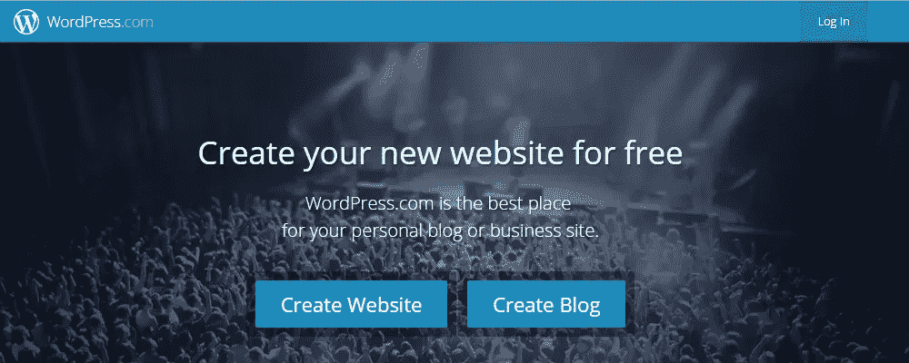

# 从 WordPress.Com 到 WordPress.Org 网站移动指南

> 原文：<https://medium.com/visualmodo/from-wordpress-com-to-wordpress-org-site-move-guide-2b1548d6506e?source=collection_archive---------0----------------------->

WordPress 是最受欢迎和最通用的 CMS，不可否认的事实是，对于那些想在几分钟内创建一个免费博客的网站管理员来说，WordPress.com 是一个理想的博客平台。

WordPress.com 虽然免费，但有一系列限制，允许用户充分利用 CMS 的潜力，因此，一些 WordPress.com 用户希望将他们的网站提升到一个新的水平，深入研究其自托管版本，[WordPress.org](https://www.wordpress.org/)。

从 WordPress.com 转到 WordPress.org 可能会令人生畏——尤其是对那些不像其他人那样精通技术的用户来说。牢记这一点，我们已经制定了一个全面的指南，以帮助网站管理员将他们的博客从 WordPress.com 转移到 WordPress.org，而不会遇到任何死胡同或丢失内容的风险。

在我们开始之前，让我们把这一切放在上下文中。

# WordPress.com 对 WordPress.org

如果你是 WordPress 的新手，你可能听说过 WordPress 和 WordPress(甚至可能互换使用)。有一件事是肯定的——在 WordPress 社区中，不时将它们混淆是很常见的。在我们继续前进之前，让我们弄清楚一些事情。

# 什么是 WordPress.com

WordPress.com

WordPress.com 属于商业网站的范畴，允许用户免费托管他们的网站。底层的开源平台是马特·莫楞威格和他的公司[automatic](https://automattic.com/)的创意。有了 WordPress.com，用户可以免交托管费。然而，他们可以购买高级主题来增加网站的视觉吸引力。

# 什么是 WordPress.org

WordPress.org

WordPress.org 是你得到 WordPress CMS 软件的地方。一旦你得到了免费软件，你就要靠自己找到一个合适的主机提供商和域名。WordPress.org 提供了全面的文档，涵盖了你想了解的关于该平台及其用法的几乎所有内容。

# WordPress.com 的局限性

简而言之:在 WordPress，你可以完全控制，而在 WordPress，你只能有限地控制你的 WordPress 网站。

WordPress.com 限制用户使用许多在 WordPress.org 可用的功能。举个例子，

*   网站的网址会很长，没有吸引力。
*   用户不能上传插件。
*   分配的存储空间有限。
*   限制对你的网站的控制。
*   用户无法访问 FTP 客户端。
*   用户不能将他们的网站货币化。
*   用户不拥有网站，因为他们不支付托管费用。

有了这些限制，你很难在博客世界做大，或者把你的在线业务提升一个档次。既然你已经真正成为明星，是时候去做更大的事情了——从把你的 WordPress.com 博客转移到一个自主托管的 WordPress.org 平台开始。

# 在开始之前

到现在为止，你可能已经确信 WordPress.org 比它的免费版更加灵活，功能更加丰富。然而，在您继续学习本教程之前，您需要准备一些东西。

WordPress.org 是一个自托管平台，这意味着你需要的第一件事是拥有一个域名并注册一个知名的支持 WordPress 的虚拟主机服务。从长远来看，你最终选择的托管公司会影响你的网站。

我全心全意提倡为 WordPress 网站提供 Bluehost 托管服务。共享托管计划是一个伟大的方式开始与 WordPress.org 没有打破银行。除了低成本之外，您还将获得以下好处:

*   一个免费域名。
*   一键式、省事的 WordPress 安装。
*   Bluehost 的客户服务代表提供 24/7 高级支持。
*   30 天退款保证。

注册 Bluehost 是显而易见的；这是一个可靠、经济高效的托管提供商，拥有您开始时所需的所有功能，有一个自托管平台，还有专门的支持人员在您遇到任何困难时帮助您。

**注意:如果你不确定如何用 Bluehost 设置你的域名和托管服务，请遵循我们的帖子** [**如何从头开始写博客**](https://colorlib.com/) **中的第三步。**

你需要的另一件真正重要的事情是访问你的 WordPress.com 账户，以便将你的博客内容(图片、帖子、页面和其他类似数据)转移到你全新的自托管网站。请确保您手边有 WordPress.com 帐户的登录凭据。

现在我们已经完成了初步的步骤，让我们继续学习教程。

# 如何将你的博客从 WordPress.com 搬到 WordPress.org

将你的免费 WordPress.com 博客网站迁移到自主托管的 WordPress.org 可能不是一件容易的事，但也没那么复杂。在这一节中，我们将带您经历五个简单的步骤来完成这一转变。

# 步骤 1:从 WordPress.com 导出数据

将数据从 WordPress.com 站点传输到新的 WordPress.org 站点几乎是一个轻松的过程，这要归功于非常有用的导出工具。

1.  登录到您的 WordPress.com 网站的帐户。
2.  从 WordPress 仪表盘导航到*工具* > *导出*。
3.  您将被重新定向到*出口*，系统将提示您在免费的*出口*选项和*引导转移*选项之间进行选择。

1.  从导出屏幕中选择所有内容。
2.  点击自由*导出*
3.  在以下屏幕上，将提示您*选择要导出的内容*。选择*所有内容*
4.  点击*下载导出文件*按钮继续。

一旦你按下按钮，你会注意到一个 XML 文件被下载到你的电脑驱动器，其中包含你的 WordPress.com 网站的所有职位，页面，评论，自定义字段，条款，导航菜单和自定义职位。

# 步骤 2:配置新的 WordPress.org 站点

如果你已经按照上面链接的指南用 Bluehost 设置了你的域名和主机服务，是时候安装 WordPress 了。

1.  使用主机提供商通过电子邮件发送给您的登录详细信息，登录您的 [Bluehost cPanel](https://my.bluehost.com/cgi/home) 。
2.  登录后，从主页导航到*网站*部分，点击*安装 WordPress* 按钮。

1.  一键式安装
2.  在接下来的屏幕上，你会得到关于 WordPress 的重要信息。快速浏览并点击屏幕右上角的*安装*按钮。

1.  单击“安装”继续。
2.  选择您刚刚注册的新域名(或您预先注册的自定义域名),然后单击*检查域名*按钮继续。

1.  从下拉菜单中选择您博客的域名。
2.  在下一个屏幕中输入您的站点信息和您的管理员登录凭据，以完成安装。

1.  点击安装！
2.  点击*立即安装*。

现在我们已经成功地将 WordPress 安装到了我们新的自托管博客中，是时候登录到您的博客并导入 XML 文件了。使用第五步中指定的凭证，登录你的自托管博客的 WordPress 仪表盘。

# 步骤 3:将数据导入自托管的 WordPress 站点

在这一步中，我们将把之前从 WordPress.com 站点导出的数据导入到自托管的 WordPress.org 站点。

1.  从 WordPress 仪表盘导航到*工具* > *导入*(从新的 WordPress 站点)。
2.  您将被重定向到导入屏幕。点击*链接从 WordPress 导出文件导入数据。*

1.  点击 WordPress 导入数据。
2.  在下面的屏幕中，你将被提示安装 WordPress 导入器插件。
3.  安装并激活 WordPress 导入器插件。
4.  一旦插件安装完毕，你将被要求上传一个 WordPress 导出文件。点击*选择文件*并浏览您计算机的驱动器，找到您之前下载的 WordPress.com XML 文件。

1.  上传 XML 文件。
2.  XML 文件上传后，点击*上传文件并导入*按钮。

在这个阶段，你可能会遇到内存问题，比如你的 XML 文件大小超过了 WordPress 允许的最大值。要解决此问题，请遵循下面提到的解决方案之一:

*   向您的虚拟主机提供商提交一张票，请求他们增加最大上传限制或为您导入 XML 文件。
*   使用 [WXR 文件分割器](http://www.rangerpretzel.com/content/view/20/19/)分割您导出的 XML 文件，并逐个导入文件。
*   通过 Bluehost cPanel 文件管理器将一个定制的 php.ini 文件上传到你的 WordPress 站点的根文件夹中，并添加下面一行(10M 代表 10M):

`upload_max_filesize = 10M`

*   将下面两行添加到你的 WordPress 站点的。htaccess 文件:

`php_value upload_max_filesize 10M`

`php_value post_max_size 10M`

**注意:根据 XML 文件的大小，可以用不同的文件大小替换 10M。**

1.  一旦 XML 文件开始导入到新的 WordPress.org 安装中，系统将提示您选择一个用户来分配旧内容。根据您的需求选择用户。
2.  请确保选择允许您导入旧附件的选项。这保证了您的 WordPress.com 站点的音频、图像和其他媒体文件也被导入。

至此，您已经将大部分数据从 WordPress.com 安全地转移到了 WordPress.org。作为一个狂热的博客作者，你可能已经在你的免费 WordPress 网站上建立了一个完整的 blogroll。如果是，那么继续下一步，如果不是，你可以跳到第 5 步。

# 步骤 4:导入你的博客

默认情况下，WordPress 以大纲处理器标记语言(OPML)格式导出所有链接，这实际上是一种专门为 blogrolls 等大纲服务的 XML 格式。

如果你的 WordPress.com 网站使用了链接功能来组织和分组链接(以 blogroll 或其他形式)，你可以按照以下步骤将相关数据导入到他们的 WordPress.org 博客中。

1.  通过访问以下链接找到您的 WordPress.com 站点的 OPML 文件:

*   [http://yoursite.wordpress.com/wp-links-opml.php](http://yoursite.wordpress.com/wp-links-opml.php)
*   [http://www.yoursite.com/wp-links-opml.php](http://www.yoursite.com/wp-links-opml.php)(用于自定义域名)

1.  一旦 OPML 文件在浏览器中打开，将其保存到您的计算机驱动器。
2.  登录你的 WordPress.org 网站，安装[链接管理器](https://wordpress.org/plugins/link-manager/)

*   从 WordPress 仪表盘导航到*插件* > *添加新的*。
*   搜索“*链接管理器*”。
*   点击*安装*。
*   一旦插件安装完毕，点击*激活*将其激活

1.  您会看到一个新的菜单项 *Links* 被添加到了管理栏中。
2.  从 WordPress 仪表盘导航到*工具* > *导入*。
3.  点击 *Blogroll* 链接，导入 OPML 格式的链接。这将安装 OPML 导入器。

1.  点击 Blogroll 链接将安装 OPML 导入器。
2.  安装导入程序后，系统会提示您上传之前在第二步中保存的 OPML 文件。
3.  点击*选择文件*并浏览你电脑的驱动器找到 OPML 文件。
4.  文件上传后，点击*导入 OPML 文件*按钮继续。

这就是全部了。你已经成功地将你的链接和博客从 WordPress 导入到你自己的 WordPress 站点。

# 步骤 5:过渡后清单

既然你的 WordPress.com 站点已经成功地转移到了一个自托管平台上，那么还有一些简单的事情可以从你的列表中划掉。

**隐藏你的 WordPress.com 网站**

你现在需要做的第一件事是隐藏你的旧 WordPress.com 网站，以确保你的观众不会每次都停留在旧网站上。从 WordPress.com 工厂的仪表板导航至*设置* > *读数*。在站点可见性部分，勾选*我希望我的站点是私有的*选项。

**让你的忠实读者知道你感动了**

你如何通知成百上千的忠实读者你已经升级到自我托管的 WordPress.org？当然是发表帖子啦！写一篇帖子，更新你的移动和域名变更的忠实观众。博客作者采用的另一个受欢迎的选择是 WordPress 的高级站点重定向服务。

网站重定向服务确实如其名——它会将任何访问你的旧域名的人重定向到新的，自托管的 WordPress 网站，它还确保搜索引擎被重定向到你的新域名，目的是保持 SEO 的努力。仅 13 美元/年，物超所值！

**更新你所有的链接**

在第 4 步中，我们处理了所有的外部链接和 blogroll。内部链接必须手动处理。那些链接到自己网站的人必须回去手工更新每个链接。这是一个很大的麻烦，但它不能被忽视！

如果你的新 WordPress.org 网站需要高级主题，请访问我们的[主题](https://visualmodo.com/wordpress-themes/)门户网站。