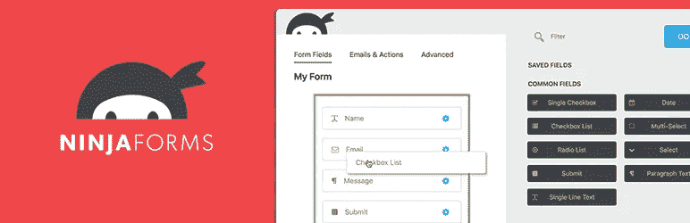
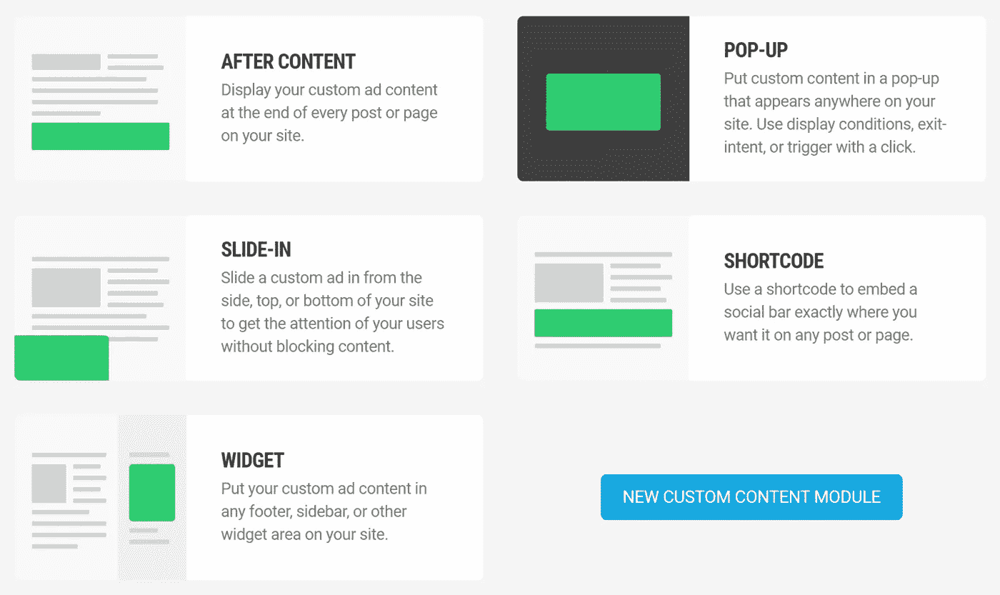

# 用 WordPress 创造更多商机

> 原文：<https://medium.com/visualmodo/generate-more-leads-with-wordpress-637f46fd0b35?source=collection_archive---------0----------------------->

WordPress 网站对产生潜在客户很有帮助，你可以添加一些神奇的插件来帮助你完成这项工作，请看新的最佳技巧和插件！

听着，我们都知道创造销售才是最重要的。但是你不能指望你的访问者这么容易被说服，以至于他们看一眼你的网站就想，“是的，我得给自己弄点那个。”虽然即时销售并非完全不可能，但它更可能是一种罕见现象，而不是对你网站的普遍反应。

即使你的访客并不都迫不及待地想要马上叉出他们的面团，但这并不意味着他们最终不会。如果 [Salesforce](https://www.salesforce.com/blog/2015/04/takes-6-8-touches-generate-viable-sales-lead-heres-why-gp.html) 可信的话，在他们准备购买之前，通常需要六到八次接触来培养销售线索。赢得他们只是需要时间。

不要坐以待毙，希望你创造了足够多的高价值内容，把这些线索吸引回你的网站六次以上，你可以把事情掌握在自己手中。通过在你的网站上利用各种潜在客户生成技术，你将使访问者能够选择接收你的信息。

通过这些常规的交流方式(如电子邮件和时事通讯)，你将能够与他们建立关系，被动地吸引他们，直到他们愿意购买。

当然，您不希望花费太多时间来构建这些潜在客户生成表格或自己收集这些信息。所以，很明显，我今天要谈的是 WordPress 最有效的线索生成插件。所有的 [Visualmodo WordPress 主题](https://visualmodo.com/)都与所有的插件完全兼容。

# 使用销售线索生成插件

# 吸引你的访客(并把他们变成付费客户)

内容营销让我想起了约会。

你的**网页设计**就像你努力完善的外表，为了给人最好的第一印象。

你的**内容**就像你写的约会简介，希望吸引符合你个性、生活方式和目标的伴侣。

你的**联系方式**就像第一步棋。“嘿，我很喜欢这个，但是在我们出去之前，我想多聊一会儿。这很酷吗？”

然后，电子邮件就成了你用来表达你对这种潜在联系有多认真的工具。你又看了一遍他或她的资料，评估你是否真的认为这是一个很好的选择，然后你等了三个星期才联系他，因为，嗯，你认为最好玩“欲擒故纵”的游戏。(Doh。)

不要等三个星期才发邮件！连三天都不要等！如果你的访客主动与你分享他们的联系信息，你最好做一些有意义的事情，一些有价值的事情，一些让他们知道他们在你的脑海中的事情…并且你希望你仍然在他们的脑海中。

在我进入潜在客户生成插件列表之前，我想快速说明一下，你应该先建立一个 CRM 或电子邮件营销解决方案。在约会的世界里，我们有一些应用程序可以帮助我们收集“线索”,并把它们组织起来。当涉及到您网站的销售线索生成时，您也需要自动收集这些信息。所有这些 CRM 和潜在客户生成工具可能会让你额外花费，但是，相信我，从长远来看，它们会帮你省钱。

所以，抛开这些不谈，让我们来看看 WordPress 最有效的潜在客户生成插件。

# 最佳联系人表格插件:忍者表格

当许多人想到“领先一代”时，他们会自动想到光滑而令人兴奋的弹出窗口，这些窗口可以在恰当的时候抓住访问者的注意力。但是销售线索的生成不仅仅是这些。有时候最简单的[联系方式](https://premium.wpmudev.org/blog/contact-form-plugins/)——比如你网站页脚的时事通讯订阅栏——就是所有访问者需要强迫他们注册。所以，在你做任何事情之前，一定要有一个像 Ninja Forms 这样的可信赖的联系表单插件，为你的网站内容添加线索生成功能。

以下是你想尝试这种方法的一些原因:

表单生成器工具非常容易使用。

表单的每一个元素都可以被控制，它们甚至会提示您可能没有考虑到的字段。

不仅与您的 CRM 或电子邮件平台集成。也将与支付网关整合，如果你的访问者准备好了的话。

对于不精通技术的用户和开发人员来说都很容易使用，这意味着您可以根据自己的需要进行定制。

对 Lead Gen: Ninja 表单的最佳联系表单插件感兴趣吗？

[详情](https://ninjaforms.com/)

# 线索生成的弹出插件:Hustle

看起来我应该把 Hustle 包括进来是非常合适的，因为这个插件是一个平滑的操作符。不过，说真的，如果你正在寻找一个简单易用且*智能的*弹出插件来帮助你挖掘潜在客户，那么没有比 [Hustle](https://premium.wpmudev.org/blog/introducing-hustle-email-optin-plugin/) 更好的了。以下是一些原因:

令人惊叹的定制选项，因此您可以创建弹出窗口、幻灯片、小部件或嵌入内容来处理您的品牌内容。

在最完美的情况下(例如退出意图)，将弹出窗口锁定给访问者。

根据其他因素，如地理位置或推荐来源，向访问者定向弹出窗口。

与大多数主要的电子邮件和社交平台集成，如 MailChimp 和 Campaign Monitor。

包括内置分析。

对 Lead Gen: Hustle 的最佳弹出插件感兴趣吗？

[详情](https://premium.wpmudev.org/project/hustle/)

# Lead Gen 的最佳 A/B 测试插件:OptinMonster

OptinMonster 可能是这个列表中最知名的 lead generation 插件，但我认为它应该属于它附带的 [A/B 测试](https://premium.wpmudev.org/blog/ab-testing/)。你为 WordPress 找到的大多数领先的插件看起来并不那么超前。相反，他们专注于短期游戏:帮助你建立你的 lead gen 元素，并让它们快速出现在你的网站上。这绝对没有错。我们需要这些插件来帮我们完成繁重的工作。然而，很高兴看到 OptinMonster 考虑到了在弹出窗口、滑动窗口和浮动栏启动后应该做什么。

如果你没有对网站的其他部分进行 A/B 测试，你至少应该对网站的这一部分进行测试。领导一代可能是一个棘手的家伙，你会想得到它的权利。

以下是 OptinMonster 成为明智选择的更多原因:

附带一个拖放构建器来简化创建选择加入表单的过程。

与 Hustle 一样，OptinMonster 提供了多种表单类型。

目标定位可以关注访问者的行为(如退出意图)、访问者的特征(如位置)或他们所登陆页面的实际内容。

可以创建特定于手机的弹出窗口。

包括 A/B 分割测试功能及其自己的分析工具。

对 Lead Gen: OptinMonster 的最佳 A/B 测试插件感兴趣？

[详情](http://optinmonster.com/)

# 领先一代的最佳一体化插件:相扑

从上面的选项中你可以看到，在你的 [WordPress](https://visualmodo.com/) 网站上有很多方法可以产生潜在客户。然而，相扑的多管齐下的方法似乎不像其他一些方法那样预先包装和简单。例如，以下是插件目前提供的主要解决方案:Lightbox 弹出窗口，集成了大多数主要的电子邮件服务提供商。

一整页的“欢迎垫”号召行动屏幕。

滚动触发的弹出窗口。

一个浮动的 [hello bar](https://premium.wpmudev.org/blog/wordpress-hello-bar/) 可以服务于多种目的，包括线索生成、导航、社交媒体推广等等。

除了提供这些线索生成元素，Sumo 还包括热图工具和分析。这样，您可以更快、更有效地评估 lead gen 工作的绩效，并在同一个工具中进行调整。

感兴趣的最好的综合插件铅一代:相扑？

[详情](https://wordpress.org/plugins/sumome/)

包扎

正如我前面提到的，潜在客户的产生不是快速冲刺。真正培养你的销售线索转化是需要时间的，所以确保你有合适的[工具](https://visualmodo.com/)来简化流程，减少你这边任何不必要的工作。这意味着使用一个潜在客户生成插件从你的网站收集潜在客户，并使用 CRM 来组织信息。