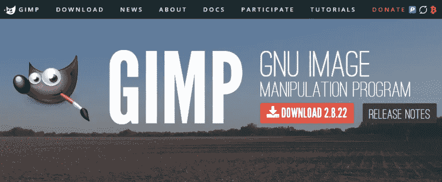
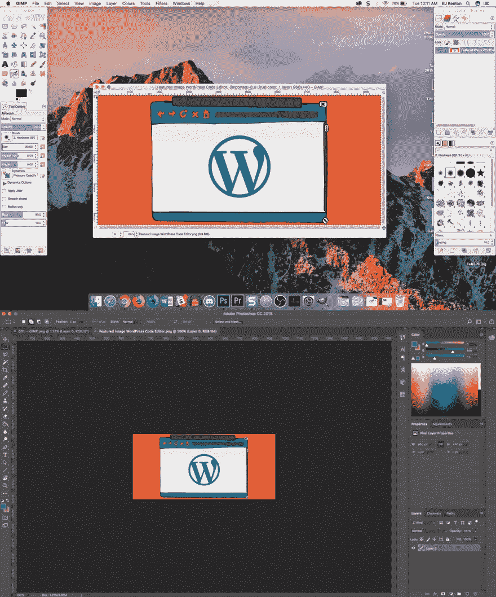
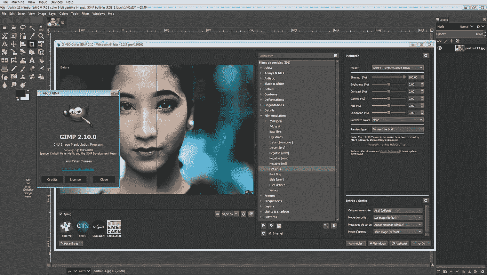

# GIMP:免费 Photoshop

> 原文：<https://medium.com/visualmodo/gimp-the-free-photoshop-4f9882ec5ed1?source=collection_archive---------0----------------------->

GIMP 是一个跨平台的图像编辑器，可用于 GNU/Linux、OS X、Windows 和更多操作系统。它是免费软件，你可以改变它的源代码，免费使用它作为 Photoshop 的一个很好的替代品。

Photoshop 已经超越了软件的范畴，成为一个动词，表示任何类型的图像处理。问题是这要花你钱。由于 Adobe 的 Creative Cloud 订阅包，成本不像几年前那样昂贵，但仍然是一项不错的投资，许多人都去寻找他们能找到的最好的 Photoshop 替代品。大多数时候，这就是开源的 gem GIMP。

# GIMP 是什么？

在我们继续深入之前，请理解这一点:GIMP 不像 [Adobe](https://visualmodo.com/) Photoshop 那么完美。如果你习惯于开源软件，那就不会感到惊讶了。出于某种原因，很难让 UX 和 UI 设计师做出和开发者一样多的贡献。如果你想要时尚、精致、超专业的现代体验，请访问[创意云](https://www.adobe.com/creativecloud.html)页面并订阅。瘸子不会为你工作的。这很酷。

但是，如果你没有被简单、实用的用户界面吓跑，这个 Photoshop 替代品有很大的威力。

GIMP，[GNU 图像处理程序](https://www.gimp.org/)的简称，是一个开源的图像编辑器，你可以在 Mac，Windows，甚至 Linux(根本不能运行 Photoshop)上使用。GNU 是一种[开源许可](https://www.gnu.org/licenses/gpl-3.0.en.html)，它恰好是我们[深爱的 WordPress 使用的](https://codex.wordpress.org/License)的同一种。

GIMP 第一次发布要追溯到 1996 年(那是相当老了，但没有 Photoshop 1988 年的处女作老)。自从最初 1996 年发布以来，围绕它的社区一直在稳步增长，功能也呈爆炸式增长。你甚至可以用 Photoshop extensions[来搭配它。](http://www.techradar.com/how-to/how-to-use-photoshop-plugins-in-gimp)

# 谨防虚假下载

这里有一个简短的警告。开源软件有它自己的挑战，不管它有多棒，GIMP 也不例外。几年前，有人为编辑器购买了回购，并开发了一款名为 GIMPshop 的产品，据开发者称，该产品旨在“让更多 Adobe Photoshop 用户更容易使用”。

但是我劝你**在任何情况下都不要下载 GIMPshop。**首先，最初的 fork 已经很多年没有更新了，其次(也是更重要的)，一些心怀不轨的人发布了一个替代版本的 GIMPshop(也被命名为 GIMPshop) **，其中充满了恶意软件和病毒**。

因此，在一个令人难以置信的旧版本、过时的用户界面和代码中的一堆坏蛋之间，我敦促你远离*并且只*从他们的网站下载原始和官方软件[。](https://www.gimp.org/)

# GIMP 入门

GIMP 是本地软件，不是基于云的，所以你必须去[下载安装程序](https://www.gimp.org/)，并在你的系统上安装它。这应该不会比你下载的其他程序有任何问题。

只是要注意 GIMP 有相当长的加载时间。根据我的经验，它大约是最新 Photoshop 的 3 倍。老实说，我觉得这没什么大不了的，但你应该知道。

# 初始用户界面

用户界面可能需要一些时间来适应。它最初是一个多窗口 UI，你可以在这里看到在 [Photoshop](https://visualmodo.com/) 和 GIMP 中打开同一个图像的区别。

如果你讨厌多窗口视图，不要惊慌。您可以通过进入**窗口- >单窗口模式**进行更改。突然间，Photoshop 用户开始觉得事物变得更加容易理解和熟悉。

# 你能用 GIMP 做什么？

实际上，很多。虽然你可以看到用户界面没有 Adobe 的旗舰产品的潇洒，但它有许多相同的功能。如果你是一个 Photoshop 超级用户，那么它可能缺少这个必备的元素。对于临时用户来说，它足够强大，几乎可以完成任何工作。

最大的不同在于工作流程。GIMP 不遵循 Adobe 的键盘快捷键或布局标准。用户发现许多标准特性在 GIMP 中缺失。这并不是说你不能这样做。GIMP 有一个非常健壮和强大的工具集。但是请记住，您可能要处理一系列的变通办法。

# 例如，曝光

例如，我在 Photoshop 中最常用的工具之一就是将图像的背景变暗。如上图所示，高亮显示**窗口- >单窗口模式**(认为箭头是在 [Snagit](https://www.techsmith.com/screen-capture.html) 之后应用的)。

为此，你高亮你想要高亮的区域，右键点击并选择**选择反转**(选择除你的高光之外的*)*，*，然后点击**图像- >调整- >曝光**，选择你想要的背景的黑暗程度。*

在 GIMP 中，你根本无法调整曝光设置。这将出现在 2.9 版本中，其中[是一个开发版本](https://www.gimp.org/downloads/devel/)，仅适用于 Windows(对不起，Mac 和 Linux 用户)。

也就是说，有一种解决方法。使用**矩形选择工具**，进行选择，转到**选择编辑器标签**并将其更改为**反转选择**。然后就是**颜色- >去饱和……->亮度**。

对于我的需求来说，它工作得很好。但我是做教程的临时用户。高端照片编辑和平面设计师都知道*曝光*和*亮度*是两个[完全不同的东西](http://www.cambridgecolour.com/forums/thread653.htm)。

# 基本情况是一样的

也就是说，两者的大部分基本内容是相同的，GIMP 的表现令人钦佩，并保持了自己的优势。在过去的几年里，GIMP 真的成长了，变得比以前更加用户友好。如果你过去对 GIMP 的学习曲线不感兴趣，那就再看看它。

老实说，这两个项目的学习曲线都很陡峭，我认为就可访问性而言，甚至现在也是如此。只要记住你在 one will transfer 中学到的原理。如果您从一个程序转移到另一个程序，工具和工作流程将需要一些调整。

请记住，GIMP 对大多数工具也使用不同的名称——比如上面例子中的矩形选框工具[和矩形选择工具。或文本工具与水平文字工具。Gimp 和 Photoshop 中也分别有画笔和画笔、桶填充工具和油漆桶工具，以及拾色器和吸管工具。](https://visualmodo.com/)

另外，所有的工具、窗格和图标都在不同的位置和菜单中。

此外，GIMP 有一个普通的 CMD-Z U *ndo* 功能，可以通过你的操作不断返回。也就是说你不用用 Photoshop 笨拙的 CMD-OPTION-Z *后退*(PS 里 CMD-Z 只后退一步变成*重做*。)

# 那么…应该用 GIMP 吗？

绝对的。如果你已经有了 Adobe Photoshop 会员资格，除了玩玩之外，你没有什么理由使用 GIMP。但是如果你是一个普通用户，不需要我们大多数人永远不会使用的所有超级高级功能，GIMP 完全可以满足你的需求。

GIMP 是一个令人惊叹的工具，它消除了为 Photoshop 付费的需要。它并不是完全的替代品，尽管它最终到达了它的生命中的某一点，那就是它*可以*被[专业地](https://visualmodo.com/)使用。可能不适合高端摄影师或图形设计高级用户，但是如果你是一个博客作者或营销人员，偶尔会为帖子、社交媒体和电子邮件调整一些图片的大小，GIMP 可能正适合你。

**你觉得 GIMP 和 Photoshop 相比怎么样？**