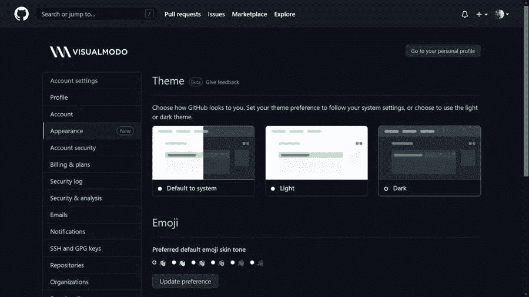

# Github 黑暗模式启用教程

> 原文：<https://medium.com/visualmodo/github-dark-mode-enable-tutorial-f9dde055004c?source=collection_archive---------0----------------------->

事实上，一些在线工具和移动应用程序正在接受原生的黑暗模式主题。在今天的文章中，您将了解如何在您的帐户设置中以快速简单的方法启用或激活 Github 原生黑暗模式。

# Github 官方黑暗模式启用教程

对我们大多数人来说幸运的是(为了保护我们的眼睛)，现在 Github 有了一个官方的黑暗模式主题。首先，在任何页面的右上角，单击您的帐户图像(个人资料图标)，然后，单击设置。

进入帐户设置页面后，您需要点击“外观”按钮。在“主题模式”上，点击下拉菜单并选择[主题首选项](https://visualmodo.com/free-maintenance-mode-and-coming-soon-plugins-for-wordpress/)。

现在是时候选择你实际想要使用的主题了。你有三个选项(亮，暗和暗暗)，但希望他们会升级，以增加更多的选项。

此外，你可以要求 Github 深色模式跟随你的系统颜色，这将使工具跟随你在桌面上使用的模式。

最后，按照下面的视频来回顾这个过程。为了选择和灵活使用 GitHub 的方式和时间，你可以配置主题设置来改变 GitHub 的外观。