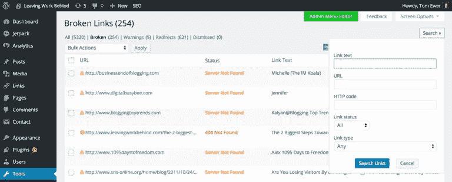

# 好的免费 WordPress 插件

> 原文：<https://medium.com/visualmodo/good-free-wordpress-plugins-5801de7982c4?source=collection_archive---------4----------------------->

你不必是一个编码专家或设计高手来创建一个令人敬畏的 WordPress 博客或网站。

# 什么是 WordPress 插件？你为什么需要它们？

多亏了插件的帮助，你可以在很短的时间内让你的网站变得光滑、安全、快如闪电。

酷的部分？一些最好的插件是免费的。

但是你需要知道选择哪些插件，避免哪些插件。否则，你会对你的网站弊大于利。

问题来了…

有超过 40，000 个插件可供选择，您可能会有点分析麻痹。

一些插件对你的网站有害，大量的插件会降低你网站的速度。

怎么会？嗯，插件需要你的站点进行额外的 HTTP 请求和/或额外的数据库查询。这两件事都会降低你网站的速度。

所以，你需要仔细选择你的插件，并且保持你的插件是最新的。

你是怎么做到的？

你来对地方了。在这篇文章中，我为你的 WordPress 博客展示了最好的免费插件。所以，准备好收藏这篇文章，当你需要一个新插件的时候再回来看看吧！

但是在我们开始之前，这里有一些插件提示，1)充分利用你的插件，2)确保它们不会让你的网站陷入困境

1.  删除任何你不再使用或需要的插件。这些可能会不必要地降低你的加载速度。
2.  **找到高质量的插件。通常不是太多的插件导致你的网站出现问题，而是糟糕的代码。所以，寻找那些有很好评论和大量安装的插件，以及我们将在这里列出的插件。**
3.  **定期更新你的插件。不要让你的插件过时。旧版本的插件也会降低你网站的速度。**
4.  做你的研究。不要总是依赖好的收视率和安装。查看支持论坛和评论，看看这个插件是如何为其他人工作的。

好了，现在让我们深入了解一些最好的免费插件…

# 以下是 WordPress 博客和网站的最佳(免费)插件

# 内容和共享

## 1.浮动社交酒吧

你的内容多久在社交媒体上被分享一次？

理想情况下，越多越好。如果你能增加这些社交份额，你就能获得更多的流量、曝光率和收入。

增加流量和社交分享的最好方法之一就是使用浮动社交栏插件。

你看，许多社交分享插件很重，会降低你网站的速度。但浮动社交栏仍然很小，因为它只支持主要的社交媒体网络，如脸书、Twitter、Pinterest、LinkedIn 和 Google+。

此外，该插件只在必要时加载脚本——它会显示一个包含所有分享计数的副本图像，直到用户滚动社交分享按钮——因此您的网站可以像往常一样快速运行。

**下载到这里:** [浮动社交吧](https://wordpress.org/plugins/floating-social-bar/)

## 2.断开链接检查器

你的访问者兴奋地加载了你的网页，但却沮丧地发现网页无法运行。因此，他们点击你的网站，可能永远不会再回来。

网站上断开的链接会产生巨大的负面影响。它们可以阻止搜索引擎爬虫，导致网站流量降低，并创造出低劣的用户体验。所有这些事情都会让你的收入流减少一大块。

解决办法？在它们的轨道上停止断开的链接，并在为时已晚之前纠正它们。

你可以很容易地用断链检查插件做到这一点。

它能快速找到你网站上的所有坏链接，并允许你立即修复它们。

**在这里下载:** [断链检查器](https://wordpress.org/plugins/broken-link-checker/)

## 3.雷文西

访问者浏览你的网站有多容易？嗯，如果你还在使用默认的 WordPress 搜索栏，实际上可能会相当困难。

访问者使用您的搜索栏快速找到他们感兴趣的内容。如果搜索查询没有返回任何有用的信息，他们会感到失望，可能会点击离开你的网站。

这就是默认 WordPress 搜索栏的问题…

它按日期而不是相关性来组织搜索结果，也不允许你索引自定义的文章类型进行搜索。因此，搜索结果是相当不合格的。

解决办法？Relevanssi 插件。

Relvannsi 按照相关性顺序提供搜索结果，此外还有一些其他很酷的功能，如:

*   **模糊匹配。这允许你匹配部分单词，以防完整的单词不匹配**
*   **禁用搜索选项。**如果不想让搜索栏出现在某个帖子类型上，可以很容易的禁用。
*   **突出显示搜索词。**当用户点击搜索结果时，它会高亮显示这些结果中的搜索词，以便于导航。

**在这里下载:** [Relevanssi](https://wordpress.org/plugins/relevanssi/)

## 4.联系表格 7

越容易联系到你，就会有越多的访问者这样做。因此，您可以与更多的访问者建立更好的关系，解决人们购买您的产品或服务的更多异议，并创造更好的用户体验。

访问者联系你最简单的方式是通过 Contact Form 7 插件。

它很简单，易于安装，也易于定制。

**在这里下载:** [联系方式 7](https://wordpress.org/plugins/contact-form-7/) 或者在这里阅读[我的完整教程](https://websitesetup.org/contact-form-wp-website/)。

## 5.按网站来源的页面生成器

不是设计、编码、html 专家？我们感受到你的痛苦…

但是有了正确的插件，你就不必这样了。您可以完全按照您想要的方式构建您的页面，而无需修改任何代码。

最棒的是，有了站点来源的页面生成器插件，它是完全免费的。

更重要的是，它适用于任何 WordPress 主题。所以，你可以创建销售页面，压缩页面，等等，所有这些都是以一种高效(和免费)的方式。

**在此下载:** [按站点来源的页面生成器](https://wordpress.org/plugins/siteorigin-panels/)

## 6.WP 审查

你在你的网站上评论产品/服务吗？如果是，WP Review 就是必备插件。

它会在谷歌搜索结果中显示你的帖子的评分。您可以对其进行自定义，使评论显示为星级、点数或百分比评级。

更何况这个插件以前是 premium，所以你知道它是高质量的。

**在这里下载:** [WP 评论](https://wordpress.org/plugins/wp-review/)

# 分析学

## 1.喷气背包

你管理你的 WordPress 站点有困难吗？事实是，站点管理涉及很多内容，有时会让人不知所措。

但是，不一定要这样。

有了 Jetpack，你可以很容易地从一个集中的位置管理你的 WordPress 站点。

以下是 Jetpack 中包含的一些功能:

*   **流量增长与洞察。**你可以开启“相关文章”功能，让相关文章出现在你的博文下方，增加访客在你网站停留的时间。
*   **安全。** Jetpack 保护您的站点免受垃圾登录和评论的攻击，并监控您站点的停机时间。
*   **形象表现。**它自动优化图像，减少带宽。
*   **集中管理。轻松管理插件菜单、发布帖子和查看增强的站点统计数据。**

**在这里下载:** [Jetpack](https://wordpress.org/plugins/jetpack/)

## 2.Yoast SEO

搜索引擎优化应该是每个网站的优先事项。你的搜索引擎优化越好，你在搜索引擎中的排名就越高，你就能获得越多的流量。

这意味着更多的转换和收入的机会。

有成千上万的 SEO 策略超出了本文的范围。

但是现在开始改进你的 SEO 的一个简单方法是下载 Yoast SEO 插件。

以下是 Yoast SEO 的一些特性:

*   **页面分析。在你发布一篇文章之前，它会检查图片以确保它们有包含焦点关键词的 alt 标签。它还会检查文章是否足够长，以及你是否用焦点关键词写了一个元描述。**
*   **元元素和链接元素。**这允许你控制在谷歌搜索结果中显示的页面。
*   **XML 网站地图。该插件自动创建网站地图，并通知 Google 和 Bing 它们的存在。**
*   **RSS 优化。这增加了你使用所选关键词的机会。**

**在这里下载:** [Yoast SEO](https://wordpress.org/plugins/wordpress-seo/)

## 3.MonsterInsights 的谷歌分析

你可能知道，密切关注你的分析是很重要的，这样你才能了解你的访问者的行为。

俗话说得好，能衡量的就能管理。谷歌分析可以让你更好地衡量访问者的统计数据。

以下是这个插件的一些特性:

*   **谷歌分析跟踪代码。这是谷歌提供的最快捷、最可靠的跟踪代码。**
*   **WordPress install 中的访问者度量仪表板。**您可以在一个地方轻松查看所有指标。
*   **简单安装。**它与 Google Analytics API 集成，因此您只需选择您想要跟踪和验证的网站，然后就可以开始了。

**在这里下载:**[monster insights](https://wordpress.org/plugins/google-analytics-for-wordpress/)的谷歌分析

# 安全性和速度

## 1.苏库里

你的网站安全应该是你的首要任务。只需一次攻击就能让你的网站陷入混乱。

所以，你需要做好财产安全防御的准备。

最好的安全形式之一是 Sucuri 插件。

以下是它保护您网站的一些方法:

*   **安全活动审计日志记录。这个监控你的 WordPress 站点中所有与安全相关的事件。**
*   **黑客攻击后的安全选项。如果你的网站被入侵，这有助于你采取正确的行动。**
*   **安全通知。只要你的网站上有与安全相关的事件，你就会得到通知，所以你总是在消息中。**
*   **远程恶意软件扫描。扫描你的网站是否有恶意软件，如果你的代码中出现任何异常，就会得到提醒。**

简而言之，如果你希望你的网站是安全的，这是可以使用的插件。

**在这里下载:** [苏库里](https://wordpress.org/plugins/sucuri-scanner/)

## 2.复印机

你曾经因为没有备份而丢失过一个站点吗？如果是这样，你知道这有多令人沮丧。

如果没有，我们保证这是你绝对不想处理的事情。

定期备份网站就像保险一样。它让你为最坏的情况做好准备，这种情况有时会发生。

你可以用复制插件轻松备份你的网站。

你所要做的就是运行插件，让它压缩你的站点，复制到新的服务器，然后运行安装文件。

**在这里下载:** [复印机](https://wordpress.org/plugins/duplicator/)

## 3.W3 总缓存

网站速度是网站最重要的方面之一。当访问者必须等待超过 2 秒才能加载页面时，他们就会开始点击你的网站。

有几种方法可以加速你的网站——从使用更快的主机，到优化图片等等。

但是保持你的站点快速运行的最简单的方法之一是使用 W3 Total Cache 插件。

它保存了你的站点的静态 HTML 版本，所以它不需要一直生成新的页面。

这减少了对服务器和数据库的请求数量，有助于页面更快地加载。这导致更快乐的访问者和更好的搜索排名。所以，这真的很容易！

**下载到这里:** [W3 总缓存](https://wordpress.org/plugins/w3-total-cache/)

# 结论

WordPress 插件可以对你的网站或博客产生强大的影响。但是一个常见的错误是当你选择太多的时候，以及当你选择错误的时候。这个错误会损害你的网站，降低它的速度。

为了避免这个错误，请从这个列表中选择你的插件。每个插件都会以这样或那样的方式对你的网站产生积极的影响，并帮助你改善你的访客体验。

好免费的 WordPress 插件来源:[https://visualmodo.com/](https://visualmodo.com/)