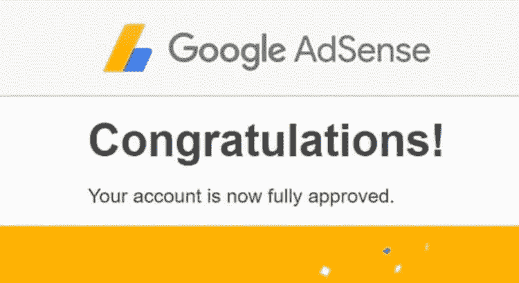

# Google Adsense 审批指南

> 原文：<https://medium.com/visualmodo/google-adsense-approval-guide-7772face351?source=collection_archive---------0----------------------->

所以，你想申请 Adsense 从你的博客赚点钱，享受你一直梦想的生活？谁不是呢？那是每个博主的梦想得到 AdSense 的认可。但是等等。我要告诉你一些事情。那可不容易。Google AdSense 在审批新应用时非常严格。每个人都试图欺骗 AdSense 获得批准，所以他们使这个过程非常困难。

信不信由你，但这是真的。而 Adsense 拒绝了我的申请。因为该应用程序对 Adsense 团队来说没有任何意义。那一次，我对 Adsense 没有任何概念，也不知道它是如何工作的。我只知道网站所有者可以从 Adsense 中赚钱。所以我想为什么不试一试。毕竟，我曾是一个手机网站的骄傲拥有者。

# Google Adsense 审批指南

和我一样，用低质量站点申请 Adsense 的人很多。这就是为什么谷歌在批准新的 Adsense 账户时变得更加严格，以保持其质量。我相信你有一个很好的网站(不是 wap ),但谷歌不同意你的申请。也许，这就是你读这篇文章的原因。

 [## 谷歌 Adsense 审批终极指南- Visualmodo 博客

### 所以，你想申请 Adsense 从你的博客赚点钱，享受你一直梦想的生活？谁会…

visualmodo.com](https://visualmodo.com/google-adsense-approval-ultimate-guide/) 

# 设计 UX

你的网站上可能有好的内容。但是这并不能保证 Adsense 的认可，除非你的网站有好的设计和简单的导航。如果你想从你的网站上赚钱，那么你应该考虑在网站设计上投资一些钱。WordPress 用户可以选择高级主题。如果你的预算不多，你可以从 Visualmodo 中抓取一个主题。

你会相信我申请了一个 WAP 网站的 Adsense，而这个网站没有任何放置 Adsense 代码的选项吗？信不信由你，但这是真的。而 Adsense 拒绝了我的申请。因为该应用程序对 Adsense 团队来说没有任何意义。

那一次，我对 Adsense 没有任何概念，也不知道它是如何工作的。我只知道网站所有者可以从 Adsense 中赚钱。所以我想为什么不试一试。毕竟，我曾是一个手机网站的骄傲拥有者。和我一样，用低质量站点申请 Adsense 的人很多。这就是为什么谷歌在批准新的 Adsense 账户时变得更加严格，以保持其质量。

# 质量

被 Adsense 拒绝是令人沮丧的。在几次拒绝之后，许多新的博客作者脑子里有了这样的想法，他们永远不会得到 Adsense 的批准。如果你是其中之一，你并不孤单。你来对地方了。

谷歌没有透露任何他们批准新账户的依据。你能做的就是在申请 Adsense 之前维持一些标准。你也可以考虑将下面的技巧作为 Google Adsense [审批](https://visualmodo.com/wordpress-membership/)清单。

# 域名所有权

人们可以通过 Blogspot、Weebly 等免费子域名网站获得 Adsense 帐户的日子已经一去不复返了。谷歌仍然批准子域名网站，但你必须确保你的网站有良好的内容，漂亮的设计，容易导航等。

让子域网站与 Adsense 标准兼容真的很难。谷歌已经禁止了一些子域名网站，如. co.cc，. co.nr。所以我建议你像我一样去抢一个顶级域名。Com)。。Com，。网，。组织，。在中，. com.bd 等是顶级域名。这里有一个例子来理解区别。

# 其他广告

当你还没有一个 Adsense 帐户的时候，尝试一些 Adsense 的替代品并不是一个坏主意。但是在申请 Adsense 之前要把那些广告去掉。虽然谷歌允许你在 Adsense 上使用其他广告网络，但是如果你的网站充斥着其他网络的广告，这会给 Adsense 团队留下不好的印象。

# 网站提交

每当你创建一个网站时，你总是希望人们能很容易地发现你的网站。搜索引擎是人们很容易找到你的网站的地方。你需要做的就是在搜索引擎上提交你的网站地图。

还要确保谷歌已经索引了你网站的页面。在谷歌搜索中输入 *site:yourdomain.com* 并检查谷歌是否索引了你的网站。有时谷歌需要一周或更长时间来索引你的网站。如果你有一些相关的反向链接，你的网页会被快速索引。链接博客文章也有助于搜索引擎机器人索引你的网页。

# 谷歌分析

分析和网站管理员工具是谷歌的两个很棒的工具。分析提供了关于你的网站的详细统计数据。网站管理员工具在谷歌上提供了网站页面可见性的详细报告。

# 独特的内容

在申请 Adsense 之前，你必须创建新鲜和独特的内容。Adsense 不需要庞大的内容，需要优质的内容。一些博主只有 20-30 个帖子就获得了 Adsense 帐户，而一些博主的帖子超过 100 个却没有获得批准。

所以高质量的内容非常重要。[优质内容](https://visualmodo.com/blog/)是经过精心开发和研究，不含版权的东西和非法下载链接，不抄袭他人，人性化，细节化的内容。所以尽量发布一些优质内容。记住，优质内容永远是王道。Adsense 禁止内容:版权内容、成人内容、黑客&破解相关内容、赌博/赌场/酒精相关内容以及所有非法内容。

# 页面创建

有一些页面提供了更好的用户体验。谷歌始终专注于更好的用户体验。大多数新的博客作者并不创建这些页面。拥有这些页面会给 Adsense 团队留下好印象。所以在申请 Adsense 之前创建以下页面。

**关于** —大多数第一次访问“关于”页面的访问者。他们想知道博客背后的你是谁。在关于页面，你可以写关于你自己和你的博客或任何你想写的东西。

**联系人** —这是最被忽略的页面。一旦你拥有了它，你就会意识到它的重要性。你可能因为没有联系页面而错过了直接广告。

**隐私政策**——根据 Adsense TOS，你必须有一个隐私页面，其中包含有关 cookies 的信息、设备特定信息、位置信息和存储在上的其他信息。

# 更多推荐

*   如果你更喜欢某个网站，那么考虑申请最好的网站。
*   您的内容应该用英语或其他 [Adsense 支持的语言](https://support.google.com/adsense/answer/9727?hl=en)编写。
*   请在申请 Adsense 帐户时提供您的真实信息。
*   您的年龄必须达到或超过 18 岁才能参与 Adsense 计划。
*   有时谷歌在某些国家需要 6 个月的旧域名，包括中国和印度。
*   避免付费流量。(Adsense 不需要很多流量)
*   不要使用有版权的图像，使用带演职员表的图像。

一旦你的站点符合以上所有事实，那么申请 [Adsense 账户](https://www.google.com/adsense/signup)的审批过程现在需要 24 到 48 小时。一旦你有了 Adsense 帐户，你就可以在你拥有的其他网站上使用 Adsense 广告。这就是为什么你可能已经注意到一些低质量的网站包含 Adsense 广告。但这不是一个好主意，在添加广告之前，一定要确保你的网站符合 Adsense 政策。如果发现你的网站有问题，Adsense 可能会封禁你的账户。