# 谷歌分析 WordPress:如何正确设置

> 原文：<https://medium.com/visualmodo/google-analytics-wordpress-how-to-properly-setup-382835b3be08?source=collection_archive---------0----------------------->

想知道人们如何找到你的网站，哪些博客帖子最受欢迎，或者有多少访问者使用移动设备？使用 Google Analytics WordPress 和 MonsterInsights 可以很容易地找到所有这些信息。在这篇文章中，我们将向你展示如何使用 MonsterInsights 设置你的 Google Analytics 账户，并将其安装在你的 WordPress 站点上。

# WordPress 中的谷歌分析第一步:登录谷歌

你需要做的第一件事是登录或注册一个谷歌账户。

首先，你需要打开[谷歌分析网站](https://www.google.com/analytics/)，点击页面右上角的**登录**链接。

然后点击出现的下拉菜单顶部的**分析**。

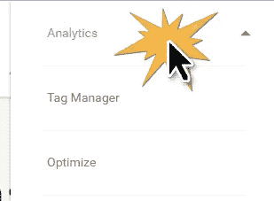

在下一页，您可以登录现有的 Google 帐户(如果您有),或者单击**创建帐户**链接创建一个新的 Google 帐户。

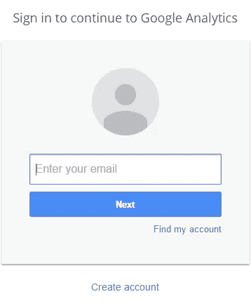

# 第二步:注册谷歌分析

登录 Google 帐户后，您需要注册 Google Analytics。点击页面右侧的**注册**按钮开始。

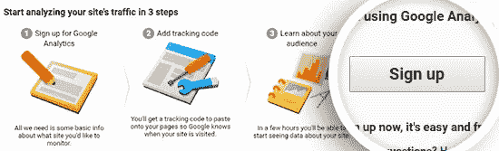

接下来，您需要输入要开始跟踪的网站的设置。

确保在顶部选择了**网站**选项。

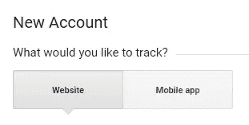

然后你可以向下滚动输入你的网站信息。你需要命名你的谷歌分析账户，并输入你的网站名称，网址，行业，以及你的时区。

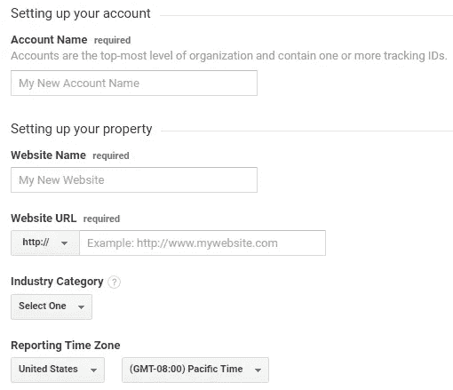

填写您的网站详细信息后，您可以向下滚动一点，以自定义您的数据共享设置。选择完选项后，您可以点击页面底部的**获取跟踪 ID** 按钮。

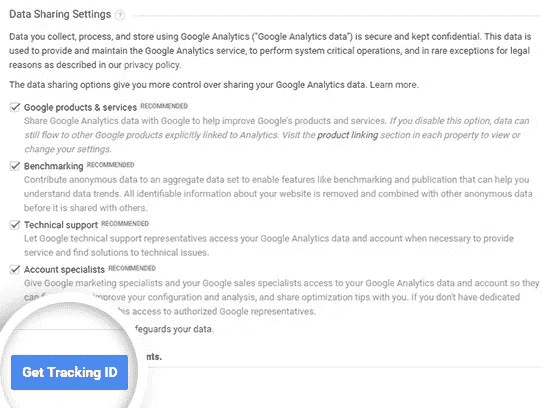

在出现的弹出窗口中，您可以查看并接受服务条款。

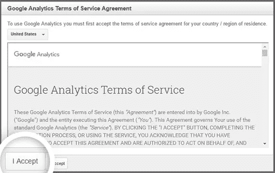

就是这样！你现在已经注册了谷歌分析。

# 步骤 3:设置 MonsterInsights

通常，你必须将你的谷歌分析跟踪代码插入到你的 WordPress 网站的代码中。

但是有了 MonsterInsights，你不需要担心使用任何代码。

相反，您可以从下载 MonsterInsights 插件开始。为此，你需要登录你的 MonsterInsights 账户并下载插件 zip 文件。

一旦你有了 zip 文件，导航到你想要安装 MonsterInsights 的站点，然后进入 WordPress 管理仪表板。

然后导航到**插件添加新插件**并点击顶部的上传插件按钮。

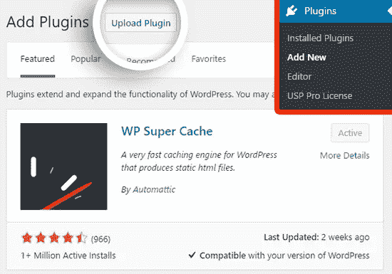

在下一个屏幕上，您可以单击**选择文件**按钮来选择您刚刚下载的 zip 文件。然后点击**立即安装**按钮上传文件并在您的站点上安装插件。

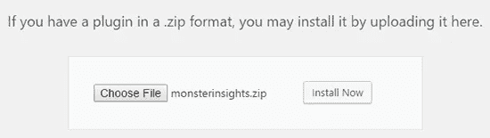

一旦插件被上传和安装，你可以点击**激活插件**按钮在你的站点上激活它。

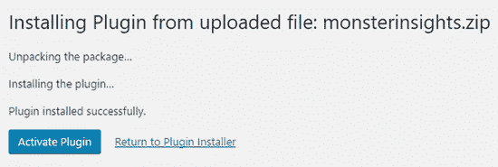

插件被激活后，你会在你的面板顶部看到一些消息。要使用 MonsterInsights 设置您的谷歌分析帐户，请点击**谷歌分析设置**链接。

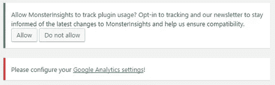

这将带您进入**洞察设置**菜单。现在你可以点击**使用你的谷歌账户**按钮来开始这个过程。

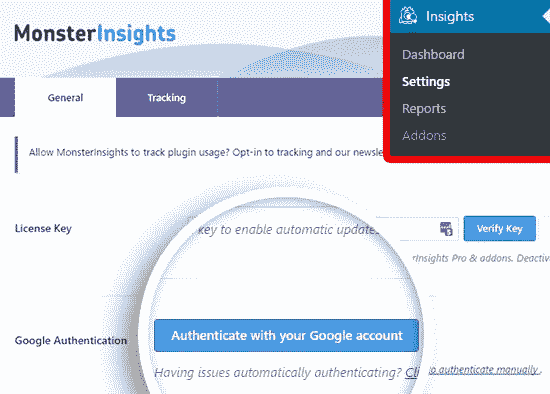

在出现的弹出窗口中，点击下一个按钮**。**

然后点击**点击获取谷歌代码**按钮。

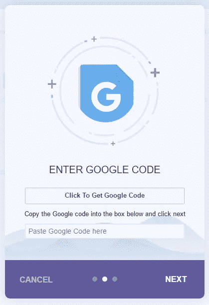

接下来，你可以点击**允许**按钮，让 MonsterInsights 访问你的谷歌分析数据。

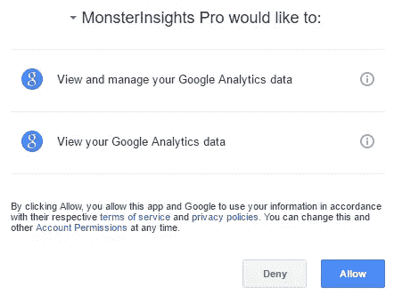

将显示一长串字母和数字。复制代码，然后将其粘贴到字段中，并单击**下一个**按钮。

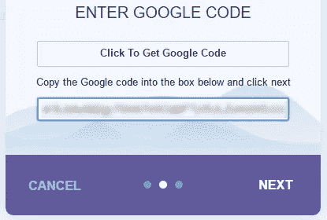

现在，您可以单击**选择个人资料**下拉菜单，选择您在 Google Analytics 中设置的网站，然后单击**下一步**按钮。

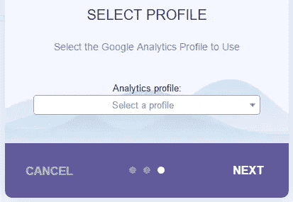

就是这样！你都准备好了。

谷歌分析可能需要几个小时才能开始收集数据。

一旦完成，你就可以去 **Insights Dashboard** 查看你的网站进展如何。

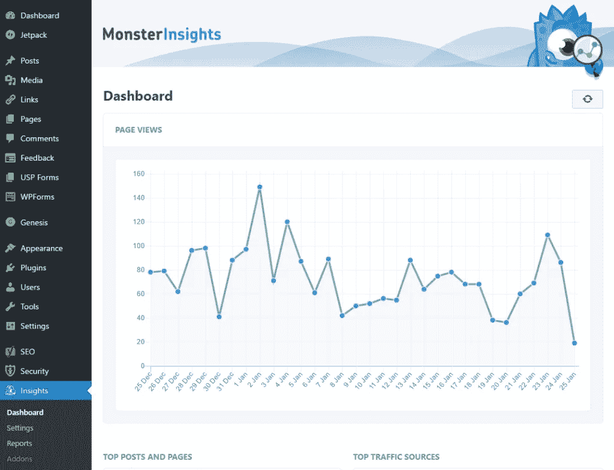

我们希望本教程能帮助你用 MonsterInsights 设置 Google Analytics。来源[https://visualmodo.com/](https://visualmodo.com/)