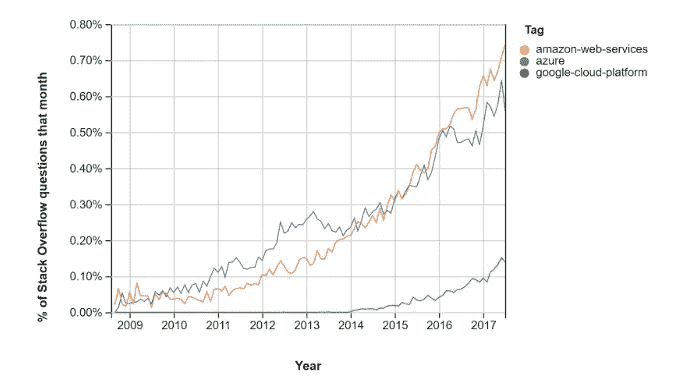

# 谷歌云的优势和好处

> 原文：<https://medium.com/visualmodo/google-cloud-advantages-and-benefits-25001f0bc730?source=collection_archive---------0----------------------->

为您的企业寻找最佳的云托管？在这里，我们列出了 Google Cloud [托管](https://visualmodo.com/differences-between-web-hosting-and-domain-name/)的 7 大优势和好处，这样你就可以做出正确的决定！

选择云提供商可能是一个困难的过程，会对生产力、成本和功能产生长期影响。你会根据现有环境的微软投资选择 Azure 吗？你使用最大的供应商 AWS(亚马逊网络服务)吗？还是选择了最新的提供商谷歌云平台(GCP)？

# 谷歌云的优势和好处

# 竞争的价格形成

此外，谷歌云优势处于劣势。尽管 GCP 在 2008 年推出，但它获得市场关注的速度一直很慢。这意味着 GCP 正在发布有竞争力的定价，可以在许多方面击败 Azure 和 AWS，包括 IOPS 和中期实例成本。请参见下图，该图来自 kinsta.com，使用了堆栈溢出问题/月的百分比。

# 比 AWS 或 Azure 便宜

在 GCP 上开始比 AWS 或 Azure 更便宜。虽然这三个都提供免费层，我发现 GCP 的免费层是最慷慨的，允许你实验而不招致成本。

# 谷歌云优势上的机器学习工具

GCP 使用谷歌。谷歌和它所有的资源运行着 GCP，这一点怎么强调都不为过。同样的互联网骨干，同样的机器学习工具，谷歌使用的同样的负载平衡器，在 GCP 都可以找到。这为您提供了一个每天都有数十亿用户使用的经验证的基础架构。

# 关于谷歌的最后一句话是

因此，使用最终成为谷歌云平台一部分的谷歌云托管服务有很多优势。上面提到的七个优势(更好的定价计划可用性、增强的执行力、实时迁移的好处、专用网络、对持续开发的承诺、控制和安全性以及冗余备份)使 Google 云托管成为一个不错的选择。有不同的定价方案，比计算世界中可用的其他平台更便宜。

那会给你留下什么？如果成本是一个关键因素，或者想尝试一个不可能实现的免费层，那么谷歌云平台可能是你的选择。